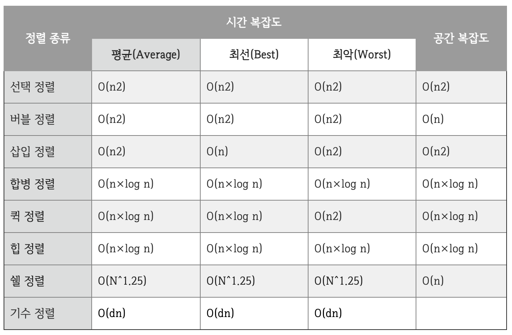

## 자료구조

  
<h3>1. 시간복잡도와 공간복잡도에 대해 설명해 주세요.</h3>

<ul>
<li> Big-O, Big-Theta, Big-Omega 에 대해 설명해 주세요.</li>
<li> 다른 것을 사용하지 않고, Big-O를 사용하는 이유가 있을까요?</li>
<li> O(1)은 O(N^2) 보다 무조건적으로 빠른가요?</li>
</ul>

  
<h3>2. 링크드 리스트에 대해 설명해 주세요.</h3>

<ul>
<li> 일반 배열과, 링크드 리스트를 비교해 주세요.</li>
<li> 링크드 리스트를 사용해서 구현할 수 있는 다른 자료구조에 대해 설명해 주세요.</li>
</ul>

  
<h3>3. 스택과 큐에 대해서 설명해 주세요.</h3>

<ul>
<li> 스택 2개로 큐를, 큐 2개로 스택을 만드는 방법과, 그 시간복잡도에 대해 설명해 주세요.</li>
<li> 시간복잡도를 유지하면서, 배열로 스택과 큐를 구현할 수 있을까요?</li>
<li> Prefix, Infix, Postfix 에 대해 설명하고, 이를 스택을 활용해서 계산/하는 방법에 대해 설명해 주세요.</li>
<li> Deque는 어떻게 구현할 수 있을까요? </li>
<li> (C++ 한정) Deque의 Random Access 시간복잡도는 O(1) 입니다. 이게 어떻게 가능한걸까요? </li>
</ul>

  
<h3>4. 해시 자료구조에 대해 설명해 주세요.</h3>

<ul>
<li> 값이 주어졌을 때, 어떻게 하면 충돌이 최대한 적은 해시 함수를 설계할 수 있을까요?</li>
<li> 해시값이 충돌했을 때, 어떤 방식으로 처리할 수 있을까요?</li>
<li> 본인이 사용하는 언어에서는, 어떤 방식으로 해시 충돌을 처리하나요?</li>
<li> Double Hashing 의 장점과 단점에 대해서 설명하고, 단점을 어떻게 해결할 수 있을지 설명해 주세요.</li>
<li> Load Factor에 대해 설명해 주세요. 본인이 사용하는 언어에서의 해시 자료구조는 Load Factor에 관련한 정책이 어떻게 구성되어 있나요?</li>
<li> 다른 자료구조와 비교하여, 해시 테이블은 멀티스레드 환경에서 심각한 수준의 Race Condition 문제에 빠질 위험이 있습니다. 성능 감소를 최소화 한 채로 해당 문제를 해결할 수 있는 방법을 설계해 보세요.</li>
</ul>

 

  
<h3>5. 트리와 이진트리, 이진탐색트리에 대해 설명해 주세요.</h3>

<ul>
<li> 그래프와 트리의 차이가 무엇인가요?</li>
<li> 이진탐색트리에서 중위 탐색을 하게 되면, 그 결과는 어떤 의미를 가지나요?</li>
<li> 이진탐색트리의 주요 연산에 대한 시간복잡도를 설명하고, 왜 그런 시간복잡도가 도출되는지 설명해 주세요.</li>
<li> 이진탐색트리의 한계점에 대해 설명해주세요.</li>
<li> 이진탐색트리의 값 삽입, 삭제 방법에 대해 설명하고, 어떤식으로 값을 삽입하면 편향이 발생할까요?</li>
<li> 이진탐색트리와 동일한 로직을 사용하면, 삼진탐색트리도 정의할 수 있을까요? 안 된다면, 그 이유에 대해 설명해 주세요.</li>
</ul>

   

 

  
<h3>6. 힙에 대해 설명해 주세요.</h3>

<ul>
<li> 힙을 배열로 구현한다고 가정하면, 어떻게 값을 저장할 수 있을까요?</li>
<li> 힙의 삽입, 삭제 방식에 대해 설명하고, 왜 이진탐색트리와 달리 편향이 발생하지 않는지 설명해 주세요.</li>
<li> 힙 정렬의 시간복잡도는 어떻게 되나요? Stable 한가요?</li>
</ul>

   

 

  
<h3>7. BBST (Balanced Binary Search Tree) 와, 그 종류에 대해 설명해 주세요.</h3>

<ul>
<li> Red Black Tree는 어떻게 균형을 유지할 수 있을까요?</li>
<li> Red Black Tree의 주요 성질 4가지에 대해 설명해 주세요.</li>
<li> 2-3-4 Tree, AVL Tree 등의 다른 BBST 가 있음에도, 왜 Red Black Tree가 많이 사용될까요?</li>
</ul>

   

## 8. 정렬 알고리즘에 대해 설명해 주세요.

    
 정렬 알고리즘에 대해 설명해 주세요.

- (1) 버블 정렬
    - 첫 번째 원소부터 인접 값끼리 비교하며 자리를 교환하는 방식
    - 배열의 두 수(a,b)를 선택한 후, 만약 두 수가 정렬되었다면 놔두고 아니라면 두 수를 바꾸는 방식으로 진행
    - 구현이 쉽고, 직관적인 코드
    - 비효율적, 최악/최선 모두 O(N^2)의 시간복잡도
- (2) 선택 정렬
    - 배열 중 최솟값을 찾고 그 값을 맨 앞에 위치한 값과 교환하는 방식
    - 구현의 쉽고, 비교 횟수는 많지만 실제 교환 횟수는 적음
    - 버블 정렬과 똑같이 O(N^2)의 시간 복잡도지만 속도 자체는 버블 < 선택
- (3) 삽입 정렬
    - 이미 정렬된 배열 부분과 비교하여, 자신의 위치를 찾아 삽입하는 정렬 방식
    - 최선의 경우 O(N)의 시각복잡도를 가지지만 최악의 경우 O(N^2), 성능 편차가 심함
- (4) 병합 정렬
    - 작은 단위로 분할 → 정렬된 단위들을 계속 병합하면서 정렬하는 방식
    - 시간복잡도는 항상 O(NlogN), 추가적인 메모리가 필요함
    - LinkedList의 정렬에 효율적, 추가 메모리 할당할 수 없는 경우 적절하지 않음
- (5) 퀵 정렬
    - 하나의 축(Pivot)을 먼저 정한 후, 피벗보다 작으면 왼쪽/크면 오른쪽으로 계속 비교하면서 교환
    - 기준 값(피벗)에 의한 분할을 통해 구현하는 정렬법, 연속적인 분할에 의한 정렬방식
    - 평균 O(logN)의 시간 복잡도를 가지지만, 피벗에 따라 시간복잡도의 편차가 큼

    
 Quick Sort와 Merge Sort를 비교해 주세요.

    
 Quick Sort에서 O(N^2)이 걸리는 예시를 들고, 이를 개선할 수 있는 방법에 대해 설명해 주세요.

    
 Stable Sort가 무엇이고, 어떤 정렬 알고리즘이 Stable 한지 설명해 주세요.

    
 Merge Sort를 재귀를 사용하지 않고 구현할 수 있을까요?

    
 Radix Sort에 대해 설명해 주세요.

    
 Bubble, Selection, Insertion Sort의 속도를 비교해 주세요.

- 시간복잡도는 평균적으로 모두 O(N^2)
- Insert Sort의 경우 데이터가 거의 정렬되어 있을 때 속도가 빠름
- Bubble Sort의 경우 불필요한 교환이 많아 가장 느림
- Selection Sort의 경우 항상 일정한 O(N^2)를 가지지만 교환 횟수가 적음 
- 전체적으로 Bubble < Selection < Insertion 

    
 값이 <strong>거의</strong> 정렬되어 있거나, 아예 정렬되어 있다면, 위 세 알고리즘의 성능 비교 결과는 달라질까요?

    
 본인이 사용하고 있는 언어에선, 어떤 정렬 알고리즘을 사용하여 정렬 함수를 제공하고 있을까요?

    
 정렬해야 하는 데이터는 50G 인데, 메모리가 4G라면, 어떤 방식으로 정렬을 진행할 수 있을까요?

 

 

  
<h3>9. 그래프 자료구조에 대해 설명하고, 이를 구현할 수 있는 두 방법에 대해 설명해 주세요.</h3>

<ul>
<li> 각 방법에 대해, "두 정점이 연결되었는지" 확인하는 시간복잡도와 "한 정점에 연결된 모든 정점을 찾는" 시간복잡도, 그리고 공간복잡도를 비교해 주세요.</li>
<li> 정점의 개수가 N개, 간선의 개수가 N^3 개라면, 어떤 방식으로 구현하는 것이 효율적일까요? </li>
<li> 사이클이 없는 그래프는 모두 트리인가요? 그렇지 않다면, 예시를 들어주세요.</li>
</ul>

   

 

  
<h3>10. 그래프에서, 최단거리를 구하는 방법에 대해 설명해 주세요.</h3>

<ul>
<li> 트리에서는 어떤 방식으로 최단거리를 구할 수 있을까요? (위 방법을 사용하지 않고) </li>
<li> 다익스트라 알고리즘에서, 힙을 사용하지 않고 구현한다면 시간복잡도가 어떻게 변화할까요? </li>
<li> 정점의 개수가 N개, 간선의 개수가 N^3 개라면, 어떤 알고리즘이 효율적일까요?</li>
<li> A* 알고리즘에 대해 설명해 주세요. 이 알고리즘은 다익스트라와 비교해서 어떤 성능을 낼까요? </li>
<li> 음수 간선이 있을 때와, 음수 사이클이 있을 때 각각 어떤 최단거리 알고리즘을 사용해야 하는지 설명해 주세요. </li>
</ul>

   

 

  
<h3>11. 재귀함수에 대해 설명해 주세요.</h3>

<ul>
<li> 재귀 함수의 동작 과정을 Call Stack을 활용해서 설명해 주세요.</li>
<li> 언어의 스펙에 따라, 재귀함수의 최적화를 진행해주는 경우가 있습니다. 어떤 경우에 재귀함수의 최적화가 가능하며, 이를 어떻게 최적화 할 수 있을지 설명해 주세요.</li>
</ul>

   

 

  
<h3>12. MST가 무엇이고, 어떻게 구할 수 있을지 설명해 주세요.</h3>

<ul>
<li> Kruskal 알고리즘에서 사용하는 Union-Find 자료구조에 대해 설명해 주세요.</li>
<li> Kruskal 과 Prim 중, 어떤 것이 더 빠를까요?</li>
<li> Kruskal 과 Prim 알고리즘을 통해 얻어진 결과물은 무조건 트리인가요? 만약 그렇다면 증명해 주세요. 그렇지 않다면, 반례를 설명해 주세요. </li>
</ul>

   

 

  
<h3>13. Thread Safe 한 자료구조가 있을까요? 없다면, 어떻게 Thread Safe 하게 구성할 수 있을까요?</h3>

<ul>
<li> 배열의 길이를 알고 있다면, 조금 더 빠른 Thread Safe 한 연산을 만들 순 없을까요?</li>
<li> 사용하고 있는 언어의 자료구조는 Thread Safe 한가요? 그렇지 않다면, Thread Safe 한 Wrapped Data Structure 를 제공하고 있나요?</li>
</ul>

  

 

  
<h3>14. 문자열을 저장하고, 처리하는 주요 자료구조 및 알고리즘 (Trie, KMP, Rabin Karp 등) 에 대해 설명해 주세요.</h3>

<ul>
</ul>

  

## 15. 이진탐색이 무엇인지 설명하고, 시간복잡도를 증명해 보세요.
 

  
 이진탐색이 무엇인지 설명하고, 시간복잡도를 증명해 보세요.

- 이진 탐색 : 
  - 정렬되어 있는 리스트에서 탐색 범위를 절반씩 좁혀가며 데이터를 탐색하는 방법
  - 중간 값을 기준으로 찾는 값과 비교하여 탐색 범위를 절반씩 줄여나간다는 것이 핵심 
  - 이진 탐색은 시작점, 끝점, 중간점을 이용하여 탐색 범위를 설정함
- 이진 탐색 과정
  > (1) 리스트 중간의 임의의 값(mid)을 선택하여 찾고자 하는 값 X(target)와 비교한다
  > (2) X가 중간 값보다 작으면 중간 값을 기준으로 좌측 데이터(왼쪽 구간으로 이동), X가 중간값보다 크면 우측 데이터(오른쪽 구간) 대상으로 탐색한다
  > (3) 동일한 방법으로 범위를 절반으로 줄이며 반복
- 시간복잡도 증명
  - 이진 탐색의 시간복잡도: N을 1이 될 때까지 2로 나누는 횟수와 같음 (O(logN))

  
 Lower Bound, Upper Bound 는 무엇이고, 이를 어떻게 구현할 수 있을까요?

  
 이진탐색의 논리를 적용하여 삼진탐색을 작성한다고 가정한다면, 시간복잡도는 어떻게 변화할까요? (실제 존재하는 삼진탐색 알고리즘은 무시하세요!)

 

  
 기존 이진탐색 로직에서 부등호의 범위가 바뀐다면, (ex. <= 라면 <로, <이라면 <= 로) 결과가 달라질까요?

## 16. 그리디 알고리즘과 동적 계획법을 비교해 주세요.

  
 그리디 알고리즘과 동적 계획법을 비교해 주세요.

**그리디 알고리즘**
    - 매 단계마다 최적해를 선택하는 방법
    - 탐욕적 선택 속성: 부분적인 최적해가 전체의 최적해가 되는 문제에서 사용
    - 보통 빠른 편, 시간복잡도는 O(NlogN) 또는 O(N)
    - 예) 거스름돈 문제, 다익스트라, 최소 신장 트리 

**동적 계획법**
    - 문제를 작은 부분 문제(subproblem)로 나누어 해결하는 방법
    - 중복되는 부분 문제를 메모이제이션을 통해 재사용 
    - 상대적으로 느린 편, 보통 O(N^2) 이상
    - 예) 피보나치 수열, 배낭 문제, 최장 공통 부분 수열 (LCS) 등

  
 그렇다면, 어떤 경우에 각각의 기법을 사용할 수 있을까요?

  
 그렇다면, 동적 계획법으로 풀 수 있는 모든 문제는 재귀로 변환하여 풀 수 있나요?

