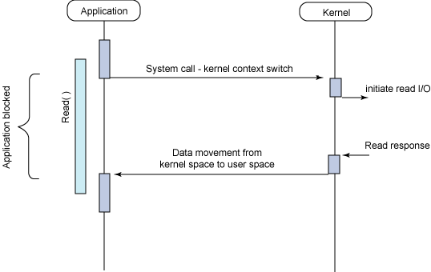
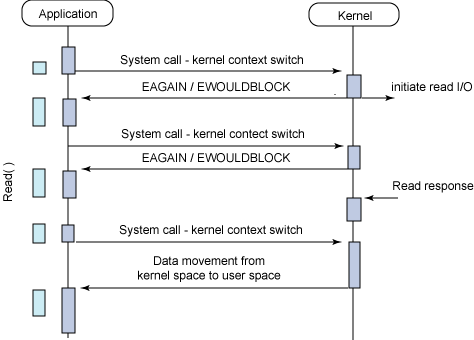

# 운영체제

## 1. 시스템 콜이 무엇인지 설명해 주세요.

### ⁃ 우리가 사용하는 시스템 콜의 예시를 들어주세요.
### ⁃ 시스템 콜이, 운영체제에서 어떤 과정으로 실행되는지 설명해 주세요.
### ⁃ 시스템 콜의 유형에 대해 설명해 주세요.
### ⁃ 운영체제의 Dual Mode 에 대해 설명해 주세요.
### ⁃ 왜 유저모드와 커널모드를 구분해야 하나요? 
### ⁃ 서로 다른 시스템 콜을 어떻게 구분할 수 있을까요?

## 2. 인터럽트가 무엇인지 설명해 주세요. 
### ⁃ 인터럽트는 어떻게 처리하나요?
### ⁃ Polling 방식에 대해 설명해 주세요.
### ⁃ HW / SW 인터럽트에 대해 설명해 주세요.
### ⁃ 동시에 두 개 이상의 인터럽트가 발생하면, 어떻게 처리해야 하나요?

## 3. 프로세스가 무엇인가요?
### ⁃ 프로그램과 프로세스, 스레드의 차이에 대해 설명해 주세요.
### ⁃ PCB가 무엇인가요?
### ⁃ 그렇다면, 스레드는 PCB를 갖고 있을까요?
### ⁃ 리눅스에서, 프로세스와 스레드는 각각 어떻게 생성될까요?
### ⁃ 자식 프로세스가 상태를 알리지 않고 죽거나, 부모 프로세스가 먼저 죽게 되면 어떻게 처리하나요?
### ⁃ 리눅스에서, 데몬프로세스에 대해 설명해 주세요.
### ⁃ 리눅스는 프로세스가 일종의 트리를 형성하고 있습니다. 이 트리의 루트 노드에 위치하는 프로세스에 대해 설명해 주세요.

## 4. 프로세스 주소공간에 대해 설명해 주세요.
### ⁃ 초기화 하지 않은 변수들은 어디에 저장될까요?
### ⁃ 일반적인 주소공간 그림처럼, Stack과 Heap의 크기는 매우 크다고 할 수 있을까요? 그렇지 않다면, 그 크기는 언제 결정될까요?
### ⁃ Stack과 Heap 공간에 대해, 접근 속도가 더 빠른 공간은 어디일까요?
### ⁃ 다음과 같이 공간을 분할하는 이유가 있을까요?
### ⁃ 스레드의 주소공간은 어떻게 구성되어 있을까요?
### ⁃ "스택"영역과 "힙"영역은 정말 자료구조의 스택/힙과 연관이 있는 걸까요? 만약 그렇다면, 각 주소공간의 동작과정과 연계해서 설명해 주세요.
### ⁃ IPC의 Shared Memory 기법은 프로세스 주소공간의 어디에 들어가나요? 그런 이유가 있을까요?
### ⁃ 스택과 힙영역의 크기는 언제 결정되나요? 프로그램 개발자가 아닌, 사용자가 이 공간의 크기를 수정할 수 있나요? 

## 5. 단기, 중기, 장기 스케쥴러에 대해 설명해 주세요.
### ⁃ 현대 OS에는 단기, 중기, 장기 스케쥴러를 모두 사용하고 있나요?
### ⁃ 프로세스의 스케쥴링 상태에 대해 설명해 주세요.
### ⁃ preemptive/non-preemptive 에서 존재할 수 없는 상태가 있을까요?
### ⁃ Memory가 부족할 경우, Process는 어떠한 상태로 변화할까요?

## 6. 컨텍스트 스위칭 시에는 어떤 일들이 일어나나요?
### ⁃ 프로세스와 스레드는 컨텍스트 스위칭이 발생했을 때 어떤 차이가 있을까요?
### ⁃ 컨텍스트 스위칭이 발생할 때, 기존의 프로세스 정보는 커널스택에 어떠한 형식으로 저장되나요?
### ⁃ 컨텍스트 스위칭은 언제 일어날까요?

## 7. 프로세스 스케줄링 알고리즘에는 어떤 것들이 있나요?
### ⁃ RR을 사용할 때, Time Slice에 따른 trade-off를 설명해 주세요.
### ⁃ 싱글 스레드 CPU 에서 상시로 돌아가야 하는 프로세스가 있다면, 어떤 스케쥴링 알고리즘을 사용하는 것이 좋을까요? 또 왜 그럴까요?
### ⁃ 동시성과 병렬성의 차이에 대해 설명해 주세요.
### ⁃ 타 스케쥴러와 비교하여, Multi-level Feedback Queue는 어떤 문제점들을 해결한다고 볼 수 있을까요?
### ⁃ FIFO 스케쥴러는 정말 쓸모가 없는 친구일까요? 어떤 시나리오에 사용하면 좋을까요? 
### ⁃ 우리는 스케줄링 알고리즘을 "프로세스" 스케줄링 알고리즘이라고 부릅니다. 스레드는 다른 방식으로 스케줄링을 하나요?
### ⁃ 유저 스레드와 커널 스레드의 스케쥴링 알고리즘은 똑같을까요?

## 8. 뮤텍스와 세마포어의 차이점은 무엇인가요?
### ⁃ 이진 세마포어와 뮤텍스의 차이에 대해 설명해 주세요.
### ⁃ Lock을 얻기 위해 대기하는 프로세스들은 Spin Lock 기법을 사용할 수 있습니다. 이 방법의 장단점은 무엇인가요? 단점을 해결할 방법은 없을까요? 
### ⁃ 뮤텍스와 세마포어 모두 커널이 관리하기 때문에, Lock을 얻고 방출하는 과정에서 시스템 콜을 호출해야 합니다. 이 방법의 장단점이 있을까요? 단점을 해결할 수 있는 방법은 없을까요?

## 9. Deadlock 에 대해 설명해 주세요.
### ⁃ Deadlock 이 동작하기 위한 4가지 조건에 대해 설명해 주세요.
### ⁃ 그렇다면 3가지만 충족하면 왜 Deadlock 이 발생하지 않을까요?
### ⁃ 어떤 방식으로 예방할 수 있을까요?
### ⁃ 왜 현대 OS는 Deadlock을 처리하지 않을까요?
### ⁃ Wait Free와 Lock Free를 비교해 주세요.

## 10. 프로그램이 컴파일 되어, 실행되는 과정을 간략하게 설명해 주세요.
### ⁃ 링커와, 로더의 차이에 대해 설명해 주세요.
### ⁃ 컴파일 언어와 인터프리터 언어의 차이에 대해 설명해 주세요.
### ⁃ JIT에 대해 설명해 주세요.
### ⁃ 본인이 사용하는 언어는, 어떤식으로 컴파일 및 실행되는지 설명해 주세요.
### ⁃ Python 같은 언어는 CPython, Jython, PyPy등의 다양한 구현체가 있습니다. 각각은 어떤 차이가 있을까요? 또한, 실행되는 과정 또한 다를까요?
### ⁃ 우리는 흔히 fork(), exec() 시스템 콜을 사용하여 프로세스를 적재할 수 있다고 배웠습니다. 로더의 역할은 이 시스템 콜과 상관있는 걸까요? 아니면 다른 방식으로 프로세스를 적재할 수 있는 건가요?

## 11. IPC가 무엇이고, 어떤 종류가 있는지 설명해 주세요.
### ⁃ Shared Memory가 무엇이며, 사용할 때 유의해야 할 점에 대해 설명해 주세요.
### ⁃ 메시지 큐는 단방향이라고 할 수 있나요?

## 12. Thread Safe 하다는 것은 어떤 의미인가요?
### ⁃ Thread Safe 를 보장하기 위해 어떤 방법을 사용할 수 있나요?
### ⁃ Peterson's Algorithm 이 무엇이며, 한계점에 대해 설명해 주세요.
### ⁃ Race Condition 이 무엇인가요?
### ⁃ Thread Safe를 구현하기 위해 반드시 락을 사용해야 할까요? 그렇지 않다면, 어떤 다른 방법이 있을까요?

## 13. Thread Pool, Monitor, Fork-Join에 대해 설명해 주세요.
### ⁃ Thread Pool을 사용한다고 가정하면, 어떤 기준으로 스레드의 수를 결정할 것인가요? 
### ⁃ 어떤 데이터를 정렬 하려고 합니다. 어떤 방식의 전략을 사용하는 것이 가장 안전하면서도 좋은 성능을 낼 수 있을까요?

## 14. 캐시 메모리 및 메모리 계층성에 대해 설명해 주세요.
### ⁃ 캐시 메모리는 어디에 위치해 있나요?
### ⁃ L1, L2 캐시에 대해 설명해 주세요.
### ⁃ 캐시에 올라오는 데이터는 어떻게 관리되나요?
### ⁃ 캐시간의 동기화는 어떻게 이루어지나요?
### ⁃ 캐시 메모리의 Mapping 방식에 대해 설명해 주세요.
### ⁃ 캐시의 지역성에 대해 설명해 주세요.
### ⁃ 캐시의 지역성을 기반으로, 이차원 배열을 가로/세로로 탐색했을 때의 성능 차이에 대해 설명해 주세요.
### ⁃ 캐시의 공간 지역성은 어떻게 구현될 수 있을까요? (힌트: 캐시는 어떤 단위로 저장되고 관리될까요?) 

## 15.메모리의 연속할당 방식 세 가지를 설명해주세요. (first-fit, best-fit, worst-fit)
### ⁃ worst-fit 은 언제 사용할 수 있을까요?
### ⁃ 성능이 가장 좋은 알고리즘은 무엇일까요?

## 16. Thrashing 이란 무엇인가요?
페이지 교체 알고리즘이 비효율적이거나 프로세스에 할당된 프레임 수가 너무 적은 경우 페이지 폴트가 과도하게 자주 발생하는데,
CPU가 프로세스를 처리하는 시간보다 페이지 교체에 소요하는 시간이 더 길어져 성능이 저하되는 현상을 Thrashing이라고 부른다.
#### 요구 페이징
프로세스를 메모리에 적재할 때 필요한 페이지(실행에 요구되는 페이지)만을 메모리에 적재하는 기법     
필요한 부분만 적재해 사용하기 떄문에 메모리 사용량이 감소하며, 실제 물리적 메모리의 용량보다 더 큰 프로그램도 실행 가능해짐 (나머지는 디스크의 swap 영역에 존재)     
#### Thrashing이 발생하는 근본적 원인
프로세스가 필요로 하는 최소한의 프레임 수가 보장되지 않음 → 페이지 폴트율 급증 + 잦은 교체 → Thrashing
#### 멀티 프로그래밍의 정도
멀티프로그래밍의 정도 (MPD ; Multiprogramming-degree) 가 높으면 CPU에서 동시에 많은 프로세스가 실행 중이라는 뜻인데, MPD가 높다고 해서 CPU 이용률이 무조건 높은 것은 아님.      
CPU에 동시에 많은 프로세스가 올라올 경우 하나의 프로세스가 사용할 수 있는 프레임 수가 적어지기 때문에 페이지 폴트가 빈번히 발생하고, 스레싱 발생
### ⁃ Thrashing 발생 시, 어떻게 완화할 수 있을까요?
- Load Shedding : 요청 일부를 거절하거나 프로세스를 일시 중단하거나 우선순위가 낮은 작업을 제거하는 등 일부 작업을 중단하거나 거절해서 부하를 감축하는 행위
- 효율적인 페이지 교체 알고리즘 사용 
- 멀티 프로그래밍 정도를 낮춘다. → 한번에 실행되는 프로세스의 수를 줄임으로써 각 프로세스들이 적절한 페이지 프레임을 할당받을 수 있도록 함
- 워킹셋 (Working Set) 기반 프레임 할당 방식 이용 → 자주 참조되는 워킹셋을 주기억장치에 상주시킴으로써 페이지 부재 및 교체 빈도를 줄임     
    > ##### 워킹셋이란? 
    > 프로세스가 일정 시간동안 자주 참조하는 페이지들의 집합     
    > 프로그램의 로컬리티 특징을 이용     
    > 워킹셋을 구하기 위해서는 `(시간에 따라) 프로세스가 참조한 페이지`와 `일정 시간 간격 (윈도우)`이 필요 
    > ##### 참조지역성의 원리 (Locality of Reference) 
    > 프로그램이 메모리에 접근하는 패턴에서 일정한 규칙이 존재함     
    > - 공간 지역성 : 한번 참조된 데이터 근처의 데이터도 참조될 가능성이 높음
    > - 시간 지역성 : CPU는 최근에 접근한 데이터를 가까운 시점에 다시 접근할 가능성이 높음
    > - 순차 지역성 : 데이터가 순차적으로 접근되는 경향으로, 공간 지역성의 형태 중 하나로 설명되기도 함
- PFF (Page Fault Frequency) 기반 프레임 할당 방식 이용 
    > ##### PFF 기반 프레임 할당 방식 
    > 운영체제가 프로세스의 페이지 폴트 빈도를 기준으로 동적으로 프레임 수를 조절 → 페이지 폴트율의 상한선과 하한선 이용
    > - PFF > 상한선 = 페이지 폴트율이 높다 → 해당 프로세스가 너무 적은 프레임을 할당 받았다 → 프레임 추가 할당 
    > - PFF < 하한선 = 페이지 폴트율이 작다 → 프로세스가 너무 많은 프레임을 할당 받았다 → 프레임 회수

## 17. 가상 메모리란 무엇인가요?
운영체제가 제공하는 메모리 관리 기법 중 하나로, 프로세스마다 독립적인 주소 공간을 제공함으로써 실제 물리적인 메모리 크기보다 더 큰 프로세스를 수행할 수 있게 하는 기술.     
프로세스는 0번지부터 시작하는 본인만의 주소 공간을 가질 수 있는데, 이를 가상 메모리라고 한다. → 여러 프로세스가 동시에 실행되어도 서로 간의 메모리 충돌을 방지할 수 있음     
프로세스는 자신의 주소 공간이 아닌 다른 프로세스의 메모리에 접근 불가하다.     
### ⁃ 가상 메모리가 가능한 이유가 무엇일까요?
가상 메모리 관리 기법에는 페이징과 세그멘테이션이 존재     
#### 페이징
프로세스의 논리 주소 공간을 페이지라는 일정한 단위로 자르고, 메모리의 물리 주소 공간을 프레임이라는 (페이지와 동일한 크기의) 일정한 단위로 자른 후 페이지를 프레임에 할당하는 기법     
각기 다른 프로세스의 페이지들을 메모리에 불연속적으로 적재 가능 → 연속 메모리 할당 방식의 외부 단편화 문제 해결 가능     
페이징 사용 시 프로세스 단위가 아닌 페이지 단위로 swap-in/out 이 가능하기 때문에 프로세스를 이루는 페이지 중 실행에 필요한 일부 페이지만 메모리에 적재하고, 당장 필요하지 않은 페이지들은 보조기억장치(disk)에 남겨둘 수 있음
#### 페이지 테이블
각 프로세스의 가상 주소와 실제 메모리의 물리 주소를 매핑해주는 테이블     
프로세스가 메모리(물리 주소)에 불연속적으로 적재되어 있기 때문에 CPU 입장에서 다음에 실행할 명령어의 위치를 찾기 어려움 → 페이지 테이블을 이용해 CPU 입장에서 바라보는 논리 주소가 연속적으로 보이도록 함
##### 페이지 테이블 엔트리
| 비트         | 설명 |
|--------------|------|
| 유효/무효 비트 | Invalid = 사용되지 않는 주소 영역임 / 해당 페이지가 물리적 메모리에 없음 |
| 보호 비트     | 페이지 보호를 위해 존재하는 비트로, 해당 페이지에 대한 rwx 권한을 나타냄 |
| 참조 비트     | 적재 이후 CPU가 해당 페이지에 접근한 적 있는지를 나타냄 |
| 수정 비트     | 해당 페이지에 대한 쓰기 작업을 수행한 적 있는지를 나타냄 → 수정한 적 있다면 해당 페이지가 swap-out 될 때 변경된 값을 보조 기억 장치에 기록하는 작업이 추가되어야 함 |

### ⁃ Page Fault가 발생했을 때, 어떻게 처리하는지 설명해 주세요.
1. Invalid Page 접근시 MMU가 page fault trap 발생시킴     
2. CPU 제어권이 kernel mode로 전환 → 페이지 부재 처리 루틴이 호출되어 페이지 부재를 처리     
3-1. 해당 페이지에 대한 접근 자체가 Invalid 할 경우 (bad address or protection violation : ex. 읽기만 가능한 페이지에 쓰기 작업 수행), 프로세스를 중단시킴     
3-2. 비어있는 프레임을 읽어온다 (없으면 swap-out 을 통해 뺏어온다.)      
3-3. 해당 페이지를 디스크로부터 swap-in → disk I/O가 끝날 때까지 해당 프로세스는 CPU를 preempt 당함 (block) → I/O 작업이 끝나면 페이지 테이블 엔트리 기록 (유효/무효 비트 갱신) → block 상태였던 프로세스를 ready queue로 이동시킴
> #### Page Fault
> Address Translation 시 해당 페이지가 Invalid 할 경우 페이지 부재(Page Fault)라는 예외 발생
### ⁃ 페이지 크기에 대한 Trade-Off를 설명해 주세요.
- 페이지 크기가 너무 클 경우 
    - 내부 단편화 크기 증가 (-) → 마지막 페이지에 사용하지 않는 공간이 커질 수 있음
    - 페이지 테이블 크기 감소 (+) → 페이지 개수가 줄어들어 관리 부담 완화 
- 페이지 크기가 너무 작을 경우 
    - 내부 단편화 크기 감소 (+) → 내부 단편화는 하나의 페이지 크기보다 작은 크기로 발생하기 때문
    - 페이지 테이블 크기 증가 (-) → 메모리 오버헤드 증가
> #### 내부 단편화
> 페이징은 외부 단편화 문제는 해결 가능하지만 내부 단편화 문제를 야기할 수 있음     
> 모든 프로세스가 페이지 크기에 딱 맞게 잘리는 것은 아님 → 프로세스의 마지막 페이지에서 남는 공간이 생길 수 있음 → 이러한 메모리 낭비를 내부 단편화라고 부른다.
### ⁃ 페이지 크기가 커지면, 페이지 폴트가 더 많이 발생한다고 할 수 있나요?


- 페이지 크기를 점차 키울 때 → 일정 구간까지 페이지 폴트율 증가.
    - 한 페이지에 들어갈 수 있는 데이터 양이 증가 → 한 번의 페이지 적재로 더 많은 데이터를 가져올 수 있음.
    - 하지만 페이지 크기가 커질수록, 물리 메모리에 적재 가능한 페이지 수가 줄어듦.
    - 물리 메모리에 있는 “페이지의 종류”가 줄어들어, 워크셋(Working Set)을 다 담기 힘들어짐. 
- 페이지 크기가 매우 커졌을 때 → 페이지 폴트율이 다시 감소.
    - 한 페이지에 프로그램의 주요 데이터가 다 들어가는 경우 발생.
    - 공간 지역성 덕분에, 한 번 페이지를 읽으면 이후 접근하는 데이터가 이미 포함되어 있는 경우가 많음.

### ⁃ 세그멘테이션 방식을 사용하고 있다면, 가상 메모리를 사용할 수 없을까요?
#### 세그멘테이션
프로그램을 논리적으로 관련 있는 여러 세그먼트로 나누어 메모리를 할당하는 방식     
작게는 프로그램을 구성하는 함수, 크게는 프로그램 전체를 하나의 세그먼트로 정의 가능     
각 세그먼트 크기는 프로그램 구조마다 다름 (가변적) → 가변 분할 방식의 장단점을 가짐     
일반적으로는 code, data, stack 부분이 하나씩 세그먼트로 정의됨     
논리적 주소는 segment number 와 offset 으로 구성     
#### 세그멘테이션 테이블 엔트리
| 항목  | 설명 |
|-------|------|
| Base  | 세그먼트의 물리적 주소의 시작 주소 |
| Limit | 세그먼트의 길이 |

#### 주소 변환
CPU가 특정 주소에 접근 → 가상 주소의 세그먼트 번호 + 세그먼트 테이블을 통해 해당 세그먼트의 base 조회 → base + 가상 주소의 offset 을 통해 물리적 주소 계산 (offset 이 length 를 초과할 경우 예외 발생)
#### 세그멘테이션 - 페이지 혼용 기법
페이징 기법과 세그멘테이션 기법 각각의 장점을 취한 가상 메모리 관리 기법     
- 페이징 기법 : 메모리 관리가 수월한 반면 페이지 테이블의 크기가 큼
- 세그멘테이션 기법 : 테이블 크기를 작게 유지할 수 있는 반면 외부 단편화로 인해 메모리 관리가 어려움
     
아이디어 : 인접한 페이지는 동일한 접근 권한을 갖는 경우가 많음 → 페이지 테이블에서 모든 프레임 번호에 권한 비트를 넣는 것은 공간 낭비 → 권한 비트의 중복을 막기 위해 중간에 세그멘테이션 테이블 추가          
     

## 18. 세그멘테이션과 페이징의 차이점은 무엇인가요?
| 구분       | 페이징(고정 크기) | 세그멘테이션(가변 크기) |
|------------|-------------------|------------------------|
| 메모리 단위 | 페이지            | 세그먼트               |
| 나누는 기준 | 물리적 단위       | 논리적 단위            |
| 단편화 종류 | 내부 단편화 발생  | 외부 단편화 발생       |
| 메모리 관리 | 구조 단순/쉬움    | 구조 복잡/어려움       |

### ⁃ 페이지와 프레임의 차이에 대해 설명해 주세요.
- 페이지 : 가상 메모리에서 (고정 분할 방식을 이용해) 일정한 크기로 나눈 단위
- 프레임 : 물리 메모리에서 일정한 크기로 나눈 단위
### ⁃ 내부 단편화와, 외부 단편화에 대해 설명해 주세요.
- 외부 단편화 (External Fragmentation) : 프로세스 크기보다 분할의 크기가 작은 경우 발생 / 프로세스를 할당하기 어려울 정도의 작은 메모리 공간 및 분할로 인해 메모리가 낭비되는 현상
- 내부 단편화 (Internal Fragmentation) : 프로세스 크기보다 분할의 크기가 큰 경우 발생 / 하나의 분할 내에서 발생하는 사용되지 않는 메모리 공간
### ⁃ 페이지에서 실제 주소를 어떻게 가져올 수 있는지 설명해 주세요.
가상 주소 VA = (P, D) = (page number, offset) → 물리 주소 FA = (F, D) = (frame number, offset)          
CPU는 page number를 index로 갖는 페이지 테이블을 통해 해당 페이지가 할당된 프레임 번호를 얻음으로써 가상 주소를 물리 주소로 변환한다.     
참고로 페이지와 프레임을 동일 크기로 잘랐기 때문에 offset은 변함 없이 그대로이다. 
### ⁃ 어떤 주소공간이 있을 때, 이 공간이 수정 가능한지 확인할 수 있는 방법이 있나요?
페이지 테이블 엔트리 중 보호 비트가 존재하는데, 해당 값을 통해 확인 가능하다. 
### ⁃ 32비트에서, 페이지의 크기가 1kb 이라면 페이지 테이블의 최대 크기는 몇 개일까요?
32비트 주소공간에서 표현할 수 있는 주소는 2^32 = 4 * 2^30 ≅ 4GB      
페이지 하나의 크기가 1KB ≅ 2^10 bit 이므로 주소의 하위 10비트는 하나의 페이지 안에서의 offset을 표현해야함       
전체 주소 비트 32비트에서 offset이 차지하는 10비트를 제외한 나머지(22bit)이 페이지 번호를 표현      
페이지 개수 = 2^22 = 4 * 2^20 ≅ 4M 이므로 페이지 테이블 엔트리 하나당 4B를 차지한다고 가정하면 페이지 테이블의 크기는 16MB로 추정
### ⁃ 32비트 운영체제는 램을 최대 4G 까지 사용할 수 있습니다. 이 이유를 페이징과 연관 지어서 설명해 주세요.
32비트 주소 → 주소 공간 크기 = 2³² = 4GB     
가상 주소에서 페이지 번호 + 페이지 오프셋으로 주소 변환을 수행     
페이지 오프셋은 페이지 크기(예: 4KB → 12비트)로 결정되고, 나머지 상위 비트가 페이지 번호로 쓰임     
32비트 주소 체계에서는 표현할 수 있는 주소가 최대 4GB이므로, 물리 메모리를 아무리 많이 꽂아도 페이지 번호로 지정 가능한 범위는 4GB 한계
### ⁃ C/C++ 개발을 하게 되면 Segmentation Fault 라는 에러를 접할 수 있을텐데, 이 에러는 세그멘테이션/페이징과 어떤 관계가 있을까요? 
1.	할당받지 않은 페이지 접근 (페이지 테이블에 매핑 없음 → 페이지 폴트 발생 → OS가 비정상 접근으로 판단)     
2.	읽기 전용 페이지에 쓰기 시도 (페이지 테이블의 보호 비트 R/W = 0)

## 19. TLB (Translation Lookaside Buffer) 는 무엇인가요?
페이지 테이블의 캐시 메모리로, 페이지 테이블 내용의 일부를 저장한다.    
이때, 참조 지역성에 근거해 최근에 사용된 페이지 위주로 가져와 저장.     
CPU의 메모리 접근 횟수를 줄이기 위해 사용하며, 일반적으로 MMU 내에 존재한다.
### ⁃ TLB를 쓰면 왜 빨라지나요?
TLB Hit 가 일어날 시 (특정 프레임이 적재된 프레임 번호를 알아내기 위해) 메모리에 접근해 페이지 테이블을 참조하는 단계가 생략되고,     
메모리 접근 시간이 줄어들기 때문에 TLB를 사용하면 빨라진다 (메모리 접근 2번 → 1번)
#### TLB가 없을 때의 프로세스 A 실행 시나리오 
1. CPU가 프로세스 A 실행 시 PTBR은 프로세스A의 페이지 테이블 시작 주소를 가리킴
    > ##### 페이지 테이블 베이스 레지스터 (PTBR; Page Table Base Register)
    > 프로세스의 페이지 테이블들은 모두 메모리에 적재되어있음      
    > PTBR은 현재 실행 중인 프로세스의 페이지 테이블이 적재된 주소를 가리키는 레지스터
2. CPU 명령어 실행 → 가상 주소 발생
CPU는는 명령을 실행하다가 가상 주소 VA = (P, D) = (page number, offset) 를 통해 메모리에 접근하려고 함
3. MMU가 페이지 테이블 참조 (메모리 접근)
PTBR + (페이지 번호 p × 페이지 테이블 엔트리 크기) → 페이지 테이블 엔트리(PTE) 주소 계산 → PTE를 읽고 물리 주소 계산
4. 실제 메모리 접근
계산된 물리 주소를 통해 데이터를 읽거나 씀
#### TLB가 존재할 때의 프로세스 A 실행 시나리오 (TLB Hit)
1. CPU가 프로세스 A 실행 시 PTBR은 프로세스A의 페이지 테이블 시작 주소를 가리킴
2. CPU 명령어 실행 → 가상 주소 발생
3. TLB 확인
4. TLB Hit
해당 페이지가 적재된 프레임 번호를 바로 얻은 후 물리 주소를 계산함
5. 실제 메모리 접근
### ⁃ MMU가 무엇인가요?
메모리 관리 장치 (Memory Management Unit) : 논리 주소와 물리 주소 간의 변환을 수행하는 하드웨어 장치
### ⁃ TLB와 MMU는 어디에 위치해 있나요?
- MMU : 일반적으로 CPU 칩 내부 (= 메모리 접근 경로상 = CPU와 주소 버스 사이) 에 위치한다.
  - CPU의 주소 버스로 나가기 전 항상 MMU를 거치게 된다.
- TLB : 일반적으로 MMU 내부에 위치한다.
  - CPU에서 메모리에 접근할 때 먼저 TLB에서 해당 페이지 번호를 검색, Hit 시 바로 물리 주소 변환 수행
### ⁃ 코어가 여러개라면, TLB는 어떻게 동기화 할 수 있을까요? 
0. 멀티 코어 환경에서는 각 코어가 자체적인 TLB를 가짐
1. Core 0이 어떤 페이지 테이블 엔트리를 수정함.
2. Core 0이 **IPI(Inter-Processor Interrupt)**를 보내 다른 코어들에게 해당 TLB 엔트리를 무효화(Invalidate)하라고 알림.
3. 다른 코어들은 자기 TLB에서 해당 엔트리를 삭제하여, 이후 접근 시 페이지 테이블을 다시 참조하도록 함.
### ⁃ TLB 관점에서, Context Switching 발생 시 어떤 변화가 발생하는지 설명해 주세요.
- 일반적인 처리 방식 : TLB Flush
  - Context Switch 시, CPU는 TLB 엔트리를 모두 비움 (flush).
  - 이전 프로세스의 가상 주소가 새로운 프로세스의 페이지 테이블과 매핑이 다르기 때문에 잘못된 메모리 접근을 막기 위함.
  - 이후 메모리 접근 시 전부 Page Table을 메모리에서 찾아야 하므로 초기 성능 저하 발생. (-)
- 최적화 방법 : ASID(Address Space Identifier) 또는 PCID(Process-Context Identifier)
  - TLB 엔트리에 “이 매핑이 어떤 프로세스의 것인지”를 표시하는 태그를 둠.
  - Context Switching 시 TLB를 전부 비우지 않고, 해당 ASID/PCID 값만 바꿔 사용.
  - 다른 프로세스의 매핑과 구분 가능하므로 TLB Hit율 유지 (+)

## 20. 동기화를 구현하기 위한 하드웨어적인 해결 방법에 대해 설명해 주세요.
하드웨어는 원자적 연산을 제공함으로써 동기화 문제를 지원한다.   
> ##### 원자적 연산 (Atomic Operation)
> 여러 개의 스레드나 프로세스에서 동시에 공유자원에 접근할 때, 해당 변수를 수정하는 연산을 원자적으로 처리함.      
> 하나의 연산이 실행되는 도중에는 다른 연산이 해당 변수에 접근하지 못함을 이용
#### Interrupt Disabling
- Critical Section 에서 disable Interrupt 를 해서 race condition이 일어나지 않게 함
  > ##### Critical Section
  > 공유 자원 중에는 두 개 이상의 프로세스를 동시에 실행하면 문제가 발생하는 자원이 존재하는데,    
  > 이러한 자원에 접근하는 코드를 임계 구역(Critical Section)이라고 한다.    
  > 두 개 이상의 프로세스가 임계 구역에 진입하는 경우 둘 중 하나는 대기해야 한다.    
  > #### Race Condition
  > 잘못된 실행으로 인해 여러 프로세스가 동시에 임계구역의 코드를 실행하는 경우,    
  > 공유 자원에 대한 접근이 어떤 순서로 이루어졌는지에 따라 그 실행값이 달라지는 상황
- CPU가 1개일 때는 대부분 임계 구역의 값이 바뀌기 전 스케줄링이 일어나서 발생하기 때문에 이를 해결하기 위해 disable INT하는 것.
- 단일 CPU 환경에서만 문제를 해결 가능함. → 멀티 프로세서 환경에서는 disable INT를 한다고 다른 CPU에서 critical section에 들어가는 것을 막을 방법 X
#### Test-and-Set (TAS)
- 하드웨어가 지원하기 때문에 한 클럭에 원자적으로 실행되는 연산
- CPU가 하드웨어적으로 직접 실행하는, 하드웨어 수준의 동기화 명령어
  ```c
    boolean TestAndSet(boolean *target) {
    boolean old = *target;
    *target = true;
    return old;
  }
  ```
- 두 스레드가 동시에 락을 획득하는 경우는 없음 
- 스핀락 구현 시 자주 사용 → but 스핀락은 공정성을 보장하지 않음 (-)
#### Compare-and-Swap (CAS)
- 하드웨어가 지원하기 때문에 한 클럭에 원자적으로 실행되는 연산
- 여러 CPU 아키텍처에서 제공하는 원자적 연산으로, 다음 3가지 인자를 받음
  - `ptr` : 값을 바꾸고 싶은 대상의 주소
  - `expected` : 기대하는 기존 값
  - `new` : 바꾸고자 하는 새로운 값
- `*ptr == expected` 인 경우 값을 변경하고, 실제 값을 반환. 다르면 아무 연산하지 않고 기존 값 반환.
- 위 과정에 하드웨어 수준에서 원자적으로 보장되기 때문에 안전하게 사용 가능

### ⁃ volatile 키워드는 어떤 의미가 있나요?
변수 선언 시 앞에 `volatile` 키워드를 사용하면 컴파일러는 해당 변수를 최적화에서 제외하여      
해당 변수를 참조하는 경우 (레지스터에 로드된 값을 사용하지 않고) 항상 메모리를 참조하도록 함

### ⁃ 싱글코어가 아니라 멀티코어라면, 어떻게 동기화가 이뤄질까요?
싱글코어는 “인터럽트 비활성화”만으로도 임계 구역 보호가 가능했지만,    
멀티코어에서는 다른 코어에서도 동시에 접근할 수 있으므로 코어 간 동기화가 필요.   
- 원자적 연산 명령어
  - TAS, CAS 같은 하드웨어 수준의 원자 연산을 사용해 안전하게 Lock/UnLock 구현
- 캐시 일관성(Coherence) 프로토콜
  - 대표적으로 MESI 프로토콜을 사용 → 각 캐시 라인의 상태를 네가지(Modified/Exclusive/Shared/Invalid)로 구분
  - 한 코어가 캐시 값을 변경하면, 다른 코어의 캐시 라인 상태를 무효화(Invalidate) 하거나 업데이트.
  - 캐시 메모리의 일관성을 보장함
- 메모리 배리어 (Memory Barrier)
  - 멀티스레딩 프로그램에서 스레드 간의 연산 순서를 제어하는 데 사용되는 하위 수준의 동기화 메커니즘.
  - 메모리 배리어를 사용하면 특정 연산들이 지정된 순서를 따르도록 강제할 수 있으며, 컴파일러와 프로세스가 연산 순서를 임의로 변경하는 것을 방지 가능
  - 멀티코어 프로세서나 컴파일러는 성능 최적화를 위해 명령어 재배치를 할 수 있는데, 멀티 스레딩 환경에서 이는 (예상치 못한 순서로 메모리 값이 읽혀) race condition 문제나 메모리 가시성 문제를 야기할 수 있음 → 메모리 배리어가 이를 방지해줌
  - 특정 시점 전후로 메모리 접근 순서를 보장. → 멀티스레딩 프로그램의 정확성을 보장하는 중요한 도구

## 21. 페이지 교체 알고리즘에 대해 설명해 주세요.
요구 페이징 기법에서는 페이지 폴트가 발생하면, 실행에 필요한 페이지를 보조기억장치에서 메모리로 가져온다.      
이때 물리 메모리가 가득 차 있다면, 현재 메모리에 적재된 페이지 중 하나를 선택해 보조기억장치로 swap-out 시켜야 하는데,    
어떤 페이지를 내보낼지 결정하는 규칙이 페이지 교체 알고리즘이다.     
#### FIFO 
- 메모리에 먼저 적재된 페이지부터 교체하는 알고리즘
- 자주 참조되는 페이지가 먼저 쫓겨나는 문제 존재 → 이를 개선한 게 '2차 기회 페이지 교체 알고리즘' 
  - 페이지의 참조 비트를 이용
  - 기본적으로 FIFO 알고리즘을 따르되 내보낼 페이지의 참조 비트가 1일 경우 0으로 만들고 현재 시간을 적재 시간으로 설정
  - 참조 비트가 1인 경우 CPU가 접근한 적 있다는 의미이므로 기회를 한번 더 주는 것 
  - 메모리에 가장 오래 머문 페이지의 참조 비트가 0일 경우 swap-out
#### 최적 페이지 교체 알고리즘
- CPU에 의해 참조되는 횟수를 고려하는 알고리즘
- 가장 오랫동안 사용되지 않을 페이지를 교체해야하는데, 이를 예측하기는 어려우므로 실제로 구현이 어렵다.
- 주로 다른 페이지 교체 알고리즘의 성능을 평가하기 위한 목적으로 사용 
#### LRU (Least Recently Used)
- 가장 오랫동안 사용되지 않은 페이지를 교체하는 알고리즘
#### LFU (Least Frequently Used)
- 참조 횟수가 가장 낮은 페이지를 교체하는 알고리즘
### ⁃ LRU 알고리즘은 어떤 특성을 이용한 알고리즘이라고 할 수 있을까요?
시간지역성 : 최근에 사용된 페이지는 가까운 미래에 다시 사용될 가능성이 높음
### ⁃ LRU 알고리즘을 구현한다면, 어떻게 구현할 수 있을까요?
#### 애플리케이션 상에서의 구현 
```java
public class LRUCache {
    private final int capacity;
    private final Map cache;
    private final LinkedList order;

    public LRUCache(int capacity) {
        this.capacity = capacity;
        this.cache = new HashMap<>();
        this.order = new LinkedList<>();
    }

    public int get(int key) {
        if (!cache.containsKey(key)) {
            return -1;
        }
        order.remove((Integer) key);
        order.addFirst(key);
        return cache.get(key);
    }

    public void put(int key, int value) {
        if (cache.containsKey(key)) {
            order.remove((Integer) key);
        } else if (cache.size() == capacity) {
            int oldest = order.removeLast();
            cache.remove(oldest);
        }
        cache.put(key, value);
        order.addFirst(key);
    }
}
```
- HashMap : 데이터 저장 
- LinkedList : 데이터 접근 순서 관리. 데이터를 접근할 때마다 접근 순서 갱신

#### OS에서의 LRU (근사 LRU)
- 메모리 접근은 매 CPU 명령마다 일어나는데, 그때마다 커널이 LRU 리스트(접근 순서)를 갱신하면 오버헤드가 너무 큼.        
  대신 하드웨어가 PTE의 참조비트를 자동으로 설정해 주고, 커널은 그걸 이용해 LRU에 근사한 알고리즘을 구현한다.
  > ##### Clock 알고리즘 (=NRU; Not Recently Used = Second Chance Algorithm)
  > 페이지들을 원형 큐에 두고 포인터가 돌며 검사      
  > 포인터가 가리킨 페이지의 참조비트가	  
  > 1이면: 0으로 내리고 “두 번째 기회” 부여, 다음으로 이동      
  > 0이면: 교체(victim)
### ⁃ LRU 알고리즘의 단점을 설명해 주세요. 이를 해결할 수 있는 대안에 대해서도 설명해 주세요.
#### 단점
table full scan (테이블 탐색 시 index를 사용하지 않고 전체 스캔) 을 하게 되면 캐시가 풀 스캔 시 사용되는 데이터들로 채워짐        
→ LRU는 최근성만 보기 때문에 한번만 참조되는 데이터를 구분하지 못하고, 그 결과 스트림이 끝나면 hot 세트는 모두 사라져서 히트율이 붕괴됨
#### 해결할 수 있는 대안
`SLRU (Segmented LRU)` : LRU의 단점을 보완하기 위해 캐시를 두 개의 세그먼트로 나눠서 관리하는 페이지 교체 알고리즘     
**핵심 아이디어** : 한 번만 참조되는 데이터(Cold)와 자주 참조되는 데이터(Hot)를 분리
> 1. Probationary Segment (Cold 구역)      
>	새로 들어온 페이지가 먼저 여기에 들어감.     
>	여기서 한 번 참조되면 → 핫 구역으로 승급.     
>	재참조 없이 밀려나면 그대로 교체됨.     
>	목적: 한 번만 쓰이고 버려지는 데이터를 빠르게 제거.
> 2. Protected Segment (Hot 구역)      
>  Probationary에서 승급된 페이지들이 위치.     
>  자주 쓰이는 페이지는 여기에 오래 남아 히트율을 높임.     
>  용량이 꽉 차면 → LRU(가장 오래 안 쓰인 페이지)가 퇴출, Probationary로 내려갈 수도 있음.     

## 22. File Descriptor와, File System에 에 대해 설명해 주세요.
#### File Descriptor
- 리눅스 혹은 유닉스 계열의 OS에서 프로세스가 파일을 추상화하여 관리하기 위해 사용하는 정수 인덱스
- 각 프로세스는 커널에 의해 관리되는 파일 디스크립터 테이블을 가지며, FD는 이 테이블의 인덱스 역할을 함
- 일반적으로 0이 아닌 정수값을 가짐 (0 : 입력 / 1 : 출력 / 2 : 에러)
##### 동작 과정
1. 프로세스가 `open()` 같은 시스템 콜로 파일을 열면 커널은 프로세스의 파일 디스크립터 숫자 중 사용하지 않는 가장 작은 값을 할당해줌
2. 이후 해당 프로세스는 파일 디스크립터 번호를 이용해 read(), write() 등 시스템 콜로 열린 자원에 접근

#### File System
- 운영체제가 저장 장치(HDD, SSD 등)에 데이터를 조직적으로 저장하고, 관리하며, 접근할 수 있도록 하는 소프트웨어 계층
- 데이터의 저장 방식(파일과 디렉터리 구조), 공간 할당 방법, 파일 메타데이터 관리, 접근 권한 및 보안 정책 등을 정의
- EXT4, NTFS, FAT32, XFS 등

### ⁃ I-Node가 무엇인가요?
- I-Node는 유닉스 계열 파일 시스템에서 파일의 메타데이터를 저장하는 자료구조.      
- 파일의 크기, 소유자, 권한, 생성/수정 시각, 데이터가 저장된 물리적 위치 등을 포함.
- 파일 시스템 내에서 파일을 식별하는 역할을 함
- 파일 이름은 별도로 저장되며 아이노드 번호를 통해 참조됨

### ⁃ 프로그래밍 언어 상에서 제공하는 파일 관련 함수 (Python - open(), Java - BufferedReader/Writer 등)은, 파일을 어떤 방식으로 읽어들이나요?
#### 버퍼링(Buffering)
- Python open()이나 Java BufferedReader는 한 번에 블록 단위로 읽어서 메모리에 저장하고, 프로그램은 그 버퍼에서 데이터를 가져옴
- 디스크 접근 횟수를 줄여 성능 향상
#### 파일 디스크립터 기반
- 내부적으로는 FD를 통해 파일을 식별하고 읽음

## 23. 동기와 비동기, 블로킹과 논블로킹의 차이에 대해 설명해 주세요.
- 동기 : 작업을 요청하고 그 작업이 완료될 때까지 기다리는 방식. 작업의 처리 결과가 반환될 때까지 다음 작업을 수행할 수 X
- 비동기 : 작업을 요청한 후 결과와 상관없이 바로 다음 작업을 수행할 수 있는 방식. 
- 블로킹 : 호출된 함수가 자신의 작업을 모두 마칠 떄까지 호출한 함수에게 제어권 반환 X 호출한 함수는 결과가 반환될 때까지 다른 작업 수행 X
- 논블로킹 : 호출된 함수가 바로 제어권을 호출한 함수에게 반환. 작업의 완료 여부와 상관없이 호출한 함수는 본인 작업을 계속 수행
### ⁃ 그렇다면, 동기이면서 논블로킹이고, 비동기이면서 블로킹인 경우는 의미가 있다고 할 수 있나요?
#### 동기 + 논블로킹
동기 + 논블로킹이 동기 + 블로킹보다 효율적일 때가 존재함.          
동기 + 논블로킹의 경우 호출하는 함수가 제어권을 가지고 있어서 다른 작업을 병렬적으로 수행 가능하나 동기 + 블로킹의 경우 제어권을 잃어서 다른 작업을 병렬적으로 수행 불가능하기 때문.       
**게임 로딩 화면**이나 **파일 다운로드 진행바** 가 대표적인 예시인데, 호출하는 함수에게 제어권이 존재하기 때문에 화면에 로드율이 표시될 수 있는 것 + 데이터가 어느 정도 다운로드되었는지 끊임없이 조회 가능한 것
#### 비동기 + 블로킹
다른 프로세스를 호출하면 해당 프로세스가 완료될 때까지 제어권을 뺏기기 때문에 비동기인 의미가 없다.

### ⁃ I/O 멀티플렉싱에 대해 설명해 주세요.
일반적으로 I/O 작업은 커널 모드를 사용하기 때문에 커널 모드에서 입출력 작업을 다 처리할 때까지 Sync-Blocking 됨
> #### Blocking I/O 
> 
> 유저 프로세스가 커널에게 입출력 함수를 시스템콜 하면 커널에 I/O를 요청하게 되고,        
> 커널의 응답이 되돌아옴과 동시에 반환된 데이터가 유저 프로세스의 I/O 버퍼에 다 돌아올 때까지        
> 프로그램은 block되어 다른 작업을 수행하지 못한다.      
> I/O 요청이 적은 서비스엔 적합하지만 요청 수가 많아진다면 리소스 사용 효율이 떨어진다.
         
따라서 I/O 요청이 많아진다면 멀티 프로세스나 멀티 스레드 등을 이용한 처리 방식을 고려 가능하지만     
커널 모드 진입 시 스레드가 block된다는 근본적인 문제를 해결할 수 없다. 
> #### 멀티 프로세스
> - 하나의 프로그램을 여러 개의 독립된 프로세스로 나누어 실행하는 방식.   
> - 각 프로세스는 독립된 메모리 공간(Code/Data/Heap/Stack)을 가짐.
> - 컨텍스트 스위칭 오버헤드가 크고, 메모리 사용량이 많다. 
> #### 멀티 스레드
> - 하나의 프로세스 안에서 **여러 실행 흐름(스레드)**를 두는 방식.
> - 스레드들은 Code, Data, Heap을 공유하지만 Stack은 독립적으로 가짐.
> - 메모리를 효율적으로 사용 가능하며, 스레드 간 통신이 빠르다.

#### I/O Multiplexing
- 하나의 스레드가 여러 입출력 관련 파일을 관리하는 방식 → I/O를 담당하는 스레드 자체는 동기적으로 커널 호출을 기다리지만, 프로그램 입장에서는 I/O 스레드 하나가 커널에서 대기하는 동안 다른 스레드는 다른 작업을 수행할 수 있음
- 비동기적인 I/O 처리 + 이벤트 루프의 결합
  > #### Non Blocking I/O
  > 
  > I/O 작업이 진행되는 동안 유저 프로세스의 작업을 중단하지 않고 다른 일을 수행할 수 있게 하는 방식.     
  > 유저 프로세스가 입출력 함수를 시스템 콜하면       
  > 커널이 CPU 제어권을 바로 반환하기 때문에 프로세스가 다른 작업을 수행할 수 있다.
- 멀티 스레드보다 훨씬 적은 리소스를 사용하면서 더 높은 처리량과 성능 제공

##### 동작 과정
1.	FD 등록
- 서버 소켓과 클라이언트 소켓의 FD를 select/poll/epoll_ctl로 커널에 등록
- 각 FD별로 관심 이벤트 지정 (예: EPOLLIN = 읽기 가능, EPOLLOUT = 쓰기 가능)
2.	대기 (Blocking)
- 프로그램은 select / poll / epoll_wait를 호출하고 이벤트 발생까지 대기
- 이때, CPU는 놀지 않고 다른 스레드나 다른 프로세스에 사용됨
- 커널은 각 FD를 모니터링하면서 이벤트 발생 여부를 체크
3.	이벤트 발생 감지
- 예: 클라이언트가 데이터 전송 → 해당 소켓 FD의 상태가 “읽기 가능”으로 변경
- 커널은 이 상태를 준비 완료(ready) 로 표시
4.	준비된 FD 반환
- 커널은 준비된 FD 목록을 사용자 프로그램에 반환
- select/poll은 전체 FD 목록을 보고 직접 검사해야 함
- epoll은 준비된 FD만 반환 → 순회 부담이 훨씬 적음
5.	I/O 처리
- 프로그램은 준비된 FD에 대해서만 read() / write() 호출
- 나머지는 그대로 대기 상태로 유지
6.	반복
- 처리 후 다시 커널에 감시 요청
- 이 과정이 이벤트 루프로 반복됨

### ⁃ 논블로킹 I/O를 수행한다고 하면, 그 결과를 어떻게 수신할 수 있나요? 
#### 폴링 (Polling)
- I/O 호출 후 일정 주기마다 read(), recv(), write() 같은 함수를 다시 호출해 데이터 준비 여부를 확인
- 구현이 단순하지만 불필요한 호출이 발생
#### 이벤트 통지
- select(), poll(), epoll 같은 I/O 멀티플렉싱 API를 사용해, 파일 디스크립터(FD)에 이벤트가 발생했을 때만 알려줌
#### 콜백 기반
- 비동기 프레임워크(예: Node.js, Netty)에서는 I/O 요청 시 콜백 함수를 등록하고, 데이터가 준비되면 해당 콜백이 호출됨