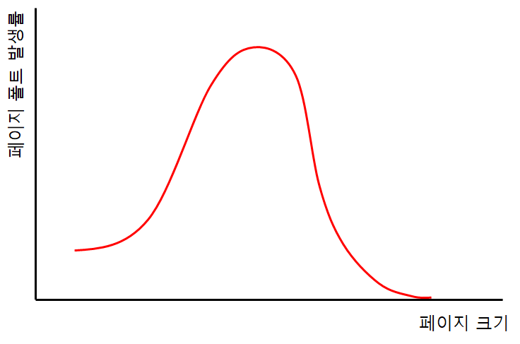
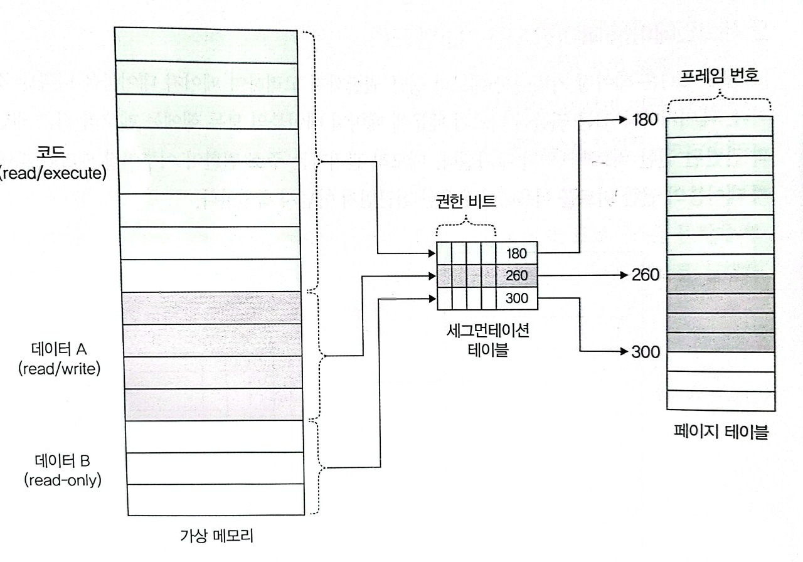

## 운영체제

  
<h3>1. 시스템 콜이 무엇인지 설명해 주세요.</h3>

<ul>
<li> 우리가 사용하는 시스템 콜의 예시를 들어주세요.</li>
<li> 시스템 콜이, 운영체제에서 어떤 과정으로 실행되는지 설명해 주세요.</li>
<li> 시스템 콜의 유형에 대해 설명해 주세요.</li>
<li> 운영체제의 Dual Mode 에 대해 설명해 주세요.</li>
<li> 왜 유저모드와 커널모드를 구분해야 하나요? </li>
<li> 서로 다른 시스템 콜을 어떻게 구분할 수 있을까요?</li>
</ul>

  
<h3>2. 인터럽트가 무엇인지 설명해 주세요.</h3>

<ul>
<li> 인터럽트는 어떻게 처리하나요?</li>
<li> Polling 방식에 대해 설명해 주세요.</li>
<li> HW / SW 인터럽트에 대해 설명해 주세요.</li>
<li> 동시에 두 개 이상의 인터럽트가 발생하면, 어떻게 처리해야 하나요? </li>
</ul>

  
<h3>3. 프로세스가 무엇인가요?</h3>

<ul>
<li> 프로그램과 프로세스, 스레드의 차이에 대해 설명해 주세요.</li>
<li> PCB가 무엇인가요?</li>
<li> 그렇다면, 스레드는 PCB를 갖고 있을까요?</li>
<li> 리눅스에서, 프로세스와 스레드는 각각 어떻게 생성될까요?</li>
<li> 자식 프로세스가 상태를 알리지 않고 죽거나, 부모 프로세스가 먼저 죽게 되면 어떻게 처리하나요?</li>
<li> 리눅스에서, 데몬프로세스에 대해 설명해 주세요.</li>
<li> 리눅스는 프로세스가 일종의 트리를 형성하고 있습니다. 이 트리의 루트 노드에 위치하는 프로세스에 대해 설명해 주세요.</li>
</ul>

  
<h3>4. 프로세스 주소공간에 대해 설명해 주세요.</h3>

<ul>
<li> 초기화 하지 않은 변수들은 어디에 저장될까요?</li>
<li> 일반적인 주소공간 그림처럼, Stack과 Heap의 크기는 매우 크다고 할 수 있을까요? 그렇지 않다면, 그 크기는 언제 결정될까요?</li>
<li> Stack과 Heap 공간에 대해, 접근 속도가 더 빠른 공간은 어디일까요?</li>
<li> 다음과 같이 공간을 분할하는 이유가 있을까요?</li>
<li> 스레드의 주소공간은 어떻게 구성되어 있을까요?</li>
<li> "스택"영역과 "힙"영역은 정말 자료구조의 스택/힙과 연관이 있는 걸까요? 만약 그렇다면, 각 주소공간의 동작과정과 연계해서 설명해 주세요.</li>
<li> IPC의 Shared Memory 기법은 프로세스 주소공간의 어디에 들어가나요? 그런 이유가 있을까요? </li>
<li> 스택과 힙영역의 크기는 언제 결정되나요? 프로그램 개발자가 아닌, 사용자가 이 공간의 크기를 수정할 수 있나요? </li>
</ul>

  
<h3>5. 단기, 중기, 장기 스케쥴러에 대해 설명해 주세요.</h3>

<ul>
<li> 현대 OS에는 단기, 중기, 장기 스케쥴러를 모두 사용하고 있나요?</li>
<li> 프로세스의 스케쥴링 상태에 대해 설명해 주세요.</li>
<li> preemptive/non-preemptive 에서 존재할 수 없는 상태가 있을까요?</li>
<li> Memory가 부족할 경우, Process는 어떠한 상태로 변화할까요?</li>
</ul>

  
<h3>6. 컨텍스트 스위칭 시에는 어떤 일들이 일어나나요?</h3>

<ul>
<li> 프로세스와 스레드는 컨텍스트 스위칭이 발생했을 때 어떤 차이가 있을까요?</li>
<li> 컨텍스트 스위칭이 발생할 때, 기존의 프로세스 정보는 커널스택에 어떠한 형식으로 저장되나요?</li>
<li> 컨텍스트 스위칭은 언제 일어날까요?</li>
</ul>

  
<h3>7. 프로세스 스케줄링 알고리즘에는 어떤 것들이 있나요?</h3>

<ul>
<li> RR을 사용할 때, Time Slice에 따른 trade-off를 설명해 주세요.</li>
<li> 싱글 스레드 CPU 에서 상시로 돌아가야 하는 프로세스가 있다면, 어떤 스케쥴링 알고리즘을 사용하는 것이 좋을까요? 또 왜 그럴까요?</li>
<li> 동시성과 병렬성의 차이에 대해 설명해 주세요.</li>
<li> 타 스케쥴러와 비교하여, Multi-level Feedback Queue는 어떤 문제점들을 해결한다고 볼 수 있을까요?</li>
<li> FIFO 스케쥴러는 정말 쓸모가 없는 친구일까요? 어떤 시나리오에 사용하면 좋을까요? </li>
<li> 우리는 스케줄링 알고리즘을 "프로세스" 스케줄링 알고리즘이라고 부릅니다. 스레드는 다른 방식으로 스케줄링을 하나요?</li>
<li> 유저 스레드와 커널 스레드의 스케쥴링 알고리즘은 똑같을까요?</li>
</ul>

  
<h3>8. 뮤텍스와 세마포어의 차이점은 무엇인가요?</h3>

<ul>
<li> 이진 세마포어와 뮤텍스의 차이에 대해 설명해 주세요.</li>
<li> Lock을 얻기 위해 대기하는 프로세스들은 Spin Lock 기법을 사용할 수 있습니다. 이 방법의 장단점은 무엇인가요? 단점을 해결할 방법은 없을까요?</li> 
<li> 뮤텍스와 세마포어 모두 커널이 관리하기 때문에, Lock을 얻고 방출하는 과정에서 시스템 콜을 호출해야 합니다. 이 방법의 장단점이 있을까요? 단점을 해결할 수 있는 방법은 없을까요?</li>
</ul>

  
<h3>9. Deadlock 에 대해 설명해 주세요.</h3>

<ul>
<li> Deadlock 이 동작하기 위한 4가지 조건에 대해 설명해 주세요.</li>
<li> 그렇다면 3가지만 충족하면 왜 Deadlock 이 발생하지 않을까요?</li>
<li> 어떤 방식으로 예방할 수 있을까요?</li>
<li> 왜 현대 OS는 Deadlock을 처리하지 않을까요?</li>
<li> Wait Free와 Lock Free를 비교해 주세요.</li>
</ul>

  
<h3>10. 프로그램이 컴파일 되어, 실행되는 과정을 간략하게 설명해 주세요.</h3>

<ul>
<li> 링커와, 로더의 차이에 대해 설명해 주세요.</li>
<li> 컴파일 언어와 인터프리터 언어의 차이에 대해 설명해 주세요.</li>
<li> JIT에 대해 설명해 주세요.</li>
<li> 본인이 사용하는 언어는, 어떤식으로 컴파일 및 실행되는지 설명해 주세요.</li>
<li> Python 같은 언어는 CPython, Jython, PyPy등의 다양한 구현체가 있습니다. 각각은 어떤 차이가 있을까요? 또한, 실행되는 과정 또한 다를까요?</li>
<li> 우리는 흔히 fork(), exec() 시스템 콜을 사용하여 프로세스를 적재할 수 있다고 배웠습니다. 로더의 역할은 이 시스템 콜과 상관있는 걸까요? 아니면 다른 방식으로 프로세스를 적재할 수 있는 건가요?</li>
</ul>

  
<h3>11. IPC가 무엇이고, 어떤 종류가 있는지 설명해 주세요.</h3>

<ul>
<li> Shared Memory가 무엇이며, 사용할 때 유의해야 할 점에 대해 설명해 주세요.</li>
<li> 메시지 큐는 단방향이라고 할 수 있나요?</li>
</ul>

  
<h3>12. Thread Safe 하다는 것은 어떤 의미인가요?</h3>

<ul>
<li> Thread Safe 를 보장하기 위해 어떤 방법을 사용할 수 있나요?</li>
<li> Peterson's Algorithm 이 무엇이며, 한계점에 대해 설명해 주세요.</li>
<li> Race Condition 이 무엇인가요?</li>
<li> Thread Safe를 구현하기 위해 반드시 락을 사용해야 할까요? 그렇지 않다면, 어떤 다른 방법이 있을까요?</li>
</ul>

  
<h3>13. Thread Pool, Monitor, Fork-Join에 대해 설명해 주세요.</h3>

<ul>
<li> Thread Pool을 사용한다고 가정하면, 어떤 기준으로 스레드의 수를 결정할 것인가요? </li>
<li> 어떤 데이터를 정렬 하려고 합니다. 어떤 방식의 전략을 사용하는 것이 가장 안전하면서도 좋은 성능을 낼 수 있을까요?</li>
</ul>

  
<h3>14. 캐시 메모리 및 메모리 계층성에 대해 설명해 주세요.</h3>

<ul>
<li> 캐시 메모리는 어디에 위치해 있나요?</li>
<li> L1, L2 캐시에 대해 설명해 주세요.</li>
<li> 캐시에 올라오는 데이터는 어떻게 관리되나요?</li>
<li> 캐시간의 동기화는 어떻게 이루어지나요?</li>
<li> 캐시 메모리의 Mapping 방식에 대해 설명해 주세요.</li>
<li> 캐시의 지역성에 대해 설명해 주세요.</li>
<li> 캐시의 지역성을 기반으로, 이차원 배열을 가로/세로로 탐색했을 때의 성능 차이에 대해 설명해 주세요.</li>
<li> 캐시의 공간 지역성은 어떻게 구현될 수 있을까요? (힌트: 캐시는 어떤 단위로 저장되고 관리될까요?) </li>
</ul>

  
<h3>15.메모리의 연속할당 방식 세 가지를 설명해주세요. (first-fit, best-fit, worst-fit)</h3>

<ul>
<li> worst-fit 은 언제 사용할 수 있을까요?</li>
<li> 성능이 가장 좋은 알고리즘은 무엇일까요?</li>
</ul>

  
<h3>16. Thrashing 이란 무엇인가요?</h3>

페이지 교체 알고리즘이 비효율적이거나 프로세스에 할당된 프레임 수가 너무 적은 경우 페이지 폴트가 과도하게 자주 발생하는데,
CPU가 프로세스를 처리하는 시간보다 페이지 교체에 소요하는 시간이 더 길어져 성능이 저하되는 현상을 Thrashing이라고 부른다.
<h4>요구 페이징</h4>
프로세스를 메모리에 적재할 때 필요한 페이지(실행에 요구되는 페이지)만을 메모리에 적재하는 기법 
필요한 부분만 적재해 사용하기 떄문에 메모리 사용량이 감소하며, 실제 물리적 메모리의 용량보다 더 큰 프로그램도 실행 가능해짐 (나머지는 디스크의 swap 영역에 존재) 
<h4>Thrashing이 발생하는 근본적 원인</h4>
프로세스가 필요로 하는 최소한의 프레임 수가 보장되지 않음 → 페이지 폴트율 급증 + 잦은 교체 → Thrashing
<h4>멀티 프로그래밍의 정도</h4>
멀티프로그래밍의 정도 (MPD ; Multiprogramming-degree) 가 높으면 CPU에서 동시에 많은 프로세스가 실행 중이라는 뜻인데, MPD가 높다고 해서 CPU 이용률이 무조건 높은 것은 아님.  
CPU에 동시에 많은 프로세스가 올라올 경우 하나의 프로세스가 사용할 수 있는 프레임 수가 적어지기 때문에 페이지 폴트가 빈번히 발생하고, 스레싱 발생
<h3> Thrashing 발생 시, 어떻게 완화할 수 있을까요? </h3>
<ul>
<li> Load Shedding : 요청 일부를 거절하거나 프로세스를 일시 중단하거나 우선순위가 낮은 작업을 제거하는 등 일부 작업을 중단하거나 거절해서 부하를 감축하는 행위</li>
<li> 효율적인 페이지 교체 알고리즘 사용 </li>
<li> 멀티 프로그래밍 정도를 낮춘다. → 한번에 실행되는 프로세스의 수를 줄임으로써 각 프로세스들이 적절한 페이지 프레임을 할당받을 수 있도록 함</li>
<li> 워킹셋 (Working Set) 기반 프레임 할당 방식 이용 → 자주 참조되는 워킹셋을 주기억장치에 상주시킴으로써 페이지 부재 및 교체 빈도를 줄임 
<blockquote>
<h5> 워킹셋이란? </h5>
프로세스가 일정 시간동안 자주 참조하는 페이지들의 집합 
프로그램의 로컬리티 특징을 이용 
워킹셋을 구하기 위해서는 `(시간에 따라) 프로세스가 참조한 페이지`와 `일정 시간 간격 (윈도우)`이 필요 
<h5> 참조지역성의 원리 (Locality of Reference) </h5>
프로그램이 메모리에 접근하는 패턴에서 일정한 규칙이 존재함 
<ul>
<li>공간 지역성 : 한번 참조된 데이터 근처의 데이터도 참조될 가능성이 높음</li>
<li> 시간 지역성 : CPU는 최근에 접근한 데이터를 가까운 시점에 다시 접근할 가능성이 높음</li>
<li> 순차 지역성 : 데이터가 순차적으로 접근되는 경향으로, 공간 지역성의 형태 중 하나로 설명되기도 함</li>
</ul>
</blockquote></li>
<li> PFF (Page Fault Frequency) 기반 프레임 할당 방식 이용 
<blockquote>
<h5> PFF 기반 프레임 할당 방식 </h5>
운영체제가 프로세스의 페이지 폴트 빈도를 기준으로 동적으로 프레임 수를 조절 → 페이지 폴트율의 상한선과 하한선 이용
<ul>
<li>
PFF > 상한선 = 페이지 폴트율이 높다 → 해당 프로세스가 너무 적은 프레임을 할당 받았다 → 프레임 추가 할당 
</li>
<li>
PFF < 하한선 = 페이지 폴트율이 작다 → 프로세스가 너무 많은 프레임을 할당 받았다 → 프레임 회수
</li>
</ul>
</blockquote>
</li>
</ul>

<h3>17. 가상 메모리란 무엇인가요?</h3>

운영체제가 제공하는 메모리 관리 기법 중 하나로, 프로세스마다 독립적인 주소 공간을 제공함으로써 실제 물리적인 메모리 크기보다 더 큰 프로세스를 수행할 수 있게 하는 기술. 
프로세스는 0번지부터 시작하는 본인만의 주소 공간을 가질 수 있는데, 이를 가상 메모리라고 한다. → 여러 프로세스가 동시에 실행되어도 서로 간의 메모리 충돌을 방지할 수 있음 
프로세스는 자신의 주소 공간이 아닌 다른 프로세스의 메모리에 접근 불가하다. 
<h3> 가상 메모리가 가능한 이유가 무엇일까요?</h3>
가상 메모리 관리 기법에는 페이징과 세그멘테이션이 존재 
<h4>페이징</h4>
프로세스의 논리 주소 공간을 페이지라는 일정한 단위로 자르고, 메모리의 물리 주소 공간을 프레임이라는 (페이지와 동일한 크기의) 일정한 단위로 자른 후 페이지를 프레임에 할당하는 기법 
각기 다른 프로세스의 페이지들을 메모리에 불연속적으로 적재 가능 → 연속 메모리 할당 방식의 외부 단편화 문제 해결 가능 
페이징 사용 시 프로세스 단위가 아닌 페이지 단위로 swap-in/out 이 가능하기 때문에 프로세스를 이루는 페이지 중 실행에 필요한 일부 페이지만 메모리에 적재하고, 당장 필요하지 않은 페이지들은 보조기억장치(disk)에 남겨둘 수 있음
<h4>페이지 테이블</h4>
각 프로세스의 가상 주소와 실제 메모리의 물리 주소를 매핑해주는 테이블 
프로세스가 메모리(물리 주소)에 불연속적으로 적재되어 있기 때문에 CPU 입장에서 다음에 실행할 명령어의 위치를 찾기 어려움 → 페이지 테이블을 이용해 CPU 입장에서 바라보는 논리 주소가 연속적으로 보이도록 함
<h5>페이지 테이블 엔트리</h5>
<table>
<tr>
<td>유효/무효 비트</td>
<td>Invalid = 사용되지 않는 주소 영역임 / 해당 페이지가 물리적 메모리에 없음</td>
</tr>
<tr>
<td>
보호 비트
</td>
<td>
페이지 보호를 위해 존재하는 비트로, 해당 페이지에 대한 rwx 권한을 나타냄
</td>
</tr>
<tr>
<td>
참조 비트
</td>
<td>
적재 이후 CPU가 해당 페이지에 접근한 적 있는지를 나타냄
</td>
</tr>
<tr>
<td>
수정 비트
</td>
<td>
해당 페이지에 대한 쓰기 작업을 수행한 적 있는지를 나타냄 → 수정한 적 있다면 해당 페이지가 swap-out 될 떄 변경된 값을 보조 기억 장치에 기록하는 작업이 추가되어야 함
</td>
</tr>
</table>
<h3> Page Fault가 발생했을 때, 어떻게 처리하는지 설명해 주세요.</h3>
1. Invalid Page 접근시 MMU가 page fault trap 발생시킴 
2. CPU 제어권이 kernel mode로 전환 → 페이지 부재 처리 루틴이 호출되어 페이지 부재를 처리 
3-1. 해당 페이지에 대한 접근 자체가 Invalid 할 경우 (bad address or protection violation : ex. 읽기만 가능한 페이지에 쓰기 작업 수행), 프로세스를 중단시킴 
3-2. 비어있는 프레임을 읽어온다 (없으면 swap-out 을 통해 뺏어온다.)  
3-3. 해당 페이지를 디스크로부터 swap-in → disk I/O가 끝날 때까지 해당 프로세스는 CPU를 preempt 당함 (block) → I/O 작업이 끝나면 페이지 테이블 엔트리 기록 (유효/무효 비트 갱신) → block 상태였던 프로세스를 ready queue로 이동시킴
<blockquote>
<h4>Page Fault</h4>
Address Translation 시 해당 페이지가 Invalid 할 경우 페이지 부재(Page Fault)라는 예외 발생
</blockquote>
<h3> 페이지 크기에 대한 Trade-Off를 설명해 주세요.</h3>
<ul>
<li>
페이지 크기가 너무 클 경우 
    <ul>
    <li>
    내부 단편화 크기 증가 (-) → 마지막 페이지에 사용하지 않는 공간이 커질 수 있음
    </li>
    <li>
    페이지 테이블 크기 감소 (+) → 페이지 개수가 줄어들어 관리 부담 완화 
    </li>
    </ul>
</li>
<li>
페이지 크기가 너무 작을 경우 
    <ul>
    <li>
    내부 단편화 크기 감소 (+) → 내부 단편화는 하나의 페이지 크기보다 작은 크기로 발생하기 때문
    </li>
    <li>
    페이지 테이블 크기 증가 (-) → 메모리 오버헤드 증가
    </li>
    </ul>
</li>
</ul>
<blockquote>
<h4>내부 단편화</h4>
페이징은 외부 단편화 문제는 해결 가능하지만 내부 단편화 문제를 야기할 수 있음 
모든 프로세스가 페이지 크기에 딱 맞게 잘리는 것은 아님 → 프로세스의 마지막 페이지에서 남는 공간이 생길 수 있음 → 이러한 메모리 낭비를 내부 단편화라고 부른다.
</blockquote>
<h3> 페이지 크기가 커지면, 페이지 폴트가 더 많이 발생한다고 할 수 있나요?</h3>

(모르겠다)
locality 측면에서 페이지 크기가 클수록 좋다는데 ...
<h3> 세그멘테이션 방식을 사용하고 있다면, 가상 메모리를 사용할 수 없을까요?</h3>
<h4>세그멘테이션</h4>
프로그램을 논리적으로 관련 있는 여러 세그먼트로 나누어 메모리를 할당하는 방식 
작게는 프로그램을 구성하는 함수, 크게는 프로그램 전체를 하나의 세그먼트로 정의 가능 
각 세그먼트 크기는 프로그램 구조마다 다름 (가변적) → 가변 분할 방식의 장단점을 가짐 
일반적으로는 code, data, stack 부분이 하나씩 세그먼트로 정의됨 
논리적 주소는 segment number 와 offset 으로 구성 
<h4>세그멘테이션 테이블 엔트리</h4>
<table>
<tr>
<td>
Base
</td>
<td>
세그먼트의 물리적 주소의 시작 주소
</td>
</tr>
<tr>
<td>
Limit
</td>
<td>
세그먼트의 길이
</td>
</tr>
</table>
<h4>주소 변환</h4>
CPU가 특정 주소에 접근 → 가상 주소의 세그먼트 번호 + 세그먼트 테이블을 통해 해당 세그먼트의 base 조회 → base + 가상 주소의 offset 을 통해 물리적 주소 계산 (offset 이 length 를 초과할 경우 예외 발생)
<h4>세그멘테이션 - 페이지 혼용 기법</h4>
페이징 기법과 세그멘테이션 기법 각각의 장점을 취한 가상 메모리 관리 기법 
<ul>
<li>
페이징 기법 : 메모리 관리가 수월한 반면 페이지 테이블의 크기가 큼
</li>
<li>
세그멘테이션 기법 : 테이블 크기를 작게 유지할 수 있는 반면 외부 단편화로 인해 메모리 관리가 어려움
</li>
</ul>
 
아이디어 : 인접한 페이지는 동일한 접근 권한을 갖는 경우가 많음 → 페이지 테이블에서 모든 프레임 번호에 권한 비트를 넣는 것은 공간 낭비 → 권한 비트의 중복을 막기 위해 중간에 세그멘테이션 테이블 추가  
 

  
<h3>18. 세그멘테이션과 페이징의 차이점은 무엇인가요?</h3>

<table>
<tr>
<td>\</td><td>페이징</td><td>세그멘테이션</td>
</tr>
<tr>
<td>메모리 단위</td><td>페이지(고정 크기)</td><td>세그먼트(가변 크기)</td>
</tr>
<tr>
<td>나누는 기준</td><td>물리적 단위</td><td>논리적 단위</td>
</tr>
<tr>
<td>단편화 종류</td><td>내부 단편화 발생</td><td>외부 단편화 발생</td>
</tr>
<tr>
<td>메모리 관리</td><td>구조 단순/쉬움</td><td>구조 복잡/어려움</td>
</tr>
</table>
<h3> 페이지와 프레임의 차이에 대해 설명해 주세요.</h3>
<ul>
<li>페이지 : 가상 메모리에서 (고정 분할 방식을 이용해) 일정한 크기로 나눈 단위</li>
<li>프레임 : 물리 메모리에서 일정한 크기로 나눈 단위</li>
</ul>
<h3> 내부 단편화와, 외부 단편화에 대해 설명해 주세요.</h3>
<ul>
<li>외부 단편화 (External Fragmentation) : 프로세스 크기보다 분할의 크기가 작은 경우 발생 / 프로세스를 할당하기 어려울 정도의 작은 메모리 공간 및 분할로 인해 메모리가 낭비되는 현상</li>
<li>내부 단편화 (Internal Fragmentation) : 프로세스 크기보다 분할의 크기가 큰 경우 발생 / 하나의 분할 내에서 발생하는 사용되지 않는 메모리 공간</li>
</ul>
<h3> 페이지에서 실제 주소를 어떻게 가져올 수 있는지 설명해 주세요.</h3>
가상 주소 VA = (P, D) = (page number, offset) → 물리 주소 FA = (F, D) = (frame number, offset)  
CPU는 page number를 index로 갖는 페이지 테이블을 통해 해당 페이지가 할당된 프레임 번호를 얻음으로써 가상 주소를 물리 주소로 변환한다. 
참고로 페이지와 프레임을 동일 크기로 잘랐기 때문에 offset은 변함 없이 그대로이다. 
<h3> 어떤 주소공간이 있을 때, 이 공간이 수정 가능한지 확인할 수 있는 방법이 있나요?</h3>
페이지 테이블 엔트리 중 보호 비트가 존재하는데, 해당 값을 통해 확인 가능하다. 
<h3> 32비트에서, 페이지의 크기가 1kb 이라면 페이지 테이블의 최대 크기는 몇 개일까요?</h3>
페이지 크기 1KB, 32비트 주소 → 페이지 테이블 최대 엔트리 4,194,304개
<h3> 32비트 운영체제는 램을 최대 4G 까지 사용할 수 있습니다. 이 이유를 페이징과 연관 지어서 설명해 주세요.</h3>
32비트 주소 → 주소 공간 크기 = 2³² = 4GB 
가상 주소에서 페이지 번호 + 페이지 오프셋으로 주소 변환을 수행 
페이지 오프셋은 페이지 크기(예: 4KB → 12비트)로 결정되고, 나머지 상위 비트가 페이지 번호로 쓰임 
32비트 주소 체계에서는 표현할 수 있는 주소가 최대 4GB이므로, 물리 메모리를 아무리 많이 꽂아도 페이지 번호로 지정 가능한 범위는 4GB 한계
<h3> C/C++ 개발을 하게 되면 Segmentation Fault 라는 에러를 접할 수 있을텐데, 이 에러는 세그멘테이션/페이징과 어떤 관계가 있을까요? </h3>
1.	할당받지 않은 페이지 접근 (페이지 테이블에 매핑 없음 → 페이지 폴트 발생 → OS가 비정상 접근으로 판단) 
2.	읽기 전용 페이지에 쓰기 시도 (페이지 테이블의 보호 비트 R/W = 0)

  
<h3>19. TLB는 무엇인가요?</h3>

<ul>
<li> TLB를 쓰면 왜 빨라지나요?</li>
<li> MMU가 무엇인가요?</li>
<li> TLB와 MMU는 어디에 위치해 있나요?</li>
<li> 코어가 여러개라면, TLB는 어떻게 동기화 할 수 있을까요? </li>
<li> TLB 관점에서, Context Switching 발생 시 어떤 변화가 발생하는지 설명해 주세요. </li>
</ul>

  
<h3>20. 동기화를 구현하기 위한 하드웨어적인 해결 방법에 대해 설명해 주세요.</h3>

<ul>
<li> volatile 키워드는 어떤 의미가 있나요?</li>
<li> 싱글코어가 아니라 멀티코어라면, 어떻게 동기화가 이뤄질까요?</li>
<li> 
</ul>

  
<h3>21. 페이지 교체 알고리즘에 대해 설명해 주세요.</h3>

<ul>
<li> LRU 알고리즘은 어떤 특성을 이용한 알고리즘이라고 할 수 있을까요?</li>
<li> LRU 알고리즘을 구현한다면, 어떻게 구현할 수 있을까요?</li>
<li> LRU 알고리즘의 단점을 설명해 주세요. 이를 해결할 수 있는 대안에 대해서도 설명해 주세요.</li>
</ul>

  
<h3>22. File Descriptor와, File System에 에 대해 설명해 주세요.</h3>

<ul>
<li> I-Node가 무엇인가요?</li>
<li> 프로그래밍 언어 상에서 제공하는 파일 관련 함수 (Python - open(), Java - BufferedReader/Writer 등)은, 파일을 어떤 방식으로 읽어들이나요?</li>
</ul>

  
<h3>23. 동기와 비동기, 블로킹과 논블로킹의 차이에 대해 설명해 주세요.</h3>

<ul>
<li> 그렇다면, 동기이면서 논블로킹이고, 비동기이면서 블로킹인 경우는 의미가 있다고 할 수 있나요?</li>
<li> I/O 멀티플렉싱에 대해 설명해 주세요.</li>
<li> 논블로킹 I/O를 수행한다고 하면, 그 결과를 어떻게 수신할 수 있나요? </li>
</ul>

