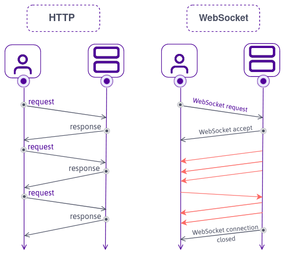
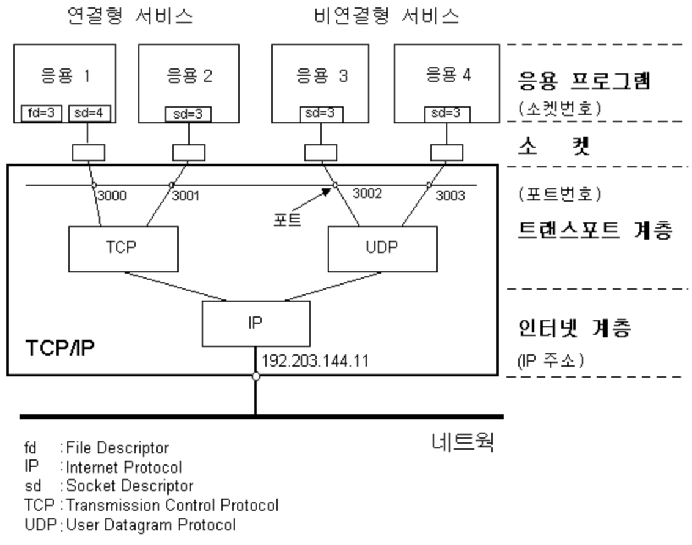
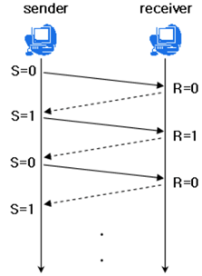
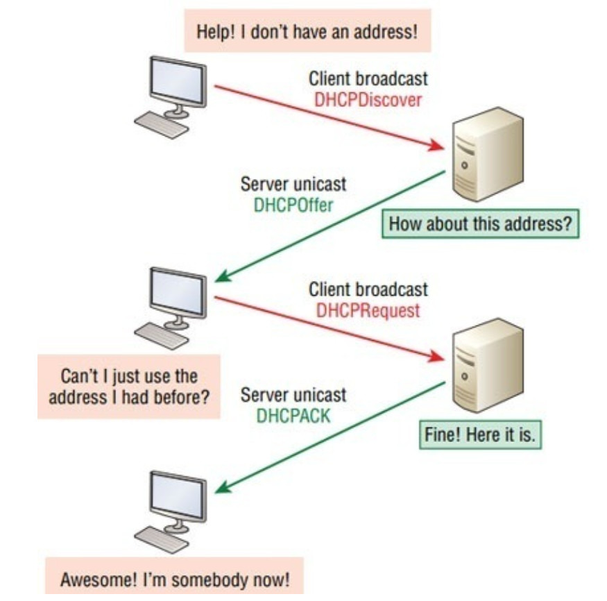
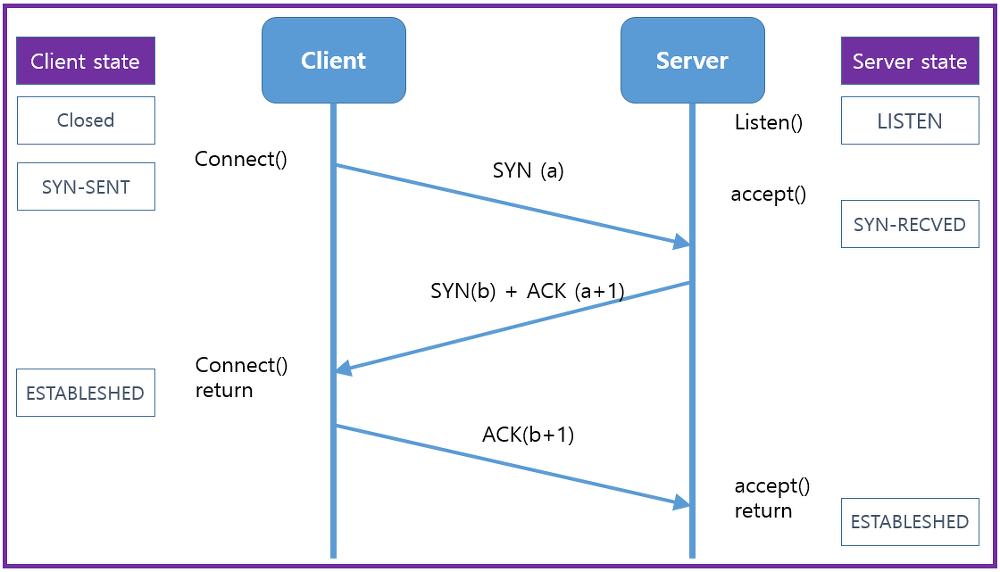
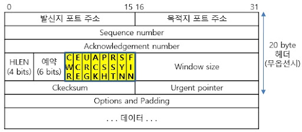
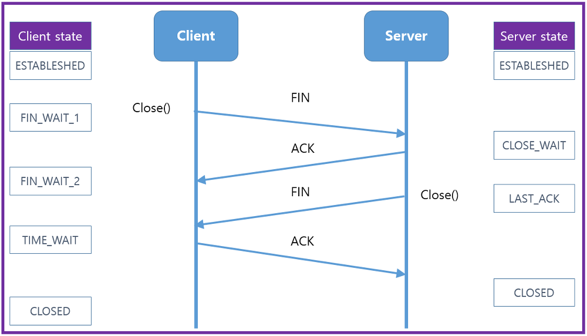
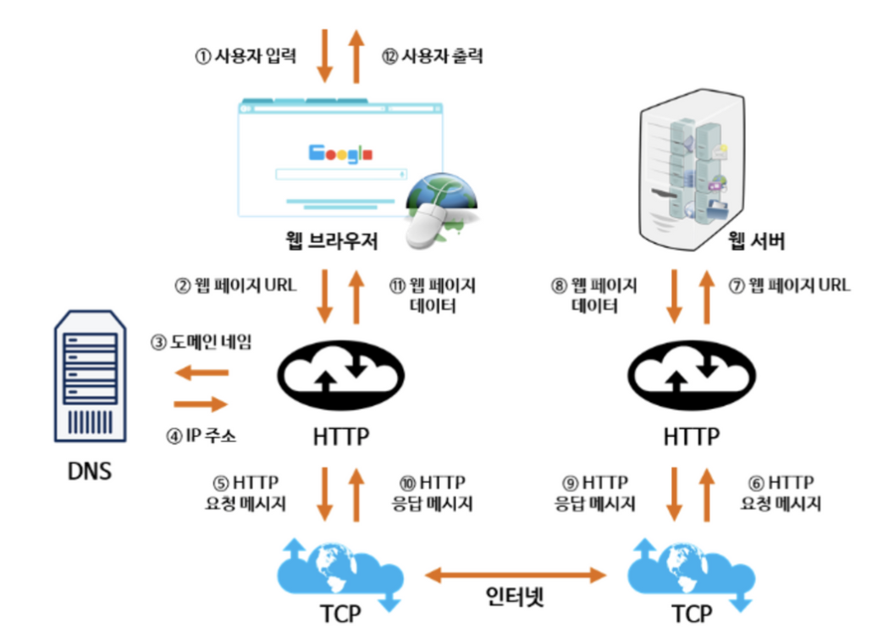

# 네트워크

## 1. 쿠키와 세션의 차이에 대해 설명해 주세요.

 
  
쿠키와 세션의 차이

- 쿠키와 세션을 사용하는 이유: HTTP 프로토콜의 특성인 Connectionless(비연결성)과 Stateless(비상태성)을 보완하기 위해
- 쿠키:
  - 클라이언트(브라우저)에 key-value 쌍으로 저장되는 데이터 파일
  - 유효 시간(expiration)까지 유지되며, 브라우저가 닫혀도 남을 수 있음
  - 서버가 응답 헤더에 Set-Cookie를 내려주면 브라우저가 저장 후 이후 요청마다 Cookie 헤더에 포함해서 보냄
  1. 서버가 클라이언트로부터 요청을 받았을 때, 클라이언트에 관한 정보를 토대로 쿠키를 구성
  2. 서버는 클라이언트에게 보내는 응답 header에 쿠키를 담아서 보냄
  3. 클라이언트가 응답을 받으면, 브라우저는 쿠키를 클라이언트 PC에 저장
- 세션:
  - 클라이언트 정보를 서버에 저장하고, 클라이언트에게는 식별자(session ID)만 전달 → 브라우저에는 세션 쿠키로 저장
  - 클라이언트 요청 시 session ID를 서버로 보내고, 서버는 해당 ID를 키로 세션 저장소에서 상태를 조회하여 응답
  1. 서버가 클라이언트 요청을 받으면, 세션 저장소에 클라이언트 상태 정보를 저장하고 이를 식별할 session ID를 생성
  2. 서버는 클라이언트에게 보내는 응답 header에 session ID가 포함된 세션 쿠키를 담아서 보냄
  3. 브라우저는 세션 쿠키를 저장하고, 이후 요청마다 Cookie 헤더에 session ID를 포함 → 서버는 세션 저장소에서 해당 ID를 키로 상태를 조회 후 응답

  
세션 방식의 로그인 과정에 대해 설명해 주세요.

1.  사용자가 ID와 PW를 입력해 로그인 요청
2.  서버가 계정 정보를 검증
3.  검증 성공 시, 서버는 세션 저장소에 사용자 상태를 저장하고 session ID를 생성
4.  session ID를 Set-Cookie 헤더로 브라우저에 전달 → 브라우저는 세션 쿠키로 저장
5.  이후 데이터 요청 시 브라우저가 session ID 쿠키를 전송 → 서버는 세션 저장소에서 상태를 조회 후 응답

- 세션 방식 로그인의 장점
  - 쿠키가 담긴 HTTP 요청이 중간에 노출되더라도 쿠키 자체에는 유의미한 값을 가지고 있지 않음
- 세션 방식 로그인의 단점
  - 유저들의 세션에 대한 정보를 저장할 공간이 필요
  - 멀티 디바이스/브라우저 환경 관리가 복잡함
  - 세션 하이재킹 공격에 취약
  - 서버 확장 시 세션 동기화 문제 발생
- 토큰 기반 로그인과의 차이점:
  - 세션 로그인 방식은 session ID만 실어서 보내면 되기 때문에 트래픽을 토큰보다 적게 사용
  - 모든 인증 정보를 서버에서 관리하기 때문에 보안 측면에서 더 유리
  - 세션 불일치 문제 발생 가능성이 높고, 확장성이 낮으며, 세션 데이터의 양이 많아지만 서버의 부담이 증가

  
HTTP의 특성인 Stateless에 대해 설명해 주세요.

- Stateless(비상태성)이란 요청 간 상태를 기억하지 않는다는 것을 의미
- 클라이언트에 보낸 정보를 서버에 저장(유지)하지 않고, 서버는 요청만 보고 처리하고 응답을 반환, 이전 요청이 어떤 상태였는지 기억하지 않음
- 수평 확장에 있어서 유리한 방법

  
Stateless의 의미를 살펴보면, 세션은 적절하지 않은 인증 방법 아닌가요?

- Stateless는 HTTP 프로토콜(Application Layer Protocol)의 성질일 뿐이고, 세션은 애플리케이션 레벨에서 상태를 관리하는 정상적인 방식
- 요구사항에 따라 다른 인증 방법을 사용할 수는 있지만, 실제 서비스는 권한에 대한 상태 정보가 필요하기 때문에 세션이 적절하지 않은 인증 방법인 것은 아님

  
규모가 커져 서버가 여러 개가 된다면, 세션을 어떻게 관리할 수 있을까요?

- 세션을 각 서버 메모리에 저장했을 때, 세션 불일치 문제가 발생할 수 있다.
- 해결 방법
    - Sticky Session 방식
      - 로드밸런서가 항상 동일한 사용자의 요청을 같은 서버로 보내도록 고정
      - 특정 서버에 트래픽이 몰릴 위험성이 있고, 서버 다운 시 세션 유실 → 안정성 낮음
    - Session 공유 저장소 방식
      - 세션 정보를 Redis, Memcached, DB 등 공유 저장소에 두는 방식
      - 모든 서버가 같은 저장소에서 session ID를 조회하므로 확장성, 안정성 확보
      - 네트워크 I/O나 인프라 비용에 대한 부담 발생

## 2. HTTP 응답코드에 대해 설명해 주세요.

  
HTTP 응답코드란?

- HTTP 상태코드는 클라이언트가 요청한 작업이 성공했는지, 실패했는지를 나타내는 표준 코드
- 상태 코드에 따라 요청의 성공/실패 여부를 세 자릿수(예: 404)로 구분
- HTTP 상태코드의 종류
    - 1XX (정보 전달) → 요청을 받았으며, 처리 중
    - 2XX (성공) → 요청이 정상적으로 완료됨
    - 3XX (리다이렉션) → 다른 URL로 이동해야 함
    - 4XX (클라이언트 오류) → 사용자의 요청이 잘못됨
    - 5XX (서버 오류) → 서버에서 요청을 처리하는 중 문제 발생

  
401 (Unauthorized) 와 403 (Forbidden)은 의미적으로 어떤 차이가 있나요?

- 401 (Unauthorized)
  - 상태: 자격 증명(토큰/쿠키)가 없거나 잘못된 경우
  - 예시: 사용자가 로그인되지 않은 경우
- 403 (Forbidden)
  - 상태: 요청을 이해했지만 권한 부족으로 거절된 경우
  - 예시: 사용자가 권한이 없는 요청을 하는 경우

  
200 (ok) 와 201 (created) 의 차이에 대해 설명해 주세요.

- 200 (ok)
  - 상태: 요청을 서버가 성공적으로 처리한 경우
  - 예시: 조회/갱신 결과를 반환해주는 경우
- 201 (created)
  - 상태: 새 리소스가 생성되었음을 의미
  - 예시: 새로운 Entity가 생성되는 POST 요청에 대한 응답인 경우

  
필요하다면 저희가 직접 응답코드를 정의해서 사용할 수 있을까요? 예를 들어 285번 처럼요. 

- 직접 응답코드를 정의하는 것이 불가능하지는 않지만, 표준을 따르지 않으면 클라이언트가 해석하기 어렵고 예상치 못한 문제를 일으킬 수 있음
- HTTP 상태 코드는 RFC 2616에 정의되어 있음, 서버와 클라이언트 간의 통신 규약
- 대신 응답으로는 표준 상태 코드를 내려주고, 응답 본문에 추가적인 커스텀 정보를 담아 전달하는 것이 좋음

## 3. HTTP Method 에 대해 설명해 주세요.

  
 HTTP Method란?
  

- HTTP Method: 클라이언트가 자원(Resource)에 대해 수행하려는 동작의 의도를 나타냄
- HTTP Method의 종류
    - POST: 요청 데이터 처리, 주로 새로운 등록에 사용
    - GET: 리소스 조회
    - PATCH: 리소스 부분 변경
    - PUT: 리소스 전체 변경(대체), 해당 리소스가 없으면 생성
    - DELETE: 특정 리소스를 삭제
    - HEAD: GET과 동일하지만, 응답 본문을 포함하지 않음
    - OPTIONS: 대상 리소스에 대한 통신 가능 옵션을 설명
    - CONNECT: 대상 자원으로 식별되는 서버에 대한 터널을 설정
    - TRACE: 대상 리소스에 대한 경로를 따라 메시지 루프백(loop-back) 테스트를 수행

  
HTTP Method의 멱등성에 대해 설명해 주세요.

- HTTP Method의 멱등성이란:
  - 여러 번 동일한 요청을 보냈을 때, 서버에 미치는 의도된 영향(자원의 상태)이 동일한 경우를 의미
- 멱등 HTTP Method:
  - GET, HEAD, OPTIONS, TRACE, PUT, DELETE
- 비멱등 HTTP Method:
    - POST, PATCH, CONNECT
  

  
GET과 POST의 차이는 무엇인가요?
  

- GET:
  - 리소스의 변화를 일으키지 않는 순수 조회 목적
  - 멱등성(Idempotent)을 가지고 있음
  - 데이터를 URL 쿼리스트링에 포함해서 전달 (예: 페이지네이션, 검색 파라미터)
  - 캐시 가능(Cacheable): 브라우저/프록시에서 응답을 캐싱 가능
- POST:
  - 리소스를 생성하거나 서버 상태를 변화시키는 요청
  - 멱등성이 없음 → 같은 요청을 여러 번 보내면 리소스가 중복 생성될 수 있음, 캐시 불가능
  - 데이터를 HTTP Body에 담아 전달 (JSON, Form 등)

  
POST와 PUT, PATCH의 차이는 무엇인가요?
  

- POST:
  - 주로 새로운 리소스를 생성하거나, 특정 동작(Action)을 실행하는 데 사용
  - 멱등성이 없음 (예: 같은 결제 요청 2번 → 중복 결제 발생 가능)
- PUT:
  - 리소스를 전체 교체하는 요청
  - 멱등성을 가짐 → 같은 PUT 요청을 여러 번 보내도 결과가 동일
  - 요청 Body에 해당 리소스 전체를 담아야 함 (없는 필드는 null/초기화될 수 있음)
- PATCH:
  - 리소스를 부분 수정하는 요청
  - 멱등성이 보장되지 않을 수도 있음
  - 변경할 속성만 Body에 담아서 전달

  
HTTP 1.1 이후로, GET에도 Body에 데이터를 실을 수 있게 되었습니다. 그럼에도 불구하고 왜 아직도 이런 방식을 지양하는 것일까요?
  

- HTTP 표준 준수: HTTP/1.1 표준(RFC 7231)에 따르면, GET 요청은 요청 본문을 포함할 수는 있으나 그 의미는 정의되지 않음
- 캐싱 문제 발생: GET 요청은 캐시될 수 있어야 하는데, 본문을 포함한 GET 요청은 캐시 일관성을 유지하기 어려움
- 안정성과 멱등성: GET 요청은 안전하고 멱등적이어야 함, 본문을 포함하는 GET 요청은 이러한 GET Method의 특성을 깨트릴 수 있음
- 클라이언트와 서버의 지원 부족: 많은 HTTP 클라이언트 라이브러리 및 서버 프레임워크는 GET 요청의 본문을 지원하지 않거나 무시
- 표준 툴 및 라이브러리 호환성: 많은 개발 도구와 라이브러리는 GET 요청에 본문이 없다는 가정을 하고 설계되어 있기 때문에, 호환성 문제 발생 가능

## 4. HTTP에 대해 설명해 주세요.

  
 HTTP란?
  

- 웹에서 클라이언트(브라우저)와 서버 간 데이터를 주고받기 위한 애플리케이션 계층 프로토콜
- 다양한 종류의 멀티미디어(html, css, javascript, png, gif, mp4)를 전송할 수 있도록 설계됨
- 일반적으로 TCP/IP 통신 프로토콜 기반으로 동작함
- HTTP 통신은 클라이언트와 서버로 나뉘어진 구조를 가짐
- HTTP의 특징:
  - Stateless: 각 요청은 독립적으로 처리, 이전 요청 상태를 기억하지 않음
  - Connectionless: 요청-응답 후 연결 종료
- HTTP 통신과 Socket 통신의 차이
[)
- HTTP 통신:
  - 클라이언트가 요청을 보내면 서버는 해당 요청에 대한 응답을 보내고 연결 종료
  - 데이터 연결 시에만 연결이 이루어짐, 리소스가 절약됨
  - 주로 웹 브라우저와 웹 서버 간의 통신에 사용
- Socket 통신: - 클라이언트와 서버가 지속적으로 연결을 유지하며 양방향으로 데이터를 주고받음
  - 실시간 데이터 전송이 필요한 경우 주로 사용
  - 리소스 소모가 크지만 실시간 통신에 유리함

  
공개키와 대칭키에 대해 설명해 주세요.
  

- **대칭키 암호화**
  
  - 암호화/복호화에 동일한 키(대칭키)를 사용하는 방식
  - 암호화/복호화 속도가 빠르고 효율적
  - 단점: 키 분배 문제, 키 교환 시 유출의 위험이 있음
  - 예: AES, DES, 3DES, RC4 알고리즘 등
- **공개키(비대칭키) 암호화**
  
  - 공개키(public key)와 개인키(private key) 쌍을 사용
  - 모두에게 공유되는 공개키로 암호화 → 자신만 가지는 개인키로 복호화
  - 단점: 대칭키보다 연산이 느림
  - 예: RSA, ECC, Diffie-Hellman 알고리즘 등
- 실제 HTTPS에서는 **두 방식을 혼합해 사용**:
  - 세션 키 교환:
    - 공개키 방식 사용
    - HTTPS 연결 시작 시, 클라이언트(브라우저)와 서버가 TLS Handshake 수행
    - Diffie-Hellman(ECDH/ECDHE) 교환을 통해 세션 키 교환
  - 데이터 통신:
    - 대칭키 방식 사용
    - 세션 키가 공유된 후에는, 속도/효율성을 고려해 이후의 데이터 통신은 모두 AES 같은 대칭키 알고리즘으로 암호화

  
왜 HTTPS Handshake 과정에서는 인증서를 사용하는 것 일까요?
  

- HTTPS 연결 과정

  > 1. 클라이언트(주로 웹 브라우저)가 "https://"로 시작하는 URL을 서버에게 요청한다.
  > 2. 서버는 공개키와 CA(인증 기관) 정보가 담긴 인증서를 클라이언트에게 전송한다.
  > 3. 클라이언트는 인증 기관의 공개키로 인증서의 유효성을 검증한다. (서버 신뢰성 확인)
  > 4. 클라이언트는 서버의 공개키를 사용해 무작위의 세션키를 생성한다.
  > 5. 세션키를 서버의 공개키로 암호화하여 서버에 전송한다.
  > 6. 서버는 받은 세션키를 자신의 개인키로 복호화하고, 세션키를 사용해서 연결을 설정한다.
  > 7. 클라이언트와 서버가 각자의 세션키로 데이터를 암호화/복호화하여 주고 받는다.

- HTTPS Handshake에서 인증서를 사용하는 이유
  - **서버 신뢰성 보장**: 인증서를 통해 서버가 신뢰할 수 있는 주체임을 보장. 없으면 중간자 공격(Man-in-the-Middle, MITM)에 취약할 수 있음.
  - **스니핑(Sniffing) 방지**: 네트워크 중간에서 트래픽을 도청하는 공격에 대비. 암호화된 세션 키를 사용하므로 중간에서 내용을 알아낼 수 없음.
  - **데이터 변조 방지**: 공개키는 인증서 안에 포함되고, 인증서는 CA의 전자서명으로 보호됨 → 공격자가 키를 변조하지 못하도록 보장.
  - **피싱(Phishing) 방지**: 인증서에 기록된 도메인·조직 정보를 통해 가짜 사이트가 진짜인 척하는 피싱을 차단.

  
SSL과 TLS의 차이는 무엇인가요?
  

- SSL과 TLS 모두 서버, 애플리케이션, 사용자 및 시스템 간의 데이터를 암호화하는 보안 통신 프로토콜
- 네트워크를 통해 연결된 두 당사자를 인증하고 데이터를 안전하게 교환할 수 있게 해줌.
- **SSL (Secure Sockets Layer)**
  - 초창기 넷스케이프에서 개발된 암호화 프로토콜
  - 여러 버전(SSL 2.0, 3.0)이 있었으나 현재는 보안 취약점으로 인해 더 이상 사용되지 않음
  - 메시지 무결성을 보장하기 위해 MAC(Message Authentication Code) 기반 인증 사용
  - TLS로 완전히 대체된 상태
- **TLS (Transport Layer Security)**
  - SSL을 기반으로 발전한 차세대 표준 프로토콜
  - 현재 HTTPS에서 사용하는 보안 계층 (TLS 1.2, TLS 1.3이 주류)
  - 보다 안전한 핸드셰이크 과정을 제공 (Diffie-Hellman 기반 키 교환, 전방위 보안 PFS 지원)
  - 일부 취약 알고리즘을 제거해 보안 강화
  - 메시지 인증에 HMAC(Hash-based MAC) 사용

## 5. 웹소켓과 소켓 통신의 차이에 대해 설명해 주세요.

  
웹소켓과 소켓 통신의 차이
  

- **소켓(Socket)**
  - 네트워크 통신의 출발점, 용프로그램은 소켓을 통하여 통신망으로 데이터를 송수신하게 됨
  - 즉, 응용 프로그램에서 TCP/IP를 이용하는 인터페이스 역할
  - 일반적으로 5-Tuple로 정의됨 `(프로토콜, 로컬 IP, 로컬 Port, 원격 IP, 원격 Port)`
  - **TCP 소켓**
    - 연결 지향적. 양방향으로 바이트 스트림을 전송함
    - 3-way Handshake로 세션 수립
    - 데이터 무결성 보장: 패킷 손실이나 손상 시 재전송
    - 데이터 순서 보장: 송신한 순서대로 데이터가 도착하도록 보장
    - 재전송/흐름제어로 인해 오버헤드 발생
  - **UDP 소켓**
    - 비연결 지향적인 소켓. 빠르고 단순하지만 순서/신뢰성 보장이 없음
    - 실시간 멀티미디어 정보 처리를 위해 사용 (예: 게임, 스트리밍, DNS 쿼리 등)
- **웹소켓(WebSocket)**
  - HTTP 프로토콜 위에 실시간 양방향 통신 기능을 추가한 프로토콜
  - HTTP 프로토콜을 업그레이드(Upgrade 헤더)하여 동작함
  - 전환 이후에는 양방향 통신이 가능 → 클라이언트/서버가 실시간으로 메시지를 주고받음
  - 특징:
    - HTTP나 HTTPS 위에서 동작하도록 설계되었음, 80/443 포트 사용
    - 서버 푸시, 실시간 알림, 채팅, 주식 시세 서비스에 최적화 되어있음
- **소켓과 웹소켓의 차이**
  - 프로토콜:
    - 소켓은 4계층에 위치하여 동작
    - 웹소켓은 HTTP에 기반하므로 7계층에서 동작
  - 데이터 전송:
    - 소켓은 바이트 스트림(TCP) 또는 데이터그램(UDP)
    - 웹소켓은 프레임 단위(텍스트, 바이너리 등 구조화된 메시지)
  - 방화벽:
    - 소켓은 새로운 TCP 포트를 열어야 하는 경우가 많음
    - 웹소켓은 80/443 포트를 활용

  
소켓과 포트의 차이가 무엇인가요?

- **포트(Port)**
  - 네트워크에서 특정 소프트웨어에 데이터를 전달하기 위한 통신 채널을 식별하는 번호
  - 포트 번호를 통해 하나의 IP를 가진 장치 내에서 프로세스를 구분할 수 있음
  - 포트의 종류 (범위: 0 ~ 65535)
    - Well-known Port: 0 ~ 1023
    - Registered Port: 1024 ~ 49151
    - Dynamic Port: 49152 ~ 65535
- **소켓(Socket)**
  
  - 실제 네트워크 연결을 위한 통신 엔드포인트
  - IP와 Port를 결합하여 소켓을 생성, 특정 IP의 특정 Port로 통신 세션을 설정하고 데이터를 송수신하는 데 사용

  
여러 소켓이 있다고 할 때, 그 소켓의 포트 번호는 모두 다른가요?
  

- **서버 측 소켓**
  - 클라이언트의 접속을 대기하는 소켓
  - 일반적으로 특정 IP 주소와 포트 번호에 바인딩되며, 이 포트 번호는 해당 서버에서 고유해야 한다
- **클라이언트 소켓**
  - 서버에 연결을 요청하는 소켓
  - 포트를 사용하지만, 이 포트 번호는 임시적으로 할당되며 동적/사설 동적/사설 포트 범위(49152-65535) 내에서 사용된다.
- **여러 소켓의 포트 번호가 같은 경우**
  - 다중 클라이언트 연결: 서버 소켓은 동일한 포트 번호에서 여러 클라이언트의 연결을 수락할 수 있다. 이 경우 서버는 포트 번호가 동일하지만, 각 클라이언트와의 연결은 소켓의 IP 주소와 소스 포트 번호가 달라 식별 가능
  - 소켓 옵션: SO_REUSEADDR와 같은 소켓 옵션을 사용하면, 동일한 포트 번호를 여러 소켓에서 재사용할 수 있다. 주로 서버 소프트웨어가 재시작될 때 이전 소켓이 완전히 종료되지 않은 상태에서도 포트를 재사용할 수 있게 해준다.

  
사용자의 요청이 무수히 많아지면, 소켓도 무수히 생성되나요?
  

- **TCP**
  - 이론적으로는 클라이언트가 요청할 때마다 커널이 연결 소켓을 생성.
  - 따라서 동시 접속 수 = 연결 소켓 수. 하지만 현실적으로 OS 자원의 한계 때문에 무한히 생성되는 것은 불가능하다.
- **UDP**
  - 비연결 지향이므로, 요청이 많아도 소켓을 새로 생성하지 않는다.
  - 하나의 소켓이 바인딩된 포트에서 여러 클라이언트의 패킷을 동시에 수신 가능하다.

## 6. HTTP/1.1과 HTTP/2의 차이점은 무엇인가요?

 HTTP/1.1과 HTTP/2의 차이점은 무엇인가요? 

- **HTTP/1.1**
  - Persistent Connection(Keep-Alive): 연결을 재사용 가능. 매 요청마다 TCP 연결을 새로 열지 않음
  - Pipelining 도입: 하나의 연결에서 여러 요청을 순차적으로 보낼 수 있게 되었음
  - 텍스트 기반 프로토콜: 메시지를 텍스트로 표현
  - 매 요청마다 중복된 헤더 전송
- **HTTP/2**
  - 멀티플렉싱(Multiplexing): 하나의 TCP 연결에서 여러 요청/응답을 동시에 처리 가능. 응답 순서 제약이 없음
  - 바이너리 프레임(Binary Framing): 텍스트 대신 바이너리로 메시지를 쪼개어 전송
  - 헤더 압축(HPACK): 중복 헤더를 압축해 전송량 절감
  - 서버 푸시(Server Push): 클라이언트 요청 전 서버가 필요한 리소스를 미리 푸시 가능

  
 HOL Blocking 에 대해 설명해 주세요.

  - **HOL Blocking(Head-of-Line Blocking)**: 
    - 패킷 대기열 의 첫 번째 패킷이 패킷을 지연시킬 때 발생하는 성능 제한 현상
  - **HTTP에서의 HOL Blocking**
    - HTTP/1.1에서의 예시: 파이프라이닝으로 여러 요청을 한 번에 보낼 수 있으나, 응답은 반드시 순서대로 와야 함 → 이전 요청이 느리면 후속 요청이 전부 대기해야 함 
    - HTTP/2에서의 예시: 위 문제를 멀티플렉싱을 통해 애플리케이션 계층에서 해결했지만, 전송(TCP) 계층에서 HOL 문제는 여전히 존재

  - **TCP에서의 HOL Blocking**
    - TCP에서의 예시: TCP는 순서를 보장하므로 특정 패킷이 손실되면 재전송 처리, 패킷의 순서가 역전되지 않도록 후속 패킷은 대기해야 함 
    -  HTTP/3.0 등장 배경: 이러한 TCP 계층의 HOL Blocking 문제 때문에 UDP 기반 HTTP/3.0이 등장

  - **HOL Blocking 문제를 완화하기 위한 방법**
    - 혼잡 제어 알고리즘 PR(예: PRR, BBR)
      - 네트워크 혼잡 상황에서도 패킷 손실과 지연을 최소화해 TCP 계층 HOL 문제를 완화
    - QUIC(Quick UDP Internet Connections) 프로토콜
      - UDP 기반 전송 계층 프로토콜로, 스트림 단위로 독립적인 전송을 지원 → 특정 패킷 손실이 다른 스트림에 영향을 주지 않아 HOL Blocking을 근본적으로 해결
  

  
HTTP/3.0의 주요 특징에 대해 설명해 주세요.

  - QUIC 프로토콜 사용: 
    - Multiplexing without HOL Blocking
    - 각 스트림이 독립적으로 동작하므로 특정 스트림에서 손실이 발생해도 다른 스트림에 영향을 주지 않음
  - Zero round-trip time (0-RTT): 
    - 기존 HTTP/2는 TCP 3-way handshake + TLS handshake가 필요 
    - QUIC은 TLS 1.3을 전송 계층에 내장하여 연결 지연을 줄임. 재연결 시에는 0-RTT로 즉시 데이터 전송 가능
  - 항상 암호화된 전송: 
    - QUIC은 TLS 1.3을 기본으로 내장하고 있어 모든 HTTP/3 통신이 자동으로 암호화되어 전송됨
  

## 7. TCP와 UDP의 차이에 대해 설명해 주세요.

  
TCP와 UDP의 차이에 대해 설명해 주세요.

  - **TCP**
    - 연결 지향적(Connection-oriented): 3-way handshake를 통해 연결 수립
    - 신뢰성 보장: 순서 보장, 손실 시 재전송, 흐름 제어, 혼잡 제어 제공
    - 스트림 기반: 바이트 단위로 데이터 전송
    - 상대적으로 느리지만, 안정성이 필요한 서비스(HTTP/HTTPS, 메일, 파일 전송)에 사용
  - **UDP**
    - 비연결형(Connectionless): handshake 과정 없이 데이터그램 전송
    - 비신뢰성: 패킷 손실, 순서 뒤바뀜 발생 가능
    - 흐름제어, 오류제어, 혼잡 제어 등을 수행하지 않음 
    - 메시지 단위 전송: 개별 데이터그램 단위로 송수신
    - 오버헤드가 작아 지연이 적고, 실시간성이 중요한 서비스(스트리밍, 온라인 게임 등)에 사용

  
 Checksum이 무엇인가요?

  - Checksum은 중복 검사의 한 형태로, 오류 정정을 통해 송신된 자료의 무결성을 보호하는 단순한 방법

  
TCP와 UDP 중 어느 프로토콜이 Checksum을 수행할까요?

  - TCP와 UDP 모두 Checksum을 수행
    - TCP: 필수적으로 Checksum 사용
    - UDP: Checksum은 선택적(optional)이지만 IPv6에서는 필수
  - **TCP Checksum**
    - 계산 시 **pseudo header** 포함: 추가적인 정보(IP 소스/목적지 주소, 프로토콜 번호, TCP 길이 등)
    - TCP는 오류 발생 시 재전송 메커니즘을 통해 복구 가
    - 계산 절차
      > 1) Pseudo Header + TCP Header + Data를 16비트 단위로 나눈다.
      > 2) TCP Header의 Checksum 필드는 0으로 초기화하고 합산한다.
      > 3) 합산 과정에서 발생하는 carry는 **wrap around** 방식(carry를 버리지 않고 다시 더해주는 방식)으로 더한다.
      > 4) 최종 합에 대해 **1의 보수**를 취해 체크섬 값으로 사용.
      > 5) 송신자는 이 값을 TCP 헤더의 Checksum 필드에 기록해 전송.
      > 6) 수신자는 동일한 방식으로 계산한 뒤, 수신된 체크섬까지 합산 → 모든 비트가 1이면 정상, 아니면 오류 발생으로 판단.

  - **UDP Checksum**
    - UDP는 비연결형·비신뢰성 프로토콜이지만, 기본적인 데이터 무결성 검증을 위해 체크섬 사용
    - 송신 측에서 계산된 체크섬과 수신 측에서 계산한 체크섬을 비교하여 데이터 손상 여부를 탐지
    - 오류가 있으면 해당 데이터그램은 폐기됨 (UDP 자체적으로 재전송은 없음)
    - UDP Checksum 계산 과정
      > **송신자**
      > 1) 송신하는 메시지(데이터 그램)을 정해진 길이(16비트)의 데이터 단위로 나눈다.
      > 2) 모든 데이터 단위를 1의 보수 연산으로 더하여 합을 구한다.
      > 3) 합의 1의 보수를 체크섬으로 생성하고 데이터그램에 추가하여 전송한다.

      > **수신자**
      > 1) 수신된 메시지(데이터 그램)을 정해진 길이(16비트)의 데이터 단위로 나눈다.(checksum 포함)
      > 2) 모든 데이터 단위를 1의 보수 연산으로 더하여 합을 구한다.
      > 3) 합이 0이면 데이터그램의 무결성이 보장된 성공적 수신, 아니라면 정확히 어떤 것이 문제인지는 모르나 오류가 발생했다고 판단한다.

  
그렇다면, Checksum을 통해 오류를 정정할 수 있나요?

  - Checksum은 오류 검출만 가능하고, 정정은 불가능.
  - TCP는 오류가 발생하면 재전송을 통해 복구하고, UDP는 단순 폐기함. 

  
 TCP가 신뢰성을 보장하는 방법에 대해 설명해 주세요.

  - **오류 검출 및 재전송 (Retransmission)**  
    - 체크섬을 이용하여 데이터의 오류 검출, 패킷 손실이 감지되면 동일한 세그먼트를 다시 전송하여 데이터 유실 방지
    - ACK(응답 확인 번호)를 통해 송신자는 수신 여부를 판단
  - **순서 보장 (In-order Delivery)**  
    - 각 세그먼트에는 시퀀스 번호가 포함되어 있어, 수신 측에서 순서대로 조립 가능
    - 만약 순서대로 도착하지 않는다면 누락된 패킷이 도착할 때 까지 대기하고
그 후에 패킷을 순서대로 재조립하여 애플리케이션에 전달
  - **흐름 제어 (Flow Control)**  
    - 수신자가 처리할 수 있는 만큼만 송신자가 데이터를 보내도록 조절
    - TCP는 슬라이딩 윈도우(윈도우 크기) 방식으로 구현
    - **흐름 제어 방법**
      - Stop and Wait: 매번 전송한 패킷에 대해 확인 응답을 받아야만 그 다음 패킷을 전송하는 방법

        
      - Sliding Window (Go Back N ARQ) : 수신측에서 설정한 윈도우 크기만큼 송신측에서 확인응답 없이 세그먼트를 전송할 수 있게 하여 데이터 흐름을 동적으로 조절하는 제어기법
        
  - **혼잡 제어 (Congestion Control)**  
    - 네트워크 상황(혼잡 여부)에 따라 전송 속도를 조절
    - 네트워크 전체의 안정성을 보장하며, 패킷 폭주를 방지

  
TCP의 혼잡 제어 처리 방법에 대해 설명해 주세요.

  - **Slow Start**  
    - 연결 초기에는 작은 혼잡 윈도우(cwnd)로 시작해, ACK가 도착할 때마다 지수적으로 전송량을 늘림  
    - 네트워크의 수용 능력을 빠르게 파악하기 위한 단계  

  - **AIMD (Additive Increase & Multiplicative Decrease)**  
    - 합 증가 / 곱 감소 알고리즘
    - Additive Increase: 혼잡이 감지되지 않으면 윈도우 크기를 선형적으로 증가  
    - Multiplicative Decrease: 혼잡(패킷 손실) 발생 시 윈도우 크기를 절반으로 줄임  
    - 선형 증가 방식이므로 네트워크 대역을 충분히 활용하기까지 시간이 걸린다는 단점이 있음  
    - AIMD와 Slow Start를 함께 사용하면, 혼잡이 자주 발생할 경우 전송률이 크게 떨어질 수 있어 이를 보완하는 기법이 추가됨  

  - **Fast Retransmit & Fast Recovery**  
    - **Fast Retransmit**: 수신 측은 누락된 패킷이 있어도 ACK를 계속 보내며, 순서대로 도착한 마지막 패킷 이후의 번호를 응답에 포함시킴. 송신 측은 동일한 ACK가 3번 연속 도착하면 손실을 감지하고 즉시 재전송 
    - **Fast Recovery**: 혼잡 발생 시 윈도우 크기를 1로 줄이지 않고 절반으로 줄인 후, 선형적으로 증가시킴. 이후에는 AIMD와 동일한 방식으로 동작해 빠르게 회복 가능.  

  - **현대적 혼잡 제어 알고리즘**  
    - PRR (Proportional Rate Reduction), BBR (Bottleneck Bandwidth and RTT) 등은 네트워크의 실제 대역폭과 RTT를 기반으로 전송률을 동적으로 최적화  
    - 기존 방식보다 손실과 지연을 줄여, HOL Blocking 같은 문제를 완화할 수 있음  

  
왜 HTTP는 TCP를 사용하나요?

  - **신뢰성 보장 필요**  
    - 웹 페이지는 텍스트, 이미지, 스크립트 등 다양한 리소스로 구성되며, 데이터가 손실되거나 순서가 뒤바뀌면 정상적으로 표시되지 않음  
    - TCP는 오류 검출 + 재전송, 순서 보장, 흐름 제어, 혼잡 제어를 제공해 신뢰성 있는 전송을 보장  
    - 따라서 HTTP/1.1, HTTP/2까지는 TCP 위에서 동작함

  
그렇다면, 왜 HTTP/3 에서는 UDP를 사용하나요? 위에서 언급한 UDP의 문제가 해결되었나요?

  - HTTP/2의 한계 (TCP 기반의 HOL Blocking)
    - HTTP/2는 멀티플렉싱을 지원하지만 여전히 TCP 기반의 HOL Blocking 문제 발생 
    - 연결 설정(3-way handshake + TLS handshake) 지연

  - UDP + QUIC을 통한 해결
    - HTTP/3는 TCP 대신 UDP 기반 QUIC을 사용  
    - QUIC은 UDP 위에서 동작하면서 연결 관리, 신뢰성, 혼잡 제어, TLS 1.3 기능을 직접 구현  
    - 스트림 단위 전송을 지원하여 특정 스트림 손실이 다른 스트림에 영향을 주지 않음 → HOL Blocking 근본적 해결  
    - UDP 자체가 문제를 해결한 게 아니라, UDP와 QUIC 프로토콜을 사용해 최적화한 것

  
그런데, 브라우저는 어떤 서버가 TCP를 쓰는지 UDP를 쓰는지 어떻게 알 수 있나요?

  - 브라우저는 기본적으로 TCP 기반 HTTP/1.1 또는 HTTP/2로 먼저 연결
  - 브라우저는 서버의 TCP/UDP 프로토콜 사용 여부를 직접 묻지 않고, 서버가 제공하는 Alt-Svc 헤더나 DNS 레코드, 그리고 ALPN(Application-Layer Protocol Negotiation)을 통해 HTTP/3 지원 여부를 확인
  - 지원되면 UDP 기반 QUIC 연결을 시도하고, 실패 시 TCP 기반 통신으로 폴백

  
본인이 새로운 통신 프로토콜을 TCP나 UDP를 사용해서 구현한다고 하면, 어떤 기준으로 프로토콜을 선택하시겠어요?

  - **서비스 성격에 따라 선택**  
    - **TCP**: 데이터의 신뢰성과 무결성이 중요한 서비스라면 TCP를 선택
      - 예: 웹 서비스(HTTP/HTTPS), 파일 전송, 금융 거래  
      - 이유: 순서 보장, 재전송, 흐름 제어, 혼잡 제어 등을 통해 안정적 전송 가능  

    - **UDP**: 실시간성이 더 중요한 서비스라면 UDP를 선택
      - 예: 실시간 스트리밍, 온라인 게임, 화상 회의  
      - 이유: 일부 손실을 감수하더라도 지연을 줄여 빠른 응답성을 보장할 수 있음  

## 8. DHCP가 무엇인지 설명해 주세요.

  
DHCP가 무엇인지 설명해 주세요.

  - DHCP (Dynamic Host Configuration Protocol)
    - 네트워크에 접속하는 클라이언트에게 IP 주소와 네트워크 설정을 동적으로 할당해주는 프로토콜  
      - 정적 할당: 수동으로 IP와 네트워크 정보를 직접 할당 (예: 데이터 센터와 같은 운영 망에서 사용되는 IP)
      - 동적 할당: 자동으로 설정 (예: 사무실 네트워크)
    - 사용자는 수동으로 IP, 서브넷 마스크, 게이트웨이, DNS 등을 입력할 필요 없이 DHCP를 통해 자동으로 설정 가능  
    - DHCP는 BOOTP(Bootstrap Protocol) 기반, 기능이 추가된 확장 프로토콜
    - 동작 과정은 DORA(Discover → Offer → Request → Acknowledge)

  
DHCP는 몇 계층 프로토콜인가요?

  - DHCP(Dynamic Host Configuration Protocol)는 OSI 7계층 중  애플리케이션 계층 프로토콜
  - 전송 계층으로는 UDP를 사용  
    - TCP가 아닌 UDP를 쓰는 이유: 초기에는 클라이언트가 IP 주소가 없으므로, 가볍고 연결성 없는 브로드캐스트가 필요하기 때문

  
DHCP는 어떻게 동작하나요?

  - **DHCP 동작 과정 (DORA)**  
    
    1) **Discover**: 클라이언트가 네트워크에 브로드캐스트로 IP 요청  
    2) **Offer**: DHCP Discover를 수신한 DHCP 서버가 사용 가능한 IP와 설정 정보(서브넷, 게이트웨이, DNS 정보 등)를 제안  
    3) **Request**: 클라이언트가 제안받은 IP 중 하나를 선택해 DHCP 요청 메시지를 전송  
    4) **Acknowledge**: 서버가 승인 응답(ACK)을 보내고, IP 사용 정보를 기록  

  
DHCP에서 UDP를 사용하는 이유가 무엇인가요?

  - 클라이언트가 아직 IP 주소를 모르는 상태에서 통신을 시작해야 하기 때문에 브로드캐스트가 필수적으로 요구
    - TCP: 브로드캐스트를 지원하지 않음
    - UDP: 브로드캐스트를 지원함 
  - 빠르고 간단한 초기 네트워크 설정에 TCP보다 UDP가 적합하기 때문
    - TCP: 연결 지향적, 3-way handshake를 거쳐야 하지만 클라이언트에 IP가 존재하지 않으므로 정상적인 연결 설정이 어려움
    - UDP: 연결 설정이 필요하지 않은 프로토콜

  
DHCP에서, IP 주소 말고 추가로 제공해주는 정보가 있나요?

  - 다양한 네트워크 환경 정보 제공
    - Subnet Mask  
      - 네트워크와 호스트 부분을 구분하여 네트워크 범위 정의
    - Default Gateway  
      - 다른 네트워크와의 통신을 위해 사용되는 라우터의 IP 주소
    - DNS 서버 주소  
      - 도메인 이름 → IP 주소로 변환하는 DNS 서버 정보 제공
    - 임대 시간
      - 클라이언트가 할당받은 IP 주소를 사용할 수 있는 기간 지정 
    - NTP(네트워크 시간 프로토콜) 서버 주소  
    - 도메인 이름, WINS(Windows Internet Name Service) 서버 정보 등 네트워크 구성에 필요한 여러 옵션 제공

  
DHCP의 유효기간은 얼마나 긴가요?

  - DHCP의 유효기간(임대 시간)은 DHCP 서버에서 설정하며, 네트워크 환경에 따라 달라지는 값 
  - 일반적으로 절반 시점에 클라이언트가 갱신 요청을 보내, 임대 기간을 연장할 수 있도록 함 

## 9. IP 주소는 무엇이며, 어떤 기능을 하고 있나요? 

  
IP 주소는 무엇이며, 어떤 기능을 하고 있나요?

  - IP 주소(Internet Protocol Address)는 네트워크에 연결된 장치를 식별하기 위한 고유한 주소 
  - 기능
    - 식별자 역할: 네트워크 상의 호스트(PC, 서버, 라우터 등)를 구분  
    - 위치 지정 역할: 패킷이 어디에서 어디로 가야 하는지를 알려주는 논리적 주소  
  - 분류
    - Public IP: 인터넷에서 고유하게 식별되는 주소 (ISP가 부여)
    - Private IP: 사설 네트워크 내부에서만 사용되는 주소 (예: 192.168.x.x)
    - 정적 IP: 고정된 주소, 변하지 않는 IP 주소
    - 동적 IP:DHCP를 통해 임시로 할당, 주기적으로 바뀔 수 있음

     
  
IPv6는 IPv4의 주소 고갈 문제를 해결하기 위해 만들어졌지만, 아직도 수많은 기기가 IPv4를 사용하고 있습니다. 고갈 문제를 어떻게 해결할 수 있을까요?
 
                     
   - NAT(Network Address Translation):
    - 사설 IP 여러 개를 공인 IP 하나로 매핑 → IPv4 주소 공간 절약 
  - CIDR(Classless Inter-Domain Routing): 
    - Classful Addressing: 초창기에는 클래스 기반 주소 지정 방식을 사용, 필요한 수보다 너무 큰 블록을 할당한다는 낭비 문제 발생 
    - 주소 할당을 클래스 기반이 아닌 임의의 prefix(/n)를 사용해 주소 할당
    - 유연하게 네트워크에 해당하는 비트의 크기를 유동적으로 조정할 수 있어 보다 효율적인 주소 운용 가능
  - IPv6 도입 병행: 
    - 점진적으로 IPv6 지원을 확산시켜 주소 고갈 문제 해소

  
IPv4와 IPv6의 차이에 대해 설명해 주세요.

  - **주소 길이**: IPv4는 32비트, IPv6는 128비트
  - **표기 방식**: IPv4는 10진수, 점(.) 구분 / IPv6는 16진수, 콜론(:) 구분  
  - **기능적 차이**
    - IPv6는 NAT 불필요 → 더 뛰어난 성능 (변환에 따른 성능 오버헤드 해소)
    - IPv6는 기본적으로 IPsec 보안 내장, 추가 보안 라우팅 프로토콜 포함
    - 커뮤니케이션 유형 차이
      - IPv4: 유니캐스트(일대일), 브로드캐스트(일대전부), 멀티캐스트(일대다)
      - IPv6: 유니캐스트, 멀티캐스트, 애니캐스트
    - IPv6는 NAT 제거, 헤더 구조 단순화, NDP 등의 방법으로 라우팅 효율성 향상  

  
수많은 사람들이 유동 IP를 사용하고 있지만, 수많은 공유기에서는 고정 주소를 제공하는 기능이 이미 존재합니다. 어떻게 가능한 걸까요?

  - 공유기는 내부적으로 DHCP 서버 역할을 수행  
  - 특정 장치의 MAC 주소와 IP 주소를 매핑해 두면, DHCP가 항상 동일한 IP를 해당 장치에 할당 → 고정 IP처럼 동작하는 것
  - 외부에서는 유동 IP일 수 있어도, 내부 LAN에서는 고정 IP 사용 가능

  
IPv4를 사용하는 장비와 IPv6를 사용하는 같은 네트워크 내에서 통신이 가능한가요? 가능하다면 어떤 방법을 사용하나요?

  - 직접 통신은 불가능 (프로토콜이 다르기 때문)  
  - 방법
    - **Dual Stack (이중 스택)**  
      - 하나의 장비가 IPv4와 IPv6를 모두 지원하여 두 주소를 동시에 할당받음  
      - 동작 과정
        1) 클라이언트는 IPv4/IPv6 주소를 모두 할당받음  
        2) DNS 조회 시, 응답에 따라 IPv4 또는 IPv6 주소를 선택  
        3) 네트워크 스택에서 해당 프로토콜 로직을 통해 패킷 생성 및 전송  
      - 단점: 운영 복잡성, 리소스/관리 부담  

    - **Tunneling (터널링)**  
      - IPv6 패킷을 IPv4 패킷 안에 캡슐화하여 전달하는 방식  
      - 동작 과정 (예: 6to4)
        1) 송신 측에서 IPv6 패킷을 생성  
        2) IPv4 헤더를 붙여 캡슐화  
        3) IPv4 네트워크를 통해 전송  
        4) 수신 측에서 IPv4 헤더를 제거 → IPv6 패킷 복원  
      - 단점: 캡슐화/비캡슐화 과정에서 성능 저하 가능  

    - **Translation (주소 변환)**  
      - IPv6 ↔ IPv4 주소 변환을 통해 통신 가능  
      - 동작 과정
        - **NAT64**: IPv6 클라이언트의 요청을 IPv4로 변환 후 서버에 전달, 응답은 다시 IPv6로 변환  
        - **DNS64**: IPv6 클라이언트가 IPv4-only 도메인 질의 시, IPv4 주소를 변환해 IPv6 주소 형태로 반환  
        - **SIIT (Stateless IP/ICMP Translation)**: 상태 정보 없이 각 패킷을 독립적으로 변환  

  
IP가 송신자와 수신자를 정확하게 전송되는 것을 보장해 주나요?

  - IP는 비연결형·비신뢰성 프로토콜
  - IP는 단순히 목적지 주소로 패킷을 전달할 뿐, 순서 보장 및 오류 검출/재전송을 보장하지 않음
  - 신뢰성은 TCP와 같은 상위 계층 프로토콜에서 보장

  
IPv4에서 수행하는 Checksum과 TCP에서 수행하는 Checksum은 어떤 차이가 있나요?

   - **IPv4 Checksum**
    - IPv4 헤더를 위한 체크섬, 데이터에 대해서는 계산하지 않음
    - 패킷의 헤더 정보가 올바르게 전송되었는지 확인하는 역할  
    - 라우터가 TTL 등을 수정할 때마다 재계산 필요 → 성능 부담 (IPv6에서는 제거됨)

  - **TCP Checksum**
    - TCP 세그먼트 전체(헤더 + 데이터 + Pseudo Header 포함)에 대해 계산  
    - 전송 데이터 무결성까지 검증 가능, 오류 탐지에 더 강력  
    - Pseudo Header를 포함시켜 올바른 송수신지 확인 가능

## 10. OSI 7계층에 대해 설명해 주세요.

  
 OSI 7계층에 대해 설명해 주세요.

- L1 물리 계층 (Physical Layer)
    - 전송 매체를 통해 비트(0,1)를 전기 신호나 광 신호로 변환해 전송.
    - 케이블, 허브, 전송 속도, 전압 등이 해당.
    - 대표 장비: 허브, 리피터, 케이블
- L2 데이터 링크 계층 (Data Link Layer)
    - 물리 계층을 통해 전송된 데이터를 프레임 단위로 관리.
    - 오류 검출/수정, 흐름 제어, MAC 주소 기반 통신.
    - 예: 이더넷, PPP, HDLC. / 대표 장치: 스위치, 브리지
- L3 네트워크 계층 (Network Layer)
    - 경로 설정(Routing)과 논리적 주소(IP)를 이용한 통신.
    - 송신지에서 수신지까지 패킷이 전달되도록 보장.
    - 예: IP, ICMP, ARP. / 대표 장비: 라우터
- L4 전송 계층 (Transport Layer)
    - 종단 간(end-to-end) 데이터 전송을 담당.
    - 오류 제어, 흐름 제어, 세그먼트 단위 전송.
    - 예: TCP(신뢰성 보장), UDP(빠른 전송).
- L5 세션 계층 (Session Layer)
    - 송수신 간 세션(대화) 관리.
    - 연결 설정, 유지, 종료 기능.
- L6 표현 계층 (Presentation Layer)
    - 데이터의 표현 형식 변환 (암호화, 압축, 인코딩).
- L7 응용 계층 (Application Layer)
    - 사용자가 직접 접하는 계층.
    - 응용 프로그램과 네트워크 서비스 연결.
    - 예: HTTP, FTP, SMTP, DNS.

  
 Transport Layer와, Network Layer의 차이에 대해 설명해 주세요.

- **Transport Layer**
  - 종단 간(end-to-end) 데이터 전송 보장
  - 데이터 단위: 세그먼트 (Segment)
  - 다중화(Multiplexing)과 역다중화(Demultiplexing), 오류 검출 및 복구, 흐름 제어, 혼잡 제어
  - 주요 프로토콜: TCP, UDP
- **Network Layer**
  - Host-to-Host 통신: IP 주소를 기반으로 최종 목적지인 호스트 간의 데이터 통신 담당
  - 데이터 단위: 패킷 (Packet)
  - 경로 설정 및 라우팅(Routing)
  - 주요 프로토콜: IP(Internet Protocol), ICMP, ARP
- **`📌 요약`**
  - 네트워크 계층: 데이터 경로 설정 담당
  - 전송 계층: 데이터 전송의 신뢰성 보장

  
 L3 Switch와 Router의 차이에 대해 설명해 주세요.

- 둘 다 네트워크 계층(L3) 장비로, IP 주소를 기반으로 패킷을 전달/라우팅할 수 있음
- 기본적으로 라우팅 테이블을 사용하여 최적 경로를 선택
- **L3 Switch**
  - L2 스위치를 기반으로 하는 장비로 L3의 라우팅 기능을 동시에 수행
  - 스위칭과 라우팅을 모두 지원
  - 로컬 네트워크 내 IP 라우팅, VLAN 간 통신
  - 처리 방식: 	하드웨어(ASIC) 기반, 속도가 빠름
- **L3 Router**
  - 서로 다른 네트워크 간의 연결, 복잡한 라우팅, WAN 연결
  - WAN ↔ LAN, 서로 다른 네트워크 연결에 최적화
  - 처리 방식: 소프트웨어 기반, 다양한 기능 지원

  
 각 Layer는 패킷을 어떻게 명칭하나요? 예를 들어, Transport Layer의 경우 Segment라 부릅니다.

| 계층                           | 데이터 단위 명칭                              |
| ---------------------------- | -------------------------------------- |
| **L7 응용 계층 (Application)**   | Data (메시지)                             |
| **L6 표현 계층 (Presentation)**  | Data                                   |
| **L5 세션 계층 (Session)**       | Data                                   |
| **L4 전송 계층 (Transport)**     | **Segment** (TCP) / **Datagram** (UDP) |
| **L3 네트워크 계층 (Network)**     | **Packet**                             |
| **L2 데이터 링크 계층 (Data Link)** | **Frame**                              |
| **L1 물리 계층 (Physical)**      | **Bit (0,1 신호)**                       |

  
 각각의 Header의 Packing Order에 대해 설명해 주세요.

    
- **`Header`**
  - L7 응용 계층 (Application Layer): X
  - L6 표현 계층 (Presentation Layer): X
  - L5 세션 계층 (Session Layer): X
  - L4 전송 계층 (Transport Layer)
    - TCP 헤더: 소스 포트, 목적지 포트, 시퀀스 번호, 확인 응답 번호, 플래그(ACK, SYN 등), 윈도우 크기, 체크섬 등
    - UDP 헤더: 소스 포트, 목적지 포트, 길이, 체크섬 등
  - L3 네트워크 계층 (Network Layer)
    - IP 헤더: 소스 IP 주소, 목적지 IP 주소, 버전, 헤더 길이, TTL(Time to Live), 프로토콜, 체크섬 등
  - L2 데이터 링크 계층 (Data Link Layer)
    - Ethernet 프레임 헤더: 목적지 MAC 주소, 소스 MAC 주소, 이더타입(프로토콜 식별자), FCS(Frame Check Sequence)
  - L1 물리 계층 (Physical Layer): X

- **`Packing Order`**
  - Packing Order(캡슐화 순서)는 데이터가 상위 계층 → 하위 계층으로 내려가면서 각 계층의 헤더(또는 트레일러)를 앞/뒤에 붙여 최종 전송 단위(프레임/비트)를 만드는 순서를 의미
  - L1 물리 계층 (Physical Layer) 
    - Data Link 계층의 프레임(frame)이 Physical 계층으로 넘어가 비트(bit) 스트림으로 변환되어 물리적 매체를 통해 전송
  - L2 데이터 링크 계층 (Data Link Layer)
    - Network 계층의 패킷(packet)이 Data Link 계층으로 넘어가 프레임(frame)으로 나뉘고, 물리적 주소 및 오류 검출 정보와 같은 헤더 추가
  - L3 네트워크 계층 (Network Layer)
    - Transport 계층의 세그먼트(segment)가 Network 계층으로 넘어가 패킷(packet)으로 나뉘고, 네트워크 주소와 라우팅 정보를 포함한 헤더 추가
  - L4 전송 계층 (Transport Layer)
    - Session 계층의 데이터가 Transport 계층으로 넘어가 세그먼트(segment)로 나뉘고, 전송 관련 헤더와 같은 제어 정보가 추가
  - L5 세션 계층 (Session Layer): 
    - Presentation 계층의 데이터가 Session 계층으로 넘어가 세션 관리 정보가 추
  - L6 표현 계층 (Presentation Layer): 
    - Application 계층의 데이터가 Presentation 계층에서 압축 또는 암호화
  - L7 응용 계층 (Application Layer)
    - 사용자 애플리케이션에서 생성된 데이터(data) Applcation 계층으로 전달 
  - | 계층 (OSI)                           | 단위             | 캡슐화 형태                                                    |
    | ---------------------------------- | -------------- | --------------------------------------------------------- |
    | **L7 응용 계층 (Application Layer)**   | 데이터 (Data)     | `DATA`                                                    |
    | **L4 전송 계층 (Transport Layer)**     | 세그먼트 (Segment) | `[TCP/UDP Header][DATA]`                                  |
    | **L3 네트워크 계층 (Network Layer)**     | 패킷 (Packet)    | `[IP Header][TCP/UDP Header][DATA]`                       |
    | **L2 데이터 링크 계층 (Data Link Layer)** | 프레임 (Frame)    | `[Ethernet Header][IP Header][TCP/UDP Header][DATA][FCS]` |
    | **L1 물리 계층 (Physical Layer)**      | 비트 (Bits)      | `010101010101... (전기 신호 / 무선 파형)`                         |

  
 ARP에 대해 설명해 주세요.

- ARP(Address Resolution Protocol): 네트워크에서 IP 주소 → MAC 주소를 변환하기 위해 사용하는 프로토콜
- 동작 계층: OSI L2(데이터 링크 계층)와 L3(네트워크 계층) 사이
- 동작 과정:
  1. ARP 요청(ARP Request): 송신자가 브로드캐스트 메시지 전송  (송신자 물리주소, 송신자 IP주소, 00-00-00-00-00, 수신자 IP주소)
  2. 응답(ARP Reply): 해당 IP를 가진 장치가 자신의 MAC 주소를 담아 유니캐스트로 응답
  3. ARP 캐시 저장: 송신자는 응답받은 MAC 주소를 ARP 테이블(캐시)에 저장해두고 일정 시간 동안 재사용  

  `📌 ARP 요청은 브로드캐스트, ARP 응답은 유니캐스트`
- RARP(Reverse Address Resolution Protocol): MAC 주소 → IP 주소로 변환하기 위해 사용하는 프로토콜

## 11. 3-Way Handshake에 대해 설명해 주세요.

    
3-Way Handshake에 대해 설명해 주세요.

- **(1) SYN:** 
  - 클라이언트가 연결을 시작
  - 헤더의 SYN (flag) = 1, Seq = x 설정. (클라이언트 ISN)
  - 클라이언트 상태 변화: CLOSED → SYN_SENT
- **(2) SYN+ACK:** 
  - 서버는 클라이언트의 SYN을 받고 수락 의사를 보냄. 
  - SYN=1, ACK=1, Seq(서버 자신의 ISN) y와 함께 Ack = x+1 (클라이언트의 다음 기대 시퀀스) 전송.
  - 서버 상태 변화: LISTEN → SYN_RECEIVED
- **(3) ACK:** 
  - 클라이언트는 서버의 ISN을 수신했음을 확인하는 ACK(ACK=1) 를 보냄.
  - Ack = y+1. (필요 시 데이터도 함께 보낼 수 있음)
  - 클라이언트 상태 변화: SYN_SENT → ESTABLISHED
  - 서버 상태 변화 (수신 후): SYN_RECEIVED → ESTABLISHED

    
ACK, SYN 같은 정보는 어떻게 전달하는 것 일까요?

- TCP 패킷의 헤더에 존재하는 여러 플래그(제어 비트)들이 상태를 전달함.
- TCP 헤더 핵심 필드 종류
  - 연결 수립(SYN) → 데이터 전송(ACK/PSH/URG) → 연결 종료(FIN/RST) 순서
  - 
    | 플래그     | 의미                        | 주요 용도                         |
    | ------- | ------------------------- | ----------------------------- |
    | **CWR** | Congestion Window Reduced | 혼잡 윈도우 축소 알림                  |
    | **ECE** | ECN Echo                  | 혼잡 신호 전달                      |
    | **URG** | Urgent                    | 긴급 데이터 처리 (Urgent Pointer 유효) |
    | **ACK** | Acknowledgement           | 확인 응답 번호 유효, 데이터 송수신 확인       |
    | **PSH** | Push                      | 즉시 상위 계층으로 전달                 |
    | **RST** | Reset                     | 연결 강제 종료(리셋)                  |
    | **SYN** | Synchronize               | 연결 시작, 시퀀스 번호 동기화             |
    | **FIN** | Finish                    | 연결 종료 요청                      |

    
2-Way Handshaking 를 하지않는 이유에 대해 설명해 주세요.

- 2-Way 방식 예: (1) 클라이언트가 SYN 보내고 (2) 서버가 ACK만 보내면 연결 성립.
- 안전하지 않은 이유:
  - **초기 시퀀스 번호(ISN) 동기화 문제**
    - TCP 연결은 양쪽 모두의 ISN(Initial Sequence Number) 를 알아야 정확히 데이터 송수신을 할 수 있음.
    - 2단계(클라이언트 SYN → 서버 ACK)만으로는 서버의 ISN이 클라이언트에 전달되지 않으므로, 클라이언트는 서버 기준으로 데이터를 보낼 수 없음.
  - **오래된 패킷(지연/재전송) 혼동**
    - 네트워크 상에 이전 연결에서 지연되거나 재전송된 SYN 패킷이 남아 있을 수 있음.
    - 서버가 이걸 새로운 연결 요청으로 착각해 연결을 열면, 이미 끝난 세션이 다시 살아나는 문제 발생. 
    - 3-Way에서는 클라이언트가 마지막 ACK을 보내면서 실제 “가용 상태(Alive)”임을 확인하기 때문에 이런 혼동을 줄일 수 있음.
  - **양측 연결 의사 확인 부족**
    - 2-Way에서는 서버는 연결 의사가 있음을 보냈지만, 클라이언트가 이를 제대로 받았는지는 보장되지 않음 → 단방향 연결 발생.
    - 3-Way에서는 마지막 ACK으로 서버도 클라이언트가 응답을 받았음을 확정할 수 있어 양방향 연결 의사가 보장됨.

    
두 호스트가 동시에 연결을 시도하면, 연결이 가능한가요? 가능하다면 어떻게 통신 연결을 수행하나요?

- Simultaneous Open을 통해 가능하다. 
  - TCP 는 두 개의 파이프를 사용하는 TCP는 양방향 전이중 통신(Full-duplex) 을 제공하기 때문에, 양쪽이 동시에 연결을 시도해도 정상적으로 세션을 맺을 수 있음
  - 연결이 된 후에는 자연스럽게 양방향 데이터 전송이 가능하다.   
  - 동작 과정: 순서는 SYN → SYN+ACK → ACK가 양방향에서 동시에 진행될 뿐, 최종적으로는 일반적인 3-Way Handshake와 같은 결과(연결 확립)에 도달
      > 1.두 호스트가 동시에 SYN 전송. (`SYN-SENT`)  
      2.SYN를 수신하고 SYN+ACK로 응답 (`SYN_RECEIVED`)  
      3.최종 ACK를 전송 (`ESTABLISHED`)

    
SYN Flooding 에 대해 설명해 주세요.

- **`SYN Flooding`**: 
  - TCP 연결 수립 절차를 악용한 DDoS/DoS 공격
- 공격 원리:
  - 공격자가 대상 서버에 대량의 SYN 패킷을 전송(발신 IP를 위조)
  - 서버는 각각의 SYN에 대해 연결 상태(TCB, half-open 상태)를 유지하기 위해 리소스(메모리, 큐 항목)를 할당하고 SYN+ACK로 응답. 
  - 공격자는 마지막 ACK을 보내지 않음
  - 이로 인해 서버의 연결 대기 큐가 가득 차게 되고, 정상적인 클라이언트의 연결 요청이 차단됨 → 서비스 거부 발생
- 방어 기법:
  - SYN Cookies: 서버가 실제로 TCB를 바로 할당하지 않고, ISN에 클라이언트 정보(암호화된 토큰)를 담아 응답. 클라이언트가 올바른 ACK를 보내면 그때 자원 할당 (리소스 낭비 방지)
  - 큐 관리 최적화: half-open 연결의 유지시간을 줄이거나 큐 크기 조정

    
위 질문과 모순될 수 있지만, 3-Way Handshake의 속도 문제 때문에 이동 수를 줄이는 0-RTT 기법을 많이 적용하고 있습니다. 어떤 방식으로 가능한 걸까요?

- **`Zero round-trip time (0-RTT)`**:
  - HTTP/3.0의 주요 특징 중 하나로, 이전 연결 정보를 사용해 왕복 지연 없이 바로 데이터 송신 가능
  - 기존 HTTP/2는 TCP 3-way handshake + TLS handshake가 필요
  - QUIC은 TLS 1.3을 전송 계층에 내장하여 연결 지연을 줄임. 재연결 시에는 0-RTT로 즉시 데이터 전송 가능
- 재연결 과정 (0-RTT)
  - 클라이언트는 과거 서버와 공유한 세션 키(Session Ticket, PSK)를 저장 
  - 다음에 같은 서버와 연결 시, 이전에 합의한 키 자료를 사용해 암호화된 데이터를 핸드셰이크와 동시에 전송 
  - 서버가 이 PSK를 검증하면 곧바로 애플리케이션 데이터를 수신/복호화

## 12. 4-Way Handshake에 대해 설명해 주세요.

    
4-Way Handshake에 대해 설명해 주세요.

- **(1) FIN**: 
  - 클라이언트가 연결 종료를 요청 
  - 헤더의 FIN (flag) = 1, Seq = u (클라이언트의 마지막 시퀀스 번호)
  - 클라이언트 상태 변화: `ESTABLISHED` → `FIN_WAIT_1`
- **(2) ACK**:
  - 서버는 FIN을 수신하고, 수락을 의미하는 ACK를 전송 
  - Ack = u+1 
  - 서버 상태 변화: `ESTABLISHED` → `CLOSE_WAIT`
  - 클라이언트 상태 변화: `FIN_WAIT_1` → `FIN_WAIT_2`
- **(3) FIN**:
  - 서버도 자신의 데이터 전송을 마쳤음을 알리기 위해 FIN을 보냄 
  - Seq = v (서버의 마지막 시퀀스 번호)
  - 서버 상태 변화: `CLOSE_WAIT` → `LAST_ACK`
- **(4) ACK**:
  - 클라이언트는 서버의 FIN을 확인하는 ACK를 전송 
  - Ack = v+1 
  - 클라이언트 상태 변화: `FIN_WAIT_2` → `TIME_WAIT` → `CLOSED`
  - 서버 상태 변화 (수신 후): `LAST_ACK` → `CLOSED`

    
패킷이 4-way handshake 목적인지 어떻게 파악할 수 있을까요?

- TCP 헤더 클래그를 통해 판별 가능
  - 종료 패킷의 신호 = FIN
  - 비정상/즉시 종료의 신호 = RST (Abort 시)

    
빨리 끊어야 할 경우엔, (즉, 4-way Handshake를 할 여유가 없다면) 어떻게 종료할 수 있을까요?

- RST(Reset)로 Abortive close(Abrupt connection release) 사용
  - RST = 1로 설정한 Segment 전송 
  - ACK를 보내거나 기다리는 작업이 필요하지 않고, 바로 연결 종료
  - 송신자는 패킷을 보내고 연결을 종료, 수신자는 패킷을 받으면 바로 연결을 종료
- RST를 사용해 연결을 종료하는 예시
  - 보안 위반의 경우: 악성 코드가 존재한다고 판단되면 연결을 즉시 종료하여 보호할 수 있음
  - 자원이 부족해 자원 할당을 해제해야 하는 경우
  - TCP 연결에 장애가 발생한 경우
- **`📌 요약`**
  - 정상 종료(4-way): 안전하지만 소곧가 느림 
  - RST 종료: 빠르지만 데이터 일관성과 상위 프로토콜에 영향

    
4-Way Handshake 과정에서 중간에 한쪽 네트워크가 강제로 종료된다면, 반대쪽은 이를 어떻게 인식할 수 있을까요?

    
왜 종료 후에 바로 끝나지 않고, TIME_WAIT 상태로 대기하는 것 일까요?

-  데이터의 신뢰성과 안전성을 보장하기 위해 존재
-  마지막 ACK 패킷의 유실에 대비하기 위해
  - TCP 연결을 먼저 종료하는 측(Active Closer)은 마지막으로 ACK 패킷을 보낸 후 TIME_WAIT 상태로 전환
  - 이 ACK 패킷이 네트워크 상에서 유실될 경우, 상대방은 FIN 패킷을 다시 보냄
  - TIME_WAIT 상태에 있는 동안에는 이 재전송된 FIN 패킷을 정상적으로 수신하고, 이에 대한 ACK를 다시 보낼 수 있음
- 지연 패킷으로부터의 격리
  - 네트워크에 남아 있는 지연된 패킷(Stale packet)이 새로운 연결에 영향을 주는 것을 막기 위한 목적
  - 동일한 4-tuple(소스/목적 IP:포트)로 새 연결을 곧바로 재사용하면 이전 연결에서 지연되어 도착한 패킷이 새 연결의 패킷으로 오인되어 데이터 혼란을 일으킬 수 있음
  - TIME_WAIT 상태는 일정 시간(일반적으로 2MSL, 즉 4분) 동안 이 포트 쌍의 재사용을 막아, 네트워크에 남아 있는 오래된 패킷들이 자연 소멸될 때까지 대기

## 13. www.github.com을 브라우저에 입력하고 엔터를 쳤을 때, 네트워크 상 어떤 일이 일어나는지 최대한 자세하게 설명해 주세요.

    
www.github.com을 브라우저에 입력하고 엔터를 쳤을 때, 네트워크 상 어떤 일이 일어나는지 최대한 자세하게 설명해 주세요.

1. 사용자 입력: 사용자가 웹 브라우저에 www.github.com을 입력하고 엔터를 누른다.
2. 웹 페이지 URL 요청: 브라우저는 사용자가 입력한 URL을 분석한다.
3. DNS 조회: 브라우저는 www.github.com에 해당하는 IP 주소를 얻기 위해 DNS 서버에 도메인 이름을 전송한다.
   - 브라우저 캐시 확인: 브라우저는 로컬 캐시에 저장된 DNS 정보를 확인한다.
   - OS 캐시 확인: 브라우저에 캐시 정보가 없으면, 운영체제(OS)의 DNS 캐시를 확인한다.
   - 라우터 캐시 확인: OS에 캐시 정보가 없으면, 라우터에서 캐시를 확인한다.
   - ISP의 DNS 서버 요청: 모든 캐시에서 찾지 못한 경우, 브라우저는 인터넷 서비스 제공자(ISP)의 DNS 서버에 쿼리를 보낸다.
   - 최종 DNS 해석: ISP의 DNS 서버도 IP 주소를 모른다면, DNS 서버는 도메인에 대한 권한을 가진 최상위 DNS 서버에 요청을 전송하고, 최종적으로 www.github.com의 IP 주소를 얻어 낸다.
4. IP 주소 반환: DNS 서버는 도메인 이름(www.github.com)에 해당하는 IP 주소를 브라우저에 반환한다.
5. HTTP 요청 메시지 생성: 브라우저는 IP 주소를 사용하여 웹 서버에 연결하고, HTTP 프로토콜을 통해 웹 페이지를 요청하는 메시지를 생성한다.
6. TCP 연결 설정: 이 HTTP 요청 메시지는 인터넷을 통해 TCP 연결을 설정하여 웹 서버로 전송된다. 이 과정은 3-way handshake로 이루어진다.
7. 웹 페이지 URL 처리: 웹 서버는 클라이언트로부터 받은 요청을 처리하기 위해 URL을 분석한다.
8. 웹 페이지 데이터 생성: 웹 서버는 요청된 페이지에 대한 데이터를 생성하거나 필요한 리소스를 준비한다. 이 단계에서 동적 콘텐츠가 생성될 수 있다.
9. HTTP 응답 메시지 생성: 웹 서버는 생성된 웹 페이지 데이터를 HTTP 응답 메시지로 포장한다.
10. HTTP 응답 메시지 전송: 이 HTTP 응답 메시지는 인터넷을 통해 다시 클라이언트(브라우저)로 전송된다.
11. 웹페이지 데이터 수신: 브라우저는 서버로부터 받은 웹 페이지를 수신하여 분석한다.
12. 사용자 출력: 브라우저는 받은 데이터를 기반으로 웹 페이지를 렌더링하여 화면에 출력한다.

    
DNS 쿼리를 통해 얻어진 IP는 어디를 가리키고 있나요?.

- DNS 쿼리를 통해 얻어진 IP 주소는 최종적으로 사용자가 요청한 도메인에 해당하는 최종 목적지 주소를 가리킨다.
- 로드 밸런서 / CDN(Content Delivery Network) 구조를 사용하는 대규모 서비스의 경우:
  - 실제 웹 서버 자체라기보다 사용자와 가장 가까운 엣지 서버나 로드밸런서의 IP (서비스 제공자의 네트워크 엔드포인트)
  - **`📌 CDN이란?`**
    - 전 세계 곳곳에 분산 배치된 캐시 서버 네트워크
    - 사용자에게 웹 콘텐츠(HTML, 이미지, JS, 동영상 등)를 더 빠르고 안정적으로 전달하기 위해, 사용자와 가까운 엣지 서버에서 데이터를 제공

    
 Web Server와 Web Application Server의 차이에 대해 설명해 주세요..

| 구분    | Web Server                                 | Web Application Server (WAS)         |
| ----- | ------------------------------------------ | ------------------------------------ |
| 정의    | 정적 콘텐츠(HTML, CSS, JS, 이미지 등)를 클라이언트에 전달하는 서버 | 동적 콘텐츠(비즈니스 로직 실행, DB 연동 등)를 처리하는 서버 |
| 주요 역할 | 요청된 파일을 찾아 클라이언트에 그대로 전달                   | 애플리케이션 실행 → 동적으로 생성된 결과를 반환          |
| 예시    | Apache HTTP Server, Nginx                  | Tomcat, JBoss, WebLogic, WebSphere   |
| 처리 대상 | 정적 리소스                                     | 동적 요청 (Servlet, JSP, API, 비즈니스 로직 등) |
| 관계    | 종종 WAS 앞단에 배치되어 **로드 밸런싱 / 캐싱 / SSL 처리**   | 웹 서버와 연동해 실제 로직 수행 후 결과를 반환          |

    
URL, URI, URN은 어떤 차이가 있나요?.

| 구분    | URL (Uniform Resource Locator)    | URI (Uniform Resource Identifier)                              | URN (Uniform Resource Name) |
| ----- |-----------------------------------| -------------------------------------------------------------- | --------------------------- |
| 정의    | 자원의 위치(Location)를 지정              | 자원을 고유하게 식별하는 **포괄적 개념**                                       | 위치와 무관하게 자원의 이름(Name)으로만 식별 |
| 포함 관계 | URI의 하위 개념                        | URL과 URN을 포함하는 상위 개념                                           | URI의 하위 개념                  |
| 형태 예시 | `https://www.github.com/index.html` | `https://www.github.com/index.html`   `urn:isbn:0451450523` | `urn:isbn:0451450523`       |
| 특징    | 브라우저가 실제 접근할 수 있는 주소 제공           | 자원을 지칭하는 식별자 전체                                                | 위치가 변해도 동일한 자원을 지칭          |

  
<h3>14. DNS에 대해 설명해 주세요.</h3>

<ul>
<li> DNS는 몇 계층 프로토콜인가요? </li>
<li> UDP와 TCP 중 어떤 것을 사용하나요?</li>
<li> DNS Recursive Query, Iterative Query가 무엇인가요?</li>
<li> DNS 쿼리 과정에서 손실이 발생한다면, 어떻게 처리하나요?</li>
<li> 캐싱된 DNS 쿼리가 잘못 될 수도 있습니다. 이 경우, 어떻게 에러를 보정할 수 있나요?</li>
<li> DNS 레코드 타입 중 A, CNAME, AAAA의 차이에 대해서 설명해주세요.</li>
<li> hosts 파일은 어떤 역할을 하나요? DNS와 비교하였을 때 어떤 것이 우선순위가 더 높나요?</li>
</ul>

  
<h3>15. SOP 정책에 대해 설명해 주세요.</h3>

<ul>
<li> CORS 정책이 무엇인가요?</li>
<li> Preflight에 대해 설명해 주세요.</li>
</ul>

  
<h3>16. Stateless와 Connectionless에 대해 설명해 주세요.</h3>

<ul>
<li> 왜 HTTP는 Stateless 구조를 채택하고 있을까요?</li>
<li> Connectionless의 논리대로면 성능이 되게 좋지 않을 것으로 보이는데, 해결 방법이 있을까요?</li>
<li> TCP의 keep-alive와 HTTP의 keep-alive의 차이는 무엇인가요?</li>
</ul>

  
<h3>17. 라우터 내의 포워딩 과정에 대해 설명해 주세요.</h3>

<ul>
<li> 라우팅과 포워딩의 차이는 무엇인가요?</li>
<li> 라우팅 알고리즘에 대해 설명해 주세요.</li>
<li> 포워딩 테이블의 구조에 대해 설명해 주세요.</li>
</ul>

  
<h3>18. 로드밸런서가 무엇인가요?</h3>

<ul>
<li> L4 로드밸런서와, L7 로드밸런서의 차이에 대해 설명해 주세요.</li>
<li> 로드밸런서 알고리즘에 대해 설명해 주세요.</li>
<li> 로드밸런싱 대상이 되는 장치중 일부 장치가 문제가 생겨 접속이 불가능하다고 가정해 봅시다. 이 경우, 로드밸런서가 해당 장비로 요청을 보내지 않도록 하려면 어떻게 해야 할까요?</li>
<li> 로드밸런서 장치를 사용하지 않고, DNS를 활용해서 유사하게 로드밸런싱을 하는 방법에 대해 설명해 주세요.</li>
</ul>

  
<h3>19. 서브넷 마스크와, 게이트웨이에 대해 설명해 주세요.</h3>

<ul>
<li> NAT에 대해 설명해 주세요. </li>
<li> 서브넷 마스크의 표현 방식에 대해 설명해 주세요.</li>
<li> 그렇다면, 255.0.255.0 같은 꼴의 서브넷 마스크도 가능한가요?</li>
</ul>

  
<h3>20. 멀티플렉싱과 디멀티플렉싱에 대해 설명해 주세요.</h3>

<ul>
<li> 디멀티플렉싱의 과정에 대해 설명해 주세요.</li>
</ul>

  
<h3>21. XSS에 대해서 설명해 주세요.</h3>

<ul>
<li> CSRF랑 XSS는 어떤 차이가 있나요?</li>
<li> XSS는 프론트엔드에서만 막을 수 있나요?</li>
</ul>

