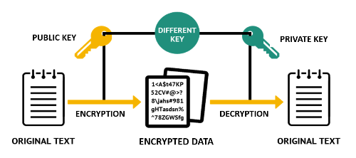

# 네트워크

## 1. 쿠키와 세션의 차이에 대해 설명해 주세요.

 
  
쿠키와 세션의 차이

- 쿠키와 세션을 사용하는 이유: HTTP 프로토콜의 특성인 Connectionless(비연결성)과 Stateless(비상태성)을 보완하기 위해
- 쿠키:
  - 클라이언트(브라우저)에 key-value 쌍으로 저장되는 데이터 파일
  - 유효 시간(expiration)까지 유지되며, 브라우저가 닫혀도 남을 수 있음
  - 서버가 응답 헤더에 Set-Cookie를 내려주면 브라우저가 저장 후 이후 요청마다 Cookie 헤더에 포함해서 보냄
  1. 서버가 클라이언트로부터 요청을 받았을 때, 클라이언트에 관한 정보를 토대로 쿠키를 구성
  2. 서버는 클라이언트에게 보내는 응답 header에 쿠키를 담아서 보냄
  3. 클라이언트가 응답을 받으면, 브라우저는 쿠키를 클라이언트 PC에 저장
- 세션: - 클라이언트 정보를 서버에 저장하고, 클라이언트에게는 식별자(session ID)만 전달 → 브라우저에는 세션 쿠키로 저장 - 클라이언트 요청 시 session ID를 서버로 보내고, 서버는 해당 ID를 키로 세션 저장소에서 상태를 조회하여 응답 1. 서버가 클라이언트 요청을 받으면, 세션 저장소에 클라이언트 상태 정보를 저장하고 이를 식별할 session ID를 생성 2. 서버는 클라이언트에게 보내는 응답 header에 session ID가 포함된 세션 쿠키를 담아서 보냄 3. 브라우저는 세션 쿠키를 저장하고, 이후 요청마다 Cookie 헤더에 session ID를 포함 → 서버는 세션 저장소에서 해당 ID를 키로 상태를 조회 후 응답

  
세션 방식의 로그인 과정에 대해 설명해 주세요.

1.  사용자가 ID와 PW를 입력해 로그인 요청
2.  서버가 계정 정보를 검증
3.  검증 성공 시, 서버는 세션 저장소에 사용자 상태를 저장하고 session ID를 생성
4.  session ID를 Set-Cookie 헤더로 브라우저에 전달 → 브라우저는 세션 쿠키로 저장
5.  이후 데이터 요청 시 브라우저가 session ID 쿠키를 전송 → 서버는 세션 저장소에서 상태를 조회 후 응답

- 세션 방식 로그인의 장점
  - 쿠키가 담긴 HTTP 요청이 중간에 노출되더라도 쿠키 자체에는 유의미한 값을 가지고 있지 않음
- 세션 방식 로그인의 단점
  - 유저들의 세션에 대한 정보를 저장할 공간이 필요
  - 멀티 디바이스/브라우저 환경 관리가 복잡함
  - 세션 하이재킹 공격에 취약
  - 서버 확장 시 세션 동기화 문제 발생
- 토큰 기반 로그인과의 차이점: - 세션 로그인 방식은 session ID만 실어서 보내면 되기 때문에 트래픽을 토큰보다 적게 사용 - 모든 인증 정보를 서버에서 관리하기 때문에 보안 측면에서 더 유리 - 세션 불일치 문제 발생 가능성이 높고, 확장성이 낮으며, 세션 데이터의 양이 많아지만 서버의 부담이 증가

  
HTTP의 특성인 Stateless에 대해 설명해 주세요.

- Stateless(비상태성)이란 요청 간 상태를 기억하지 않는다는 것을 의미
- 클라이언트에 보낸 정보를 서버에 저장(유지)하지 않고, 서버는 요청만 보고 처리하고 응답을 반환, 이전 요청이 어떤 상태였는지 기억하지 않음
- 수평 확장에 있어서 유리한 방법

  
Stateless의 의미를 살펴보면, 세션은 적절하지 않은 인증 방법 아닌가요?

- Stateless는 HTTP 프로토콜(Application Layer Protocol)의 성질일 뿐이고, 세션은 애플리케이션 레벨에서 상태를 관리하는 정상적인 방식
- 요구사항에 따라 다른 인증 방법을 사용할 수는 있지만, 실제 서비스는 권한에 대한 상태 정보가 필요하기 때문에 세션이 적절하지 않은 인증 방법인 것은 아님

  
규모가 커져 서버가 여러 개가 된다면, 세션을 어떻게 관리할 수 있을까요?

- 세션을 각 서버 메모리에 저장했을 때, 세션 불일치 문제가 발생할 수 있다.
- 해결 방법 - Sticky Session 방식 - 로드밸런서가 항상 동일한 사용자의 요청을 같은 서버로 보내도록 고정 - 특정 서버에 트래픽이 몰릴 위험성이 있고, 서버 다운 시 세션 유실 → 안정성 낮음 - Session 공유 저장소 방식 - 세션 정보를 Redis, Memcached, DB 등 공유 저장소에 두는 방식 - 모든 서버가 같은 저장소에서 session ID를 조회하므로 확장성, 안정성 확보 - 네트워크 I/O나 인프라 비용에 대한 부담 발생

## 2. HTTP 응답코드에 대해 설명해 주세요.

  
HTTP 응답코드란?

- HTTP 상태코드는 클라이언트가 요청한 작업이 성공했는지, 실패했는지를 나타내는 표준 코드
- 상태 코드에 따라 요청의 성공/실패 여부를 세 자릿수(예: 404)로 구분
- HTTP 상태코드의 종류 - 1XX (정보 전달) → 요청을 받았으며, 처리 중 - 2XX (성공) → 요청이 정상적으로 완료됨 - 3XX (리다이렉션) → 다른 URL로 이동해야 함 - 4XX (클라이언트 오류) → 사용자의 요청이 잘못됨 - 5XX (서버 오류) → 서버에서 요청을 처리하는 중 문제 발생

  
401 (Unauthorized) 와 403 (Forbidden)은 의미적으로 어떤 차이가 있나요?

- 401 (Unauthorized)
  - 상태: 자격 증명(토큰/쿠키)가 없거나 잘못된 경우
  - 예시: 사용자가 로그인되지 않은 경우
- 403 (Forbidden) - 상태: 요청을 이해했지만 권한 부족으로 거절된 경우 - 예시: 사용자가 권한이 없는 요청을 하는 경우

  
200 (ok) 와 201 (created) 의 차이에 대해 설명해 주세요.

- 200 (ok)
  - 상태: 요청을 서버가 성공적으로 처리한 경우
  - 예시: 조회/갱신 결과를 반환해주는 경우
- 201 (created) - 상태: 새 리소스가 생성되었음을 의미 - 예시: 새로운 Entity가 생성되는 POST 요청에 대한 응답인 경우

  
필요하다면 저희가 직접 응답코드를 정의해서 사용할 수 있을까요? 예를 들어 285번 처럼요. 

- 직접 응답코드를 정의하는 것이 불가능하지는 않지만, 표준을 따르지 않으면 클라이언트가 해석하기 어렵고 예상치 못한 문제를 일으킬 수 있음
- HTTP 상태 코드는 RFC 2616에 정의되어 있음, 서버와 클라이언트 간의 통신 규약
- 대신 응답으로는 표준 상태 코드를 내려주고, 응답 본문에 추가적인 커스텀 정보를 담아 전달하는 것이 좋음

## 3. HTTP Method 에 대해 설명해 주세요.

  
 HTTP Method란?
  

- HTTP Method: 클라이언트가 자원(Resource)에 대해 수행하려는 동작의 의도를 나타냄
- HTTP Method의 종류 - POST: 요청 데이터 처리, 주로 새로운 등록에 사용 - GET: 리소스 조회 - PATCH: 리소스 부분 변경 - PUT: 리소스 전체 변경(대체), 해당 리소스가 없으면 생성 - DELETE: 특정 리소스를 삭제 - HEAD: GET과 동일하지만, 응답 본문을 포함하지 않음 - OPTIONS: 대상 리소스에 대한 통신 가능 옵션을 설명 - CONNECT: 대상 자원으로 식별되는 서버에 대한 터널을 설정 - TRACE: 대상 리소스에 대한 경로를 따라 메시지 루프백(loop-back) 테스트를 수행

  
HTTP Method의 멱등성에 대해 설명해 주세요.

- HTTP Method의 멱등성이란:
  - 여러 번 동일한 요청을 보냈을 때, 서버에 미치는 의도된 영향(자원의 상태)이 동일한 경우를 의미
- 멱등 HTTP Method:
  - GET, HEAD, OPTIONS, TRACE, PUT, DELETE
- 비멱등 HTTP Method: - POST, PATCH, CONNECT
  

  
GET과 POST의 차이는 무엇인가요?
  

- GET:
  - 리소스의 변화를 일으키지 않는 순수 조회 목적
  - 멱등성(Idempotent)을 가지고 있음
  - 데이터를 URL 쿼리스트링에 포함해서 전달 (예: 페이지네이션, 검색 파라미터)
  - 캐시 가능(Cacheable): 브라우저/프록시에서 응답을 캐싱 가능
- POST: - 리소스를 생성하거나 서버 상태를 변화시키는 요청 - 멱등성이 없음 → 같은 요청을 여러 번 보내면 리소스가 중복 생성될 수 있음, 캐시 불가능 - 데이터를 HTTP Body에 담아 전달 (JSON, Form 등)

  
POST와 PUT, PATCH의 차이는 무엇인가요?
  

- POST:
  - 주로 새로운 리소스를 생성하거나, 특정 동작(Action)을 실행하는 데 사용
  - 멱등성이 없음 (예: 같은 결제 요청 2번 → 중복 결제 발생 가능)
- PUT:
  - 리소스를 전체 교체하는 요청
  - 멱등성을 가짐 → 같은 PUT 요청을 여러 번 보내도 결과가 동일
  - 요청 Body에 해당 리소스 전체를 담아야 함 (없는 필드는 null/초기화될 수 있음)
- PATCH: - 리소스를 부분 수정하는 요청 - 멱등성이 보장되지 않을 수도 있음 - 변경할 속성만 Body에 담아서 전달

  
HTTP 1.1 이후로, GET에도 Body에 데이터를 실을 수 있게 되었습니다. 그럼에도 불구하고 왜 아직도 이런 방식을 지양하는 것일까요?
  

- HTTP 표준 준수: HTTP/1.1 표준(RFC 7231)에 따르면, GET 요청은 요청 본문을 포함할 수는 있으나 그 의미는 정의되지 않음
- 캐싱 문제 발생: GET 요청은 캐시될 수 있어야 하는데, 본문을 포함한 GET 요청은 캐시 일관성을 유지하기 어려움
- 안정성과 멱등성: GET 요청은 안전하고 멱등적이어야 함, 본문을 포함하는 GET 요청은 이러한 GET Method의 특성을 깨트릴 수 있음
- 클라이언트와 서버의 지원 부족: 많은 HTTP 클라이언트 라이브러리 및 서버 프레임워크는 GET 요청의 본문을 지원하지 않거나 무시
- 표준 툴 및 라이브러리 호환성: 많은 개발 도구와 라이브러리는 GET 요청에 본문이 없다는 가정을 하고 설계되어 있기 때문에, 호환성 문제 발생 가능

## 4. HTTP에 대해 설명해 주세요.

  
 HTTP란?
  

- 웹에서 클라이언트(브라우저)와 서버 간 데이터를 주고받기 위한 애플리케이션 계층 프로토콜
- 다양한 종류의 멀티미디어(html, css, javascript, png, gif, mp4)를 전송할 수 있도록 설계됨
- 일반적으로 TCP/IP 통신 프로토콜 기반으로 동작함
- HTTP 통신은 클라이언트와 서버로 나뉘어진 구조를 가짐
- HTTP의 특징:
  - Stateless: 각 요청은 독립적으로 처리, 이전 요청 상태를 기억하지 않음
  - Connectionless: 요청-응답 후 연결 종료
- HTTP 통신과 Socket 통신의 차이
 - HTTP 통신: - 클라이언트가 요청을 보내면 서버는 해당 요청에 대한 응답을 보내고 연결 종료 - 데이터 연결 시점엠나 연결이 이루어짐, 리소스가 절약됨 - 주로 웹 브라우저와 웹 서버 간의 통신에 사용 - Socket 통신: - 클라이언트와 서버가 지속적으로 연결을 유지하며 양방향으로 데이터를 주고받음 - 실시간 데이터 전송이 필요한 경우 주로 사용 - 리소스 소모가 크지만 실시간 통신에 유리함

  
공개키와 대칭키에 대해 설명해 주세요.
  

- **대칭키 암호화**
  
  - 암호화/복호화에 동일한 키(대칭키)를 사용하는 방식
  - 암호화/복호화 속도가 빠르고 효율적
  - 단점: 키 분배 문제, 키 교환 시 유출의 위험이 있음
  - 예: AES, DES, 3DES, RC4 알고리즘 등
- **공개키(비대칭키) 암호화**
  
  - 공개키(public key)와 개인키(private key) 쌍을 사용
  - 모두에게 공유되는 공개키로 암호화 → 자신만 가지는 개인키로 복호화
  - 단점: 대칭키보다 연산이 느림
  - 예: RSA, ECC, Diffie-Hellman 알고리즘 등
- 실제 HTTPS에서는 **두 방식을 혼합해 사용**: - 세션 키 교환: - 공개키 방식 사용 - HTTPS 연결 시작 시, 클라이언트(브라우저)와 서버가 TLS Handshake 수행 - Diffie-Hellman(ECDH/ECDHE) 교환을 통해 세션 키 교환 - 데이터 통신: - 대칭키 방식 사용 - 세션 키가 공유된 후에는, 속도/효율성을 고려해 이후의 데이터 통신은 모두 AES 같은 대칭키 알고리즘으로 암호화

  
왜 HTTPS Handshake 과정에서는 인증서를 사용하는 것 일까요?
  

- HTTPS 연결 과정

  > 1. 클라이언트(주로 웹 브라우저)가 "https://"로 시작하는 URL을 서버에게 요청한다.
  > 2. 서버는 공개키와 CA(인증 기관) 정보가 담긴 인증서를 클라이언트에게 전송한다.
  > 3. 클라이언트는 인증 기관의 공개키로 인증서의 유효성을 검증한다. (서버 신뢰성 확인)
  > 4. 클라이언트는 서버의 공개키를 사용해 무작위의 세션키를 생성한다.
  > 5. 세션키를 서버의 공개키로 암호화하여 서버에 전송한다.
  > 6. 서버는 받은 세션키를 자신의 개인키로 복호화하고, 세션키를 사용해서 연결을 설정한다.
  > 7. 클라이언트와 서버가 각자의 세션키로 데이터를 암호화/복호화하여 주고 받는다.

- HTTPS Handshake에서 인증서를 사용하는 이유 - **서버 신뢰성 보장**: 인증서를 통해 서버가 신뢰할 수 있는 주체임을 보장. 없으면 중간자 공격(Man-in-the-Middle, MITM)에 취약할 수 있음.  
 - **스니핑(Sniffing) 방지**: 네트워크 중간에서 트래픽을 도청하는 공격에 대비. 암호화된 세션 키를 사용하므로 중간에서 내용을 알아낼 수 없음.  
 - **데이터 변조 방지**: 공개키는 인증서 안에 포함되고, 인증서는 CA의 전자서명으로 보호됨 → 공격자가 키를 변조하지 못하도록 보장.  
 - **피싱(Phishing) 방지**: 인증서에 기록된 도메인·조직 정보를 통해 가짜 사이트가 진짜인 척하는 피싱을 차단.

  
SSL과 TLS의 차이는 무엇인가요?
  

- SSL과 TLS 모두 서버, 애플리케이션, 사용자 및 시스템 간의 데이터를 암호화하는 보안 통신 프로토콜
- 네트워크를 통해 연결된 두 당사자를 인증하고 데이터를 안전하게 교환할 수 있게 해줌.
- **SSL (Secure Sockets Layer)**
  - 초창기 넷스케이프에서 개발된 암호화 프로토콜
  - 여러 버전(SSL 2.0, 3.0)이 있었으나 현재는 보안 취약점으로 인해 더 이상 사용되지 않음
  - 메시지 무결성을 보장하기 위해 MAC(Message Authentication Code) 기반 인증 사용
  - TLS로 완전히 대체된 상태
- **TLS (Transport Layer Security)** - SSL을 기반으로 발전한 차세대 표준 프로토콜 - 현재 HTTPS에서 사용하는 보안 계층 (TLS 1.2, TLS 1.3이 주류) - 보다 안전한 핸드셰이크 과정을 제공 (Diffie-Hellman 기반 키 교환, 전방위 보안 PFS 지원) - 일부 취약 알고리즘을 제거해 보안 강화 - 메시지 인증에 HMAC(Hash-based MAC) 사용

## 5. 웹소켓과 소켓 통신의 차이에 대해 설명해 주세요.

  
웹소켓과 소켓 통신의 차이
  

- **소켓(Socket)**
  - 네트워크 통신의 출발점, 용프로그램은 소켓을 통하여 통신망으로 데이터를 송수신하게 됨
  - 즉, 응용 프로그램에서 TCP/IP를 이용하는 인터페이스 역할
  - 일반적으로 5-Tuple로 정의됨 `(프로토콜, 로컬 IP, 로컬 Port, 원격 IP, 원격 Port)`
  - **TCP 소켓**
    - 연결 지향적. 양방향으로 바이트 스트림을 전송함
    - 3-way Handshake로 세션 수립
    - 데이터 무결성 보장: 패킷 손실이나 손상 시 재전송
    - 데이터 순서 보장: 송신한 순서대로 데이터가 도착하도록 보장
    - 재전송/흐름제어로 인해 오버헤드 발생
  - **UDP 소켓**
    - 비연결 지향적인 소켓. 빠르고 단순하지만 순서/신뢰성 보장이 없음
    - 실시간 멀티미디어 정보 처리를 위해 사용 (예: 게임, 스트리밍, DNS 쿼리 등)
- **웹소켓(WebSocket)**
  - HTTP 프로토콜 위에 실시간 양방향 통신 기능을 추가한 프로토콜
  - HTTP 프로토콜을 업그레이드(Upgrade 헤더)하여 동작함
  - 전환 이후에는 양방향 통신이 가능 → 클라이언트/서버가 실시간으로 메시지를 주고받음
  - 특징:
    - HTTP나 HTTPS 위에서 동작하도록 설계되었음, 80/443 포트 사용
    - 서버 푸시, 실시간 알림, 채팅, 주식 시세 서비스에 최적화 되어있음
- **소켓과 웹소켓의 차이** - 프로토콜: - 소켓은 4계층에 위치하여 동작 - 웹소켓은 HTTP에 기반하므로 7계층에서 동작 - 데이터 전송: - 소켓은 바이트 스트림(TCP) 또는 데이터그램(UDP) - 웹소켓은 프레임 단위(텍스트, 바이너리 등 구조화된 메시지) - 방화벽: - 소켓은 새로운 TCP 포트를 열어야 하는 경우가 많음 - 웹소켓은 80/443 포트를 활용

  
소켓과 포트의 차이가 무엇인가요?

- **포트(Port)**
  - 네트워크에서 특정 소프트웨어에 데이터를 전달하기 위한 통신 채널을 식별하는 번호
  - 포트 번호를 통해 하나의 IP를 가진 장치 내에서 프로세스를 구분할 수 있음
  - 포트의 종류 (범위: 0 ~ 65535)
    - Well-known Port: 0 ~ 1023
    - Registered Port: 1024 ~ 49151
    - Dynamic Port: 49152 ~ 65535
- **소켓(Socket)**
  
  - 실제 네트워크 연결을 위한 통신 엔드포인트
  - IP와 Port를 결합하여 소켓을 생성, 특정 IP의 특정 Port로 통신 세션을 설정하고 데이터를 송수신하는 데 사용

  
여러 소켓이 있다고 할 때, 그 소켓의 포트 번호는 모두 다른가요?
  

- **서버 측 소켓**
  - 클라이언트의 접속을 대기하는 소켓
  - 일반적으로 특정 IP 주소와 포트 번호에 바인딩되며, 이 포트 번호는 해당 서버에서 고유해야 한다
- **클라이언트 소켓**
  - 서버에 연결을 요청하는 소켓
  - 포트를 사용하지만, 이 포트 번호는 임시적으로 할당되며 동적/사설 동적/사설 포트 범위(49152-65535) 내에서 사용된다.
- **여러 소켓의 포트 번호가 같은 경우** - 다중 클라이언트 연결: 서버 소켓은 동일한 포트 번호에서 여러 클라이언트의 연결을 수락할 수 있다. 이 경우 서버는 포트 번호가 동일하지만, 각 클라이언트와의 연결은 소켓의 IP 주소와 소스 포트 번호가 달라 식별 가능 - 소켓 옵션: SO_REUSEADDR와 같은 소켓 옵션을 사용하면, 동일한 포트 번호를 여러 소켓에서 재사용할 수 있다. 주로 서버 소프트웨어가 재시작될 때 이전 소켓이 완전히 종료되지 않은 상태에서도 포트를 재사용할 수 있게 해준다.

  
사용자의 요청이 무수히 많아지면, 소켓도 무수히 생성되나요?
  

- **TCP**
  - 이론적으로는 클라이언트가 요청할 때마다 커널이 연결 소켓을 생성.
  - 따라서 동시 접속 수 = 연결 소켓 수. 하지만 현실적으로 OS 자원의 한계 때문에 무한히 생성되는 것은 불가능하다.
- **UDP**
  - 비연결 지향이므로, 요청이 많아도 소켓을 새로 생성하지 않는다.
  - 하나의 소켓이 바인딩된 포트에서 여러 클라이언트의 패킷을 동시에 수신 가능하다.

  
<h3>6. HTTP/1.1과 HTTP/2의 차이점은 무엇인가요?</h3>

<ul>
<li> HOL Blocking 에 대해 설명해 주세요.</li>
<li> HTTP/3.0의 주요 특징에 대해 설명해 주세요.</li>
</ul>

  
<h3>7. TCP와 UDP의 차이에 대해 설명해 주세요.</h3>

<ul>
<li> Checksum이 무엇인가요?</li>
<li> TCP와 UDP 중 어느 프로토콜이 Checksum을 수행할까요?</li>
<li> 그렇다면, Checksum을 통해 오류를 정정할 수 있나요? </li>
<li> TCP가 신뢰성을 보장하는 방법에 대해 설명해 주세요.</li>
<li> TCP의 혼잡 제어 처리 방법에 대해 설명해 주세요.</li>
<li> 왜 HTTP는 TCP를 사용하나요?</li>
<li> 그렇다면, 왜 HTTP/3 에서는 UDP를 사용하나요? 위에서 언급한 UDP의 문제가 해결되었나요?</li>
<li> 그런데, 브라우저는 어떤 서버가 TCP를 쓰는지 UDP를 쓰는지 어떻게 알 수 있나요?</li>
<li> 본인이 새로운 통신 프로토콜을 TCP나 UDP를 사용해서 구현한다고 하면, 어떤 기준으로 프로토콜을 선택하시겠어요?</li>
</ul>

  
<h3>8. DHCP가 무엇인지 설명해 주세요.</h3>

<ul>
<li> DHCP는 몇 계층 프로토콜인가요? </li>
<li> DHCP는 어떻게 동작하나요?</li>
<li> DHCP에서 UDP를 사용하는 이유가 무엇인가요?</li>
<li> DHCP에서, IP 주소 말고 추가로 제공해주는 정보가 있나요?</li>
<li> DHCP의 유효기간은 얼마나 긴가요?</li>
</ul>

  
<h3>9. IP 주소는 무엇이며, 어떤 기능을 하고 있나요?</h3>

<ul>
<li> IPv6는 IPv4의 주소 고갈 문제를 해결하기 위해 만들어졌지만, 아직도 수많은 기기가 IPv4를 사용하고 있습니다. 고갈 문제를 어떻게 해결할 수 있을까요?</li>
<li> IPv4와 IPv6의 차이에 대해 설명해 주세요.</li>
<li> 수많은 사람들이 유동 IP를 사용하고 있지만, 수많은 공유기에서는 고정 주소를 제공하는 기능이 이미 존재합니다. 어떻게 가능한 걸까요?</li>
<li> IPv4를 사용하는 장비와 IPv6를 사용하는 같은 네트워크 내에서 통신이 가능한가요? 가능하다면 어떤 방법을 사용하나요? </li>
<li> IP가 송신자와 수신자를 정확하게 전송되는 것을 보장해 주나요?</li>
<li> IPv4에서 수행하는 Checksum과 TCP에서 수행하는 Checksum은 어떤 차이가 있나요?</li>
<li> TTL(Hop Limit)이란 무엇인가요? </li>
<li> IP 주소와 MAC 주소의 차이에 대해 설명해 주세요.</li>
</ul>

  
<h3>10. OSI 7계층에 대해 설명해 주세요.</h3>

<ul>
<li> Transport Layer와, Network Layer의 차이에 대해 설명해 주세요.</li>
<li> L3 Switch와 Router의 차이에 대해 설명해 주세요.</li>
<li> 각 Layer는 패킷을 어떻게 명칭하나요? 예를 들어, Transport Layer의 경우 Segment라 부릅니다.</li>
<li> 각각의 Header의 Packing Order에 대해 설명해 주세요.</li>
<li> ARP에 대해 설명해 주세요.</li>
</ul>

  
<h3>11. 3-Way Handshake에 대해 설명해 주세요.</h3>

<ul>
<li> ACK, SYN 같은 정보는 어떻게 전달하는 것 일까요?</li>
<li> 2-Way Handshaking 를 하지않는 이유에 대해 설명해 주세요.</li>
<li> 두 호스트가 동시에 연결을 시도하면, 연결이 가능한가요? 가능하다면 어떻게 통신 연결을 수행하나요?</li>
<li> SYN Flooding 에 대해 설명해 주세요.</li>
<li> 위 질문과 모순될 수 있지만, 3-Way Handshake의 속도 문제 때문에 이동 수를 줄이는 0-RTT 기법을 많이 적용하고 있습니다. 어떤 방식으로 가능한 걸까요?</li>
</ul>

  
<h3>12. 4-Way Handshake에 대해 설명해 주세요.</h3>

<ul>
<li> 패킷이 4-way handshake 목적인지 어떻게 파악할 수 있을까요?</li>
<li> 빨리 끊어야 할 경우엔, (즉, 4-way Handshake를 할 여유가 없다면) 어떻게 종료할 수 있을까요?</li>
<li> 4-Way Handshake 과정에서 중간에 한쪽 네트워크가 강제로 종료된다면, 반대쪽은 이를 어떻게 인식할 수 있을까요?</li>
<li> 왜 종료 후에 바로 끝나지 않고, TIME_WAIT 상태로 대기하는 것 일까요? </li>
</ul>

  
<h3>13. www.github.com을 브라우저에 입력하고 엔터를 쳤을 때, 네트워크 상 어떤 일이 일어나는지 최대한 자세하게 설명해 주세요.</h3>

<ul>
<li> DNS 쿼리를 통해 얻어진 IP는 어디를 가리키고 있나요?</li>
<li> Web Server와 Web Application Server의 차이에 대해 설명해 주세요. </li>
<li> URL, URI, URN은 어떤 차이가 있나요? </li>
</ul>

  
<h3>14. DNS에 대해 설명해 주세요.</h3>

<ul>
<li> DNS는 몇 계층 프로토콜인가요? </li>
<li> UDP와 TCP 중 어떤 것을 사용하나요?</li>
<li> DNS Recursive Query, Iterative Query가 무엇인가요?</li>
<li> DNS 쿼리 과정에서 손실이 발생한다면, 어떻게 처리하나요?</li>
<li> 캐싱된 DNS 쿼리가 잘못 될 수도 있습니다. 이 경우, 어떻게 에러를 보정할 수 있나요?</li>
<li> DNS 레코드 타입 중 A, CNAME, AAAA의 차이에 대해서 설명해주세요.</li>
<li> hosts 파일은 어떤 역할을 하나요? DNS와 비교하였을 때 어떤 것이 우선순위가 더 높나요?</li>
</ul>

  
<h3>15. SOP 정책에 대해 설명해 주세요.</h3>

<ul>
<li> CORS 정책이 무엇인가요?</li>
<li> Preflight에 대해 설명해 주세요.</li>
</ul>

  
<h3>16. Stateless와 Connectionless에 대해 설명해 주세요.</h3>

<ul>
<li> 왜 HTTP는 Stateless 구조를 채택하고 있을까요?</li>
<li> Connectionless의 논리대로면 성능이 되게 좋지 않을 것으로 보이는데, 해결 방법이 있을까요?</li>
<li> TCP의 keep-alive와 HTTP의 keep-alive의 차이는 무엇인가요?</li>
</ul>

  
<h3>17. 라우터 내의 포워딩 과정에 대해 설명해 주세요.</h3>

<ul>
<li> 라우팅과 포워딩의 차이는 무엇인가요?</li>
<li> 라우팅 알고리즘에 대해 설명해 주세요.</li>
<li> 포워딩 테이블의 구조에 대해 설명해 주세요.</li>
</ul>

  
<h3>18. 로드밸런서가 무엇인가요?</h3>

<ul>
<li> L4 로드밸런서와, L7 로드밸런서의 차이에 대해 설명해 주세요.</li>
<li> 로드밸런서 알고리즘에 대해 설명해 주세요.</li>
<li> 로드밸런싱 대상이 되는 장치중 일부 장치가 문제가 생겨 접속이 불가능하다고 가정해 봅시다. 이 경우, 로드밸런서가 해당 장비로 요청을 보내지 않도록 하려면 어떻게 해야 할까요?</li>
<li> 로드밸런서 장치를 사용하지 않고, DNS를 활용해서 유사하게 로드밸런싱을 하는 방법에 대해 설명해 주세요.</li>
</ul>

  
<h3>19. 서브넷 마스크와, 게이트웨이에 대해 설명해 주세요.</h3>

<ul>
<li> NAT에 대해 설명해 주세요. </li>
<li> 서브넷 마스크의 표현 방식에 대해 설명해 주세요.</li>
<li> 그렇다면, 255.0.255.0 같은 꼴의 서브넷 마스크도 가능한가요?</li>
</ul>

  
<h3>20. 멀티플렉싱과 디멀티플렉싱에 대해 설명해 주세요.</h3>

<ul>
<li> 디멀티플렉싱의 과정에 대해 설명해 주세요.</li>
</ul>

  
<h3>21. XSS에 대해서 설명해 주세요.</h3>

<ul>
<li> CSRF랑 XSS는 어떤 차이가 있나요?</li>
<li> XSS는 프론트엔드에서만 막을 수 있나요?</li>
</ul>

