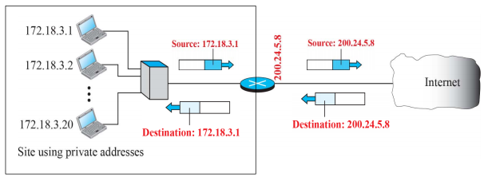
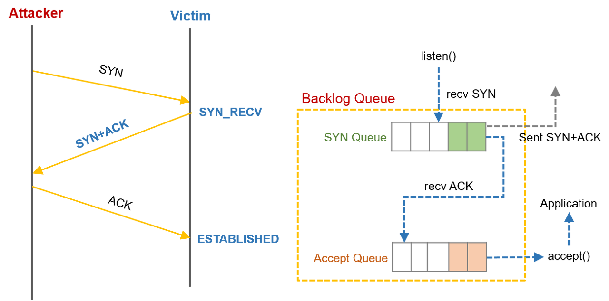

# 네트워크

## 1. 쿠키와 세션의 차이에 대해 설명해 주세요.
주된 차이점은 **저장 위치**와 **라이프 사이클**    

#### 쿠키
- 클라이언트의 로컬에 저장되는 키와 값이 들어있는 작은 데이터 파일
- 사용자 인증이 유효한 시간을 명시할 수 있으며 유효시간이 정해지면 브라우저가 종료되어도 인증이 유지됨
- 도메인당 가질 수 있는 쿠키의 개수와 쿠키의 최대 용량이 정해져있음
- Response Header에 Set-Cookie 속성을 사용해 클라이언트에 쿠키 생성 가능
- 용도 | 로그인 상태 유지 (자동 로그인/아이디 저장 등), 사용자 맞춤 환경(다크모드 여부/팝업 안 보기 등)
> ##### 쿠키의 동작 과정 
> 1. 클라이언트가 페이지 요청
> 2. 웹 서버는 쿠키를 생성
> 3. HTTP 응답 헤더에 쿠키를 포함시켜 전송
> 4. 클라이언트는 쿠키를 로컬 PC에 저장하고 있다가 이후 서버에 요청할 때 쿠키를 포함시켜 요청
> 5. 서버에서 쿠키를 읽고 이전 상태 정보를 변경할 필요가 있으면 쿠키를 업데이트 후 변경된 쿠키를 응답 헤더에 포함시켜 전송함

#### 세션
- 클라이언트가 웹 서버에 접속한 시점부터 웹 브라우저를 종료해 연결을 끊어내는 시점까지의 일정 시간 동안 같은 클라이언트로부터 들어오는 일련의 요구를 하나의 상태로 보고, 그 상태를 유지시키는 기술
- 쿠키와 달리 웹 서버에 웹 컨테이너의 상태를 유지하기 위한 정보 저장
- 세션 데이터는 서버 측 저장소에 저장하고, 세션 ID만 클라이언트 쿠키에 저장하므로 그냥 쿠키만 사용하는 것보다 보안이 좋음
- 세션 타임아웃으로 서버에서 세션 데이터를 삭제하거나 클라이언트가 브라우저를 종료해서 세션 쿠키가 삭제되는 경우에 소멸됨
- 각 클라이언트에게 고유 Session ID 부여
- 용도 | 로그인 인증 정보, 사용자별 중요한 상태 관리
> ##### 세션의 동작 과정
> 1. 클라이언트가 페이지 요청
> 2. 서버는 접근한 클라이언트의 Request-Header 필드인 Cookie를 확인하여 클라이언트가 Session ID를 보냈는지 확인
> 3. Session ID가 존재하지 않는다면 웹 서버는 Session ID를 생성해 클라이언트에게 전송
> 4. 클라이언트는 서버로부터 받은 Session ID를 쿠키에 저장, 다음 요청부터 해당 값을 포함하여 전송
> 5. 서버는 전달받은 Session ID로 Session에 있는 클라이언트 정보를 가지고 요청을 처리 후 응답

### ⁃ 세션 방식의 로그인 과정에 대해 설명해 주세요.

#### 세션 방식의 로그인

1.	로그인 요청      
- 클라이언트가 아이디/비밀번호를 서버에 전송      
2.	인증 처리     
- 서버가 DB에서 사용자 정보 확인 → 성공 시 세션 생성      
- 세션에는 사용자 ID, 권한 등 상태 정보 저장       
3.	세션 ID 발급     
- 서버는 생성된 세션의 고유 ID를 클라이언트에 전달      
- 브라우저는 이 세션 ID를 세션 쿠키에 저장      
4.	인증 유지     
- 클라이언트가 이후 요청 시 쿠키에 세션 ID 포함 → 서버는 세션 저장소에서 해당 ID를 찾아 사용자 식별      
5.	만료/로그아웃     
- 세션 타임아웃이 지나거나 사용자가 로그아웃하면 서버에서 세션 삭제 → 세션 ID는 더 이상 유효하지 않음     

#### 토큰 방식의 로그인

1.	로그인 요청       
- 클라이언트가 아이디/비밀번호를 서버에 전송          
2.	인증 처리 & 토큰 발급       
- 서버가 DB에서 사용자 정보 확인 → 성공 시 토큰(JWT 등) 발급          
- 토큰 내부에는 사용자 ID, 권한, 만료 시간 등 정보가 **서명(Signature)**과 함께 담김          
3.	토큰 저장       
- 클라이언트는 토큰을 로컬스토리지, 세션스토리지, 혹은 쿠키에 저장          
4.	인증 유지       
- 이후 요청 시 Authorization: Bearer <token> 헤더에 토큰을 포함시켜 전달          
- 서버는 서명(Signature)을 검증하여 토큰이 위·변조되지 않았음을 확인 → 유저 인증 완료          
- 별도의 서버 세션 저장소 조회 없이 인증 가능.
5.	만료/로그아웃          
- 토큰에 포함된 **만료 시간(exp)**이 지나면 자동으로 무효화          
- 서버는 원칙적으로 상태를 저장하지 않기 때문에(logout 구현은 보통 refresh token 블랙리스트 등 별도 처리)          

### ⁃ HTTP의 특성인 Stateless에 대해 설명해 주세요.
서버가 클라이언트에서 보내준 정보를 저장하지 않고, 상태를 보존하지 않는다는 의미 → 수평 확장에 유리함

| stateful                                                   | stateless                                            |
|------------------------------------------------------------|------------------------------------------------------|
| 특정 서버가 특정 클라이언트의 정보를 갖고 있기 때문에 클라이언트는 항상 같은 서버에게 요청을 보내야 함 | 서버가 클라이언트의 상태를 저장하지 않기 때문에 클라이언트는 아무 서버에게나 요청을 보내도 됨 |
| 특정 서버에 장애 발생 시 해당 서버로 요청을 보내던 클라이언트의 정보를 잃게 될 것            | 특정 서버에 장애 발생 시 클라이언트의 요청은 다른 서버가 처리해주면 됨 |

> #### HTTP의 특성
> 1. 클라이언트 - 서버 구조 | 클라이언트에서 요청을 보내면 서버는 그에 따른 응답을 보내는 구조를 갖는다.
> 2. Stateless | 서버는 클라이언트의 상태를 저장하지 않는다.
> 3. Connectionless | 클라이언트의 요청 - 서버의 응답 이후에는 연결을 종료한다.

### ⁃ Stateless의 의미를 살펴보면, 세션은 적절하지 않은 인증 방법 아닌가요?
세션 인증에서는 서버가 클라이언트의 상태를 저장하기 때문에 Stateful하다고 볼 수 있으며, Stateless 원칙에 충실하려면 JWT 등을 이용한 토큰 인증을 사용하는 것이 맞다.     
하지만 보안 측면에서 토큰은 클라이언트의 모든 정보가 담겨 있으므로 탈취 시 위험이 크다는 단점이 있고, 반면 세션은 서버가 상태를 직접 관리하기 때문에 필요하다면 즉시 무효화 가능하다는 장점이 있다.      
또한 세션을 사용하면 특정 사용자의 세션을 강제로 만료시키거나 권한을 즉시 변경하는 것이 가능하다.         
다만 소규모, 단일 서버 환경에서는 세션 관리 비용이 크게 부담되지 않으나 대규모, 분산환경에서는 세션 공유 및 동기화가 어렵기 때문에 Stateless한 토큰 인증 방식이 선호된다. 

### ⁃ 규모가 커져 서버가 여러 개가 된다면, 세션을 어떻게 관리할 수 있을까요?

#### Sticky Session
- 웹 애플리케이션의 로드 밸런싱에서 사용되는 기술
- 클라이언트의 요청이 항상 특정 서버로 라우팅되도록 보장
- 서버 부하 불균형, 서버 장애 시 문제, 서버 확장 시 동기화 및 관리의 어려움 등의 문제점이 존재

#### Session Clustering
- 웹 애플리케이션 환경에서 세션 데이터를 여러 서버 간에 공유할 수 있도록 세션 데이터를 서버 간에 복제·동기화하는 방식
- 비효율적인 메모리 관리, 세션 데이터 복제 및 동기화를 위한 네트워크 사용으로 인한 네트워크 트래픽 증가 등의 문제점이 존재

#### Session Storage
- 세션 저장소를 Redis와 같은 외부 서버로 분리하는 방식
- 수평 확장, 장애 내성에 유리함
- 네트워크 비용, 단일 장애점 등과 같은 문제점 존재 

## 2. HTTP 응답코드에 대해 설명해 주세요.
- 모든 HTTP 응답 코드는 5개의 클래스로 구분됨
- 상태 코드의 첫 번째 숫자는 응답의 클래스를 정의

> #### 상태 코드
> 1xx (정보) | 요청을 받았으며 프로세스를 계속한다      
> 2xx (성공) | 요청을 성공적으로 받았으며 인식했고 수용하였다       
> 3xx (리다이렉션) | 요청 완료를 위해 추가 작업 조치가 필요하다       
> 4xx (클라이언트 오류) | 요청의 문법이 잘못되었거나 요청을 처리할 수 없다       
> 5xx (서버 오류) | 서버가 명백히 유효한 요청에 대해 충족을 실패했다       

### ⁃ 401 (Unauthorized) 와 403 (Forbidden)은 의미적으로 어떤 차이가 있나요?

#### 401 (Unauthorized)
- 클라이언트가 인증되지 않았거나, 유효한 인증 정보가 부족하여 요청이 거부되었음을 의미
- 클라이언트가 인증되지 않았기 때문에 요청을 정상적으로 처리 불가함을 알려주기 위함
- 주로 로그인되지 않은 상태에서 무언가를 요청하는 경우 해당 응답 코드 사용

#### 403 (Forbidden)
- 서버가 해당 요청을 이해했지만, 권한이 없어 요청이 거부되었음을 의미
- 클라이언트가 해당 요청에 대한 권한이 없음을 알려주기 위함

### ⁃ 200 (ok) 와 201 (created) 의 차이에 대해 설명해 주세요.

#### 200 (ok)
- 서버가 성공적으로 요청을 처리했음을 의미
- 일반적으로 클라이언트가 요청한 데이터를 응답에 포함

#### 201 (created)
- 서버가 성공적으로 요청을 처리했으며, 그 결과 새로운 리소스가 생성되었음을 의미
- 일반적으로 새롭게 생성된 리소스 자체 혹은 생성된 위치를 응답에 포함

### ⁃ 필요하다면 저희가 직접 응답코드를 정의해서 사용할 수 있을까요? 예를 들어 285번 처럼요. 
- 클라이언트와 서버는 HTTP 표준에 맞춰 통신하기 때문에, 임의의 상태 코드를 넣으면 대부분의 클라이언트는 제대로 인식하지 X       
- 표준 코드 안에서 의미에 맞게 쓰는 것이 권장됨
- 추가적인 상태 정보가 필요하다면 `json` 안에 커스텀 코드를 정의해 사용

## 3. HTTP Method 에 대해 설명해 주세요.
클라이언트와 서버 사이에 이루어지는 요청과 응답 데이터를 전송하는 방식을 의미         

#### HTTP 메서드 종류
- `GET` | 리소스 조회
- `POST` | 요청 데이터 처리, 주로 등록에 사용
- `PUT` | 리소스 대체 (덮어쓰기, 전체 변경), 해당 리소스가 없다면 생성
- `PATCH` | 리소스 부분 변경 
- `DELETE` | 리소스 삭제
- `HEAD` | GET과 동일하지만 body 부분을 제외하고 상태 줄과 헤더만 반환
- `OPTIONS` | 대상 리소스에 대한 통신 가능 옵션 설명
- `CONNECT` | 대상 자원으로 식별되는 서버에 대한 터널 설정
- `TRACE` | 대상 리소스에 대한 경로를 따라 메시지 루프백 테스트 수행
 
### ⁃ HTTP Method의 멱등성에 대해 설명해 주세요.
HTTP 메서드의 속성 중 Safe, Cacheable과 함께 Idempotence가 존재하며, 멱등성은 "여러 번 동일한 요청을 보냈을 때 서버에 미치는 의도된 영향이 동일한 경우"라고 정의되어 있음.       
HTTP 멱등성이 필요한 이유는 요청의 재시도 때문인데, 만약 HTTP 요청이 멱등하다면 요청이 실패했을 때 주저없이 재요청을 하면 되지만 HTTP 요청이 멱등하지 않다면 리소스가 이미 처리되었는데 중복 요청을 보낼 수 있기 때문

#### HTTP 메서드의 멱등 여부
|HTTP 메서드 | 멱등 여부 | 이유 | 
| ----- | ----- | ------|
|GET | O | 같은 요청을 여러 번 호출해도 항상 같은 결과가 조회됨|
|POST | X | 같은 요청을 여러 번 호출하면 새로운 리소스가 생성되거나 리소스의 상태가 달라지며 호출 결과가 달라질 수 있음|
|PUT| O | 같은 요청을 여러 번 호출해도 항상 대상 리소스를 대체하여 동일한 상태로 만듦|
|PATCH | X | 기존 리소스에 응답을 추가하는 경우에도 PATCH가 사용될 수 있는데, 이때 호출 결과가 달라질 수 있음 | 
|DELETE|O| 같은 요청을 여러 번 호출해도 항상 리소스가 없는 동일한 상태임 |

### ⁃ GET과 POST의 차이는 무엇인가요?
1. 의미 | GET은 리소스 조회 시 사용, POST는 리소스 생성 시 사용
2. 멱등성 | GET은 멱등성이 보장되지만 POST는 멱등성 보장 X

### ⁃ POST와 PUT, PATCH의 차이는 무엇인가요?
1. 의미 | POST는 리소스 생성 시 사용, PUT은 리소스 대체 시 사용, PATCH는 리소스 일부 변경 시 사용     
2. 멱등성 | POST와 PATCH는 멱등성이 보장되지 않지만 PUT은 멱등성 보장

### ⁃ HTTP 1.1 이후로, GET에도 Body에 데이터를 실을 수 있게 되었습니다. 그럼에도 불구하고 왜 아직도 이런 방식을 지양하는 것일까요?
1. 의미적 혼동 | GET은 리소스 조회의 의미를 가지고 있는데, body에 데이터가 존재할 경우 의미가 명확하지 않게 되고, REST 원칙을 위반하게 됨
2. 호환성 문제 | 많은 서버 / 프록시 / 캐시 시스템이 GET의 body를 무시하도록 설계됨

## 4. HTTP(Hyper Text Transfer Protocol)에 대해 설명해 주세요.
- 웹 상에서 데이터를 주고받기 위한 프로토콜
- 다양한 종류의 데이터(html, css, javascript, png, gif, mp4)를 전송할 수 있도록 설계된 프로토콜
- 일반적으로 **TCP/IP 프로토콜** 기반으로 동작
- HTTP 프로토콜을 통해 전달되는 자료는 http: 로 시작하는 URL로 조회할 수 있으며, 사용하는 **포트는 80번**
- 클라이언트와 서버 간의 요청과 응답을 통해 작동
- **비연결성**과 **무상태**라는 특징을 가진다.
- 데이터를 평문(사람이 알아볼 수 있는 정보)로 전송하기 때문에 도청 및 데이터 변조의 위험이 있고, 보안에 취약함 → 이를 보완하기 위해 나온 것이 https

#### HTTP의 흐름

1. 사용자가 웹 브라우저 주소창에 `https://www.google.com` 입력
2. 브라우저는 입력된 도메인 이름을 IP 주소로 변환하기 위해 DNS 서버에 요청을 보낸다. DNS 서버는 해당 도메인의 IP 주소를 응답으로 보내준다.
3. 브라우저는 받은 IP 주소를 통해 구글 서버와 TCP 연결을 설정한다.
4. TCP 연결이 설정되면, 브라우저는 HTTP 요청 메시지를 구글 서버에 보낸다. 
5. 서버가 요청을 처리하고 HTTP 응답을 전송한다. 
6. 브라우저가 응답을 받아 화면에 구글 웹 사이트를 표시한다. 

### ⁃ 공개키와 대칭키에 대해 설명해 주세요.

#### 대칭키

- 암호화, 복호화에 사용하는 키가 동일하다.
- 키를 교환해야 한다
    - 탈취 위험 존재 (-)
    - 사람이 증가할수록 키 관리가 어려워진다 (-)
    - 확장성이 떨어진다 (-)
- 속도가 빠르다 (+)
- 기밀성을 제공하지만 무결성/인증/부인방지 보장 X
- 대표적 알고리즘 | SEED, DES, 3DES, AES, ARIA

#### 공개키 (비대칭키)

- 암호화, 복호화에 사용하는 키가 서로 다르다.
- 속도가 느리다 (-)
- 키 분배 필요 X
  - 암호 모드 | 수신자 공개키로 암호화 → 수신자 개인키로 복호화         
    소량의 메시지를 암호화하는 것이 목적. 주로 키 교환의 용도로 사용
  - 인증 모드 | 송신자 개인키로 암호화 → 송신자 공개키로 복호화        
    메시지를 누가 보냈는지 확인하는 것이 목적. 주로 전자서명을 개인키로 암호화하고 공개키로 복호화해 진위를 확인함
- 기밀성, 인증, 부인방지 기능 제공
- 대표적 알고리즘 | Diffie Hellman, RSA, DSA, ECC

### ⁃ 왜 HTTPS Handshake 과정에서는 인증서를 사용하는 것 일까요?
인증서를 통해 (서버의) 공개키의 진위와 서버의 신뢰성을 보장한다. 

#### SSL Handshake
         
- Server Hello | 서버의 공개키가 담긴 SSL 인증서를 전달. 인증서는 CA의 비밀키로 암호화되어 발급된 상태
- SSL 인증서 확인 | 브라우저에 내장된 CA 공개키로 암호화된 인증서를 복호화         
- Parameter Secret | 클라이언트가 생성한 난수와 서버의 난수를 사용해 만든 parameter secret을 서버의 공개키로 암호화하여 전송
- Parameter Secret 복호화 | 서버는 서버의 비밀키로 클라이언트가 보낸 값을 복호화하여 master secret 값으로 저장, 이를 사용해 session key를 생성하고 세션 키를 대칭 키로 사용해서 클라이언트와 주고받는 데이터를 암호화한다.

### ⁃ SSL과 TLS의 차이는 무엇인가요?

#### SSL (Secure Sockets Layer)
- 넷스케이프가 1990년대 초반에 개발한 보안 프로토콜
- 현재는 보안 취약점 때문에 사용 X

#### TLS (Transport Layer Security)
- SSL 3.0을 기반으로 IETF가 개선한 표준 프로토콜
- SSL의 후속 버전
- HTTPS, 메일 전송, VPN 등에서 널리 사용

## 5. 웹소켓과 소켓 통신의 차이에 대해 설명해 주세요.
소켓 통신은 네트워크 기술 / 프로그래밍 인터페이스 (API)로 볼 수 있다면 웹소켓은 애플리케이션 계층의 프로토콜

#### 웹소켓
- 단일 TCP 연결을 통해 서버와 클라이언트가 실시간으로 양방향 통신을 할 수 있게 해주는 프로토콜
- TCP 기반으로 동작
- 초기 연결은 HTTP 요청을 통해 이루어지지만 이후 웹소켓 프로토콜로 업그레이드하게 되면 연결이 끊어질 때까지 계속해서 유지됨

#### 소켓 통신
- 네트워크에서 두 컴퓨터 간의 '실시간 양방향 통신'을 제공하는 기술/인터페이스
- TCP 또는 UDP 라는 두가지 주요 프로토콜 사용
  - TCP 소켓 | 연결 지향적, 신뢰성 있는 데이터 전송
  - UDP 소켓 | 비연결, 빠르지만 신뢰성 X

### ⁃ 소켓과 포트의 차이가 무엇인가요?
소켓은 통신 엔드포인트, 포트는 한 컴퓨터 내에서 특정 프로세스를 식별하는 번호

#### 소켓
- 네트워크에서 '두 대의 디바이스 간' 데이터 송수신을 위한 통신 **엔드포인트**
- IP 주소 + 포트 번호 + 프로토콜을 묶은 네트워크 통신의 끝점 → 192.168.0.10:8080 (TCP)
- 클라이언트 소켓과 서버 소켓의 연결로 데이터 송수신
- 운영체제에서 소켓은 실제 통신을 위한 식별자, 핸들처럼 관리됨
- 192.168.0.10:12345 (Client) ↔ 13.124.23.10:443 (Server)

#### 포트
- 네트워크에서 '특정 소프트웨어에' 데이터를 전달하기 위한 통신 채널을 식별하는 번호
- 운영체제에서 실행 중인 프로세스를 구분하기 위한 번호
- 포트 번호는 0부터 65535까지의 범위를 가지며 일반적으로 잘 알려진 포트 번호와 동적 포트 번호로 나뉨 → HTTPS 포트 번호는 443
  - 0 ~ 1023 : 잘 알려진 포트
  - 1024 ~ 49151 : 등록된 포트
  - 49152 ~ 65535 : 동적/사설 포트
- :443 (HTTPS 서버 프로세스)

### ⁃ 여러 소켓이 있다고 할 때, 그 소켓의 포트 번호는 모두 다른가요?
- 리스닝 소켓 | 리스닝 포트는 고유해야 하므로 소켓끼리의 포트 번호는 모두 달라야 한다.
- 연결 소켓 | (클라이언트 IP, 클라이언트 Port, 서버 IP, 서버 Port) 로 구분되므로 소켓끼리 서버 포트가 같아도 상관 X

#### 서버 소켓
- 서버는 보통 고정된 포트 번호 사용. Ex. 0.0.0.0:443 (HTTPS)
- 같은 서버 안에 여러 개의 서버 소켓이 있어도 포트 번호는 달라야 함. Ex. 80 두 개를 동시에 listen 하는 것은 불가능

#### 클라이언트 소켓
- 클라이언트가 서버에 연결할 때는 운영체제가 임시 포트를 자동으로 배정해줌 (49152 ~ 65535)
- 여러 클라이언트 소켓이 같은 서버에 접속해도, 각 클라이언트 소켓은 출발지 포트가 달라서 구분됨      
    ```
    클라1 소켓: 192.168.0.10:53001 → 13.124.23.10:443
    클라2 소켓: 192.168.0.10:53002 → 13.124.23.10:443
    ```

### ⁃ 사용자의 요청이 무수히 많아지면, 소켓도 무수히 생성되나요?
#### TCP의 경우
- 요청이 많아질 경우 그만큼의 연결 소켓이 생기지만, 리스닝 소켓은 그대로 1개        
- 동시에 유지되는 연결의 수 = 연결 소켓의 수      
- 서버 자원에는 한계가 있으므로 커넥션 관리 전략 (커넥션 풀/keep-alive 시간 제한/로드밸런싱) 필요
#### UDP의 경우
- UDP는 비연결형 프로토콜 → 별도의 연결을 맺지 않고, 그냥 데이터를 보내고 받음
- 따라서 서버가 한 개의 소켓만 열어두고 있어도, 수많은 클라이언트의 요청을 처리할 수 있음
- 클라이언트 주소(IP/포트) 정보를 패킷 헤더에서 읽어 처리하기 때문에 굳이 클라이언트마다 소켓을 따로 만들 필요 X
- 예) DNS 서버는 보통 하나의 UDP 소켓으로 수십만 요청을 처리

> ##### 서버 소켓의 구조
> 크게 두 종류의 소켓이 존재
> 1. 리스닝 소켓
> - 특정 포트에서 연결 요청을 기다리는 소켓
> - 서버 시작 시 한 번만 생성되고 계속 유지됨
> 2. 연결 소켓
> - 클라이언트와 실제 연결이 맺어지면 리스닝 소켓이 accept() 를 통해 새로 생성
> - 클라이언트마다 1개씩 생성됨
> - 클라이언트와 연결이 끝나면 CLOSE 되고 OS가 자원을 해제함

## 6. HTTP/1.1과 HTTP/2의 차이점은 무엇인가요?

#### HTTP/1.1

- TCP 위에서 동작하는 애플리케이션 계층 프로토콜
- 텍스트 기반 프로토콜 → 헤더와 바디를 사람이 읽을 수 있는 ASCII로 전송
- 하나의 TCP 연결에서 한번에 하나의 요청만 처리 → Head-of-Line Blocking 문제
- 헤더에 대한 압축 기술이나 최적화 기술이 없어 매번 똑같은 헤더를 전송해야 하는 부담 존재
- 위 문제를 회피하기 위해 TCP 커넥션을 여러 개 사용하는 경우도 있었음

#### HTTP/2

- HTTP/1.1 에서 발생한 HOLB를 해결하기 위해 스트림이라는 개념과 멀티플렉싱을 도입
- 하나의 HTTP 메시지를 여러 프레임으로 쪼개서 전송하는데, 이때 Headers, Frame, Data Frame 으로 분리되어 압축되어 전송됨
- 하나의 TCP 연결에서 여러 요청/응답을 동시에 처리하는 멀티플렉싱 도입 → HOLB 문제 완화
- 스트림 우선순위 지정 → 요청마다 스트림 ID를 부여하여 독립적으로 전송 가능하게 하고, 중요한 리소스에 우선순위를 높게 설정할 수 있도록 함
- 서버 푸시 지원 → 클라이언트 요청이 없어도 서버가 미리 리소스 전송 가능 (html 요청 시 css, js 동시에 푸시)
- HPACK 알고리즘을 사용해 헤더 압축 → 이미 알고있는 헤더에 대해서는 인덱스만 보내고, 그렇지 않은 헤더에 대해서는 Huffman 부호화 적용

### ⁃ HOL Blocking 에 대해 설명해 주세요.
큐에서 첫번째 요소로 인해 나머지 요소들이 정체되어 성능 제한 현상이 발생하는 경우

### ⁃ HTTP/3.0의 주요 특징에 대해 설명해 주세요.

- HTTP/2는 HTTP/1.1의 HOLB 문제를 완화하긴 했지만, 여전히 TCP 위에서 동작하기 때문에 완전히 해결하지 못했다는 한계 존재        
- HTTP/2의 한계를 극복하기 위해 나온 것이 HTTP/3
- `QUIC (Quick UDP Internet Connections)` 라는 새로운 전송 계층 프로토콜 이용
- UDP 기반 QUIC 프로토콜 위에서 동작 → 스트림 단위로 독립적인 전송을 함으로써 한 스트림 패킷 손실이 다른 스트림에 영향을 주지 않음
- TCP + TLS 에서는 최소 3-way handshake + TLS handshake 필요하지만 QUIC은 TLS 1.3을 내장 → 1RTT, 재접속 시에는 0RTT로 암호화된 통신 시작 가능
- HTTP/2도 멀티플렉싱을 지원했으나 TCP 기반이라 하나의 패킷 손실이 전체 스트림 지연으로 이어짐. 그러나 HTTP/3은 QUIC 덕분에 스트림 독립성을 보장하고, 지연이 최소화됨
- QUIC은 TLS 1.3을 내장하므로 HTTP/3 연결은 항상 암호화된 상태
- TCP는 연결이 IP + Port 에 묶이므로 네트워크 변경 시 연결이 끊기지만 QUIC은 Connection ID를 사용하기 때문에 IP가 바뀌어도 연결 유지 가능

## 7. TCP와 UDP의 차이에 대해 설명해 주세요.


| 구분       | TCP                        | UDP                        |
|----------|----------------------------|----------------------------|
| 연결 방식    | 연결형 서비스 (가상 회선 방식)         | 비연결형 서비스 (데이터그램 방식)        |
| 이미지 |  |  |
| 전송 순서 보장 | O                          | X                          |
| 수신 여부 확인 | O (데이터 손실 시 재전송)           | X                          |
| 통신 방식    | 1 : 1 통신                   | 1 : 1 / 1 : N / N : N      |
| 신뢰성      | 높다                         | 낮다                         |
| 속도       | 느리다                        | 빠르다 (no handshake)         |
| 헤더 크기    | 최소 20B                     | 8B                         |
| 주요 사용 사례 | 웹, 이메일, 파일 전송              | 스트리밍, 온라인 게임, VoIP, DNS    |

### ⁃ Checksum이 무엇인가요?
- 데이터 전송 중 오류가 발생했는지, 즉 데이터 무결성을 검출하기 위한 에러 검출 기법 중 하나
- 송신 측에서 전송할 데이터를 일정한 단위로 나눠 모두 더한 후, 그 값을 보정해서 만든 값을 의미함
- 동작 과정
  - 송신 측은 데이터와 체크섬을 함께 전송
  - 수신 측은 받은 데이터를 다시 같은 방식으로 합산해 체크섬과 비교
  - 만약 값이 다르면 전송 중 오류 발생을 의미
- 단순하고 빠른 연산 제공
- 모든 오류를 완벽하게 잡아내지는 못함 (특히 2비트가 동시에 바뀌는 경우)

### ⁃ TCP와 UDP 중 어느 프로토콜이 Checksum을 수행할까요?
TCP와 UDP 모두 checksum을 수행한다.
#### TCP의 Checksum
- 헤더 안에 Checksum 필드 (16비트) 존재 
- 헤더 + 데이터 + 의사 헤더를 합쳐서 체크섬 계산
  > ##### 의사 헤더 (Pseudo Header) 
  > TCP의 체크섬은 TCP 세그먼트가 올바른 목적지에 손상되지 않고 도착했는지 확인하기 위한 값이지만 TCP는 전송 계층이지만 출발지/목적지 IP 주소와 같은 네트워크 계층의 정보가 없어 패킷이 다른 주소로 잘못 전송되더라도 이를 알 수가 없다. 따라서 IP 계층 정보의 일부를 가져와서 (실제로 전송되지는 않지만) 의사 헤더라는 것을 만들고, 체크섬을 계산할 때 포함시킨다. 
#### UDP의 Checksum
- 헤더 안에 Checksum 필드 (16비트) 존재
- TCP와 유사하게 헤더 + 데이터 + 의사 헤더를 이용해 체크섬 계산
- IPv4 환경에서는 UDP 체크섬이 optional (사용하지 않을 경우 0으로 채움)
- IPv6 환경에서는 반드시 체크섬을 계산해야함

### ⁃ 그렇다면, Checksum을 통해 오류를 정정할 수 있나요? 
- 체크섬으로 오류 검출은 가능하지만 오류 정정은 불가능하다. 단순히 데이터를 일정 단위로 나눠 모두 더하고 보수를 취한 값이기 때문
- 오류 검출 | 체크섬, 패리티 비트, CRC 등
- 오류 정정 | 해밍 코드, 리드-솔로몬 코드 등

### ⁃ TCP가 신뢰성을 보장하는 방법에 대해 설명해 주세요.
#### 순서 보장
> 
- 전송하는 바이트마다 `Sequence Number`를 부여
- 수신자는 해당 번호를 기반으로 순서를 재조립
- 수신자는 정상적으로 받은 데이터의 다음 바이트 번호를 ACK으로 응답
- 송신자는 ACK을 받으면 데이터가 정상적으로 도착했다고 판단
- 송신자가 정해진 시간(RTO; retransmission timeout) 내에 ACK을 받지 못할 경우 해당 데이터를 재전송

#### 흐름 제어
- 데이터를 보내는 속도를 조절하여 수신자의 버퍼 오버플로우를 방지함
- Stop-and-Wait
  >           
  - 송신자는 한번에 한 개의 데이터 블록만 전송, 수신자의 ACK을 받아야 다음 데이터를 전송함
- Sliding Window 
  >             
  - 수신 측에서 설정한 윈도우 크기만큼 송신 측에서 연속적으로 데이터를 전송 (파이프라이닝)
  - 오류가 검출될 경우 그 이후의 모든 프레임을 재전송해야 함
  - 최초 윈도우의 크기는 3-way handshaking 과정을 통해 설정, TCP 헤더에 저장되고 관리됨

#### 오류 제어
- TCP 헤더 + 데이터 + 의사헤더까지 모두 합산해 오류를 검출
- ARQ (Automatic Repeat Request) 기법을 사용해 프레임이 손상되었거나 손실되었을 경우 재전송을 통해 오류 복구
  > ##### Stop and Wait ARQ
  > 수신 측은 수신된 데이터의 에러 유무 판단에 따라 ACK 또는 NAK을 전송        
  > NAK을 받은 송신 측은 데이터를 재전송
  > ##### Go-Back-n ARQ
  > 전송된 프레임이 손상되거나 분실된 경우, ACK 패킷의 손실로 인한 타임아웃이 발생한 경우 확인된 마지막 프레임 이후의 모든 프레임을 재전송       
  > ACK은 다음 프레임 전송을 의미, NAK은 손상된 프레임 자체 번호를 반환
  > ##### Selective-Repeat ARQ
  > GBn ARQ의 확인된 마지막 프레임 이후의 모든 프레임을 재전송하는 단점을 보완     
  > 송신 측은 손실된 프레임만 재전송하며, 수신 측에 별도의 버퍼를 두어 수신받은 데이터를 정렬해야 한다.

#### 혼잡 제어
- 송신 측의 데이터 전달과 네트워크 데이터 처리 속도를 해결하기 위한 기법
- 한 라우터에게 데이터가 몰려 모든 데이터를 처리할 수 없는 경우 재전송으로 이어지고, 결국 혼잡을 가중시켜 오버플로우 혹은 데이터 손실이 발생
- 이와 같은 네트워크 혼잡을 피하기 위해 송신 측에서 보내는 데이터의 전송 속도를 제어하는 것이 혼잡 제어의 개념

### ⁃ TCP의 혼잡 제어 처리 방법에 대해 설명해 주세요.
수신자의 처리 능력(rwnd)와 네트워크 혼잡 상태(cwnd) 두 조건을 모두 만족해야 전송 진행
> ##### 혼잡 윈도우 (cwnd)
> 송신 측이 네트워크 상태를 고려해 보낼 수 있는 데이터 양을 제한하는 변수
> ##### 수신 윈도우 (rwnd)
> 수신 측 버퍼의 크기를 알려주는 값   

#### TCP 혼잡 제어 알고리즘

##### Slow Start 
처음에는 네트워크 상태를 모르므로 cwnd = 1 MSS(Maximum Segment Size)로 시작        
ACK을 받을 때마다 cwnd가 지수적으로 증가         
일정 임계값(=ssthresh)에 도달하면 Congestion Avoidance로 전환
##### Congestion Avoidance
cwnd를 지수적으로 늘리지않고 선형적으로 (1 MMS씩) 증가
##### Fast Retransmit
동일한 ACK이 3번 연속 도착하면 해당 세그먼트가 손실된 것으로 간주, 타임아웃을 기다리지 않고 즉시 재전송
##### Fast Recovery
손실이 발생했다고 해서 cwnd를 처음으로 줄이지 않고, ssthresh를 줄인 후 cwnd를 절반 정도로 줄이고 선형적 증가

### ⁃ 왜 HTTP는 TCP를 사용하나요?
HTTP는 HTML, 이미지, 동영상 등 다양한 리소스를 전송하는 프로토콜이므로 데이터가 손실되거나 순서가 뒤바뀌면 웹 페이지가 불완전하게 표시될 수 있음.      
따라서 정확하고 순서가 보장된 데이터 전달이 매우 중요하고, 그러한 점에서 TCP의 특성과 맞아떨어지기 때문
### ⁃ 그렇다면, 왜 HTTP/3 에서는 UDP를 사용하나요? 위에서 언급한 UDP의 문제가 해결되었나요?
HTTP/3에서는 UDP 기반의 QUIC 프로토콜을 사용하는데, TCP의 3-way handshake 연결 설정과 HOL 블로킹 문제를 해결하기 위함.      
그러나 QUIC 자체가 TCP의 신뢰성/순서 보장 기능을 UDP 위에서 다시 구현한 것이기 때문에 본질적으로는 여전히 신뢰성을 확보하고 있음
### ⁃ 그런데, 브라우저는 어떤 서버가 TCP를 쓰는지 UDP를 쓰는지 어떻게 알 수 있나요?
서버는 특정 포트 번호에서 TCP/UDP 중 어떤 전송 계층 프로토콜을 사용할지 웹 서버 설정 파일 등에 미리 지정해둠     
```
server {
    listen 80;       # TCP 80번 포트
    listen 443 ssl;  # TCP 443번 포트, TLS 사용
}
```
#### 동작 과정
1.	브라우저에서 https://example.com 입력
2.	브라우저는 HTTPS 규칙에 따라 TCP 443 포트로 연결 시도
3.	TCP 3-way handshake → TLS handshake → HTTP 요청/응답 진행
4.	만약 서버가 HTTP/3(QUIC, UDP/443)을 지원하면 → 응답 헤더를 통해 광고
5.	브라우저는 이후 UDP 기반 QUIC 연결로 업그레이드

### ⁃ 본인이 새로운 통신 프로토콜을 TCP나 UDP를 사용해서 구현한다고 하면, 어떤 기준으로 프로토콜을 선택하시겠어요?
정확성과 안정성이 우선되는 경우 TCP를, 일부 데이터 손실이 허용되고 실시간성이 중요한 경우 UDP를 선택

## 8. DHCP(Dynamic Host Configuration Protocol)가 무엇인지 설명해 주세요.
- 호스트의 IP 주소와 서브넷 마스크, 게이트웨이, DNS 서버 주소 같은 네트워크 기본 설정을 클라이언트에게 자동적으로 제공해주는 프로토콜       
- 네트워크에 사용되는 IP 주소를 DHCP 서버가 중앙집중식으로 관리하는 클라이언트-서버 모델을 사용      
- DHCP 지원 클라이언트는 네트워크 부팅 과정에서 DHCP 서버에 사용 가능한 IP 주소를 요청하고, 이를 얻을 수 있음
> ##### 호스트의 IP 주소 할당 방식
> 1. 고정 IP 주소 방식으로, 직접 IP, 서브넷 마스크, 게이트웨이를 설정. 주로 관공서 등에서 사용하는 방식        
> 2. DHCP를 이용해 동적으로 필요할 때 IP 주소를 할당받음. 주로 일반 사용자들이 사용하는 방식

### ⁃ DHCP는 몇 계층 프로토콜인가요? 
Application Layer

### ⁃ DHCP는 어떻게 동작하나요?
#### DORA

1. Discover | 호스트가 브로드캐스트를 통해 DHCP 서버를 찾아낸다. 이때 호스트는 IP 주소가 없고 68번 포트를 사용하며 DHCP 서버의 포트는 67번
2. Offer | DHCP 서버가 요청에 응답. 이때 2대 이상의 DHCP 서버가 DHCP Offer를 보낼 수 있으므로 DHCP 서버는 자신의 IP 주소를 응답에 포함시킴
3. Request | 호스트가 IP 주소를 요청
4. Ack | DHCP 서버가 사용 가능한 IP 주소를 알려줌

### ⁃ DHCP에서 UDP를 사용하는 이유가 무엇인가요?
1. DHCP Discover 과정에서 호스트는 처음에 브로드캐스트를 통해 DHCP 서버를 찾아내는데, TCP는 브로드캐스트를 지원하지 않는 반면 UDP는 브로드캐스트와 멀티캐스트 지원
2. DHCP는 장치가 아직 IP 주소조차 없는 상태에서 통신 시작. 이 상황에서 3-way handshake이 필요한 TCP를 쓰면 복잡하고 시간이 걸림

### ⁃ DHCP에서, IP 주소 말고 추가로 제공해주는 정보가 있나요?
1. 클라이언트가 실제로 사용할 IP 주소
2. 서브넷 마스크
3. 게이트웨이
4. DNS 서버 주소
5. 임대 기간 → 해당 IP를 얼마나 오래 사용할 수 있는지 나타내는 값
6. 기타 → 도메인 이름, 브로드캐스트 주소 등

### ⁃ DHCP의 유효기간은 얼마나 긴가요?
- DHCP Lease Time은 클라이언트가 할당받은 IP 주소를 사용할 수 있는 시간으로, 고정되지 않고 DHCP에서 설정하는 값
- 할당받은 IP 주소가 만료될 경우 클라이언트는 IP를 반납하거나 갱신해야 함. 보통 임대기간의 절반이 지나면 DHCP 서버에 갱신 요청을 보냄
- 일반적으로 소규모 네트워크에서는 하루, 기업이나 학교에서는 몇 시간 단위, 공공 와이파이의 경우 빠른 회전이 필요하므로 몇 분 ~ 몇 시간 단위로 설정

## 9. IP 주소는 무엇이며, 어떤 기능을 하고 있나요?
- 네트워크에 연결된 장치를 구분하기 위해 부여되는 고유 식별 번호
- 식별 기능 → 네트워크에 연결된 각각의 장치를 구분함
- 위치 지정 기능 → 장치가 네트워크 내에서 어느 위치에 있는지 알려줌
- 경로 설정 기능 → 라우터는 IP 주소를 보고 데이터 패킷을 어디로 보낼지 최적의 경로를 선택함

### ⁃ IPv6는 IPv4의 주소 고갈 문제를 해결하기 위해 만들어졌지만, 아직도 수많은 기기가 IPv4를 사용하고 있습니다. 고갈 문제를 어떻게 해결할 수 있을까요?
#### CIDR (Classless Inter-Domain Routing)

- A/B/C 클래스 단위로 IP 주소를 구분하는 클래스 기반 주소방식을 사용하던 과거에는 사용하지 않는 주소가 다수 발생하게 되어 주소의 낭비가 심했음
- CIDR은 가변 길이 서브넷 마스크(VLSM)을 사용해 효율적으로 IP를 할당함

#### DHCP (Dynamic Host Configuration Protocol)
- 장치가 항상 같은 IP를 차지하지 않고 네트워크에 접속할 때마다 필요할 때만 IP를 임대받아 사용

#### NAT (Network Address Translation)

- 사설 IP를 여러 장치가 쓰고, 외부 인터젯 접속 시에는 하나의 공인 IP로 변환해 사용하는 방식
- 가정용 공유기나 기업 네트워크에서 주로 사용하며, 공인 IPv4의 주소 절약 가능
- NAT로 변환 시 각 사설 IP별로 포트가 지정되어 요청자를 구분 가능

### ⁃ IPv4와 IPv6의 차이에 대해 설명해 주세요.
| 구분   | IPv4                    | IPv6                 |
|------|-------------------------|----------------------|
| 주소 길이 | 32bit                   | 128bit               |
| 주소 표기법 | 10진수 점(.)으로 구분          | 16진수 콜론(:)으로 구분      |
| 주소 종류 | 유니캐스트, 브로드캐스트, 멀티캐스트    | 유니캐스트, 멀티캐스트, 애니캐스트  |
| 헤더   | 길이 가변, 복잡               | 고정 길이 헤더 사용, 단순화     |
| 보안   | IPSec 프로토콜 별도 설치 필요     | IPSec 내장 (자체 지원)     |
| QoS  | DSCP, TOS 와 같은 추가 필드 필요 | 헤더에 Flow Label 필드 내장 |
| 주소 자동설정 | 수동 설정 / DHCP            | 자동 설정 + DHCPv6       |
|Plug & Play| 불가 (DHCP 이용 시 가능) | 가능 |
> ##### Plug & Play
> 사용자가 컴퓨터에 새 하드웨어를 연결했을 때 시스템이 자동으로 장치를 인식하고 필요한 설정을 구성해주는 기술

### ⁃ 수많은 사람들이 유동 IP를 사용하고 있지만, 수많은 공유기에서는 고정 주소를 제공하는 기능이 이미 존재합니다. 어떻게 가능한 걸까요?
공유기는 내부적으로 DHCP 서버를 가지고 있으며, 공유기는 개별 기기의 MAC 주소를 인식할 수 있기 때문에 MAC 주소를 기준으로 항상 같은 사설 IP를 재할당 가능하다. (=Static DHCP)         
공유기 뒤에 연결된 기기들은 기본적으로 유동 할당된 ip 주소를 받지만 고정 ip 예약 기능을 키게 되면 항상 같은 주소를 받게 되는 것

### ⁃ IPv4를 사용하는 장비와 IPv6를 사용하는 같은 네트워크 내에서 통신이 가능한가요? 가능하다면 어떤 방법을 사용하나요? 
직접 통신은 불가능하지만 Dual Stack, Tunneling, NAT64/DNS64 와 같은 기술을 이용하면 같은 네트워크 내에서 통신 가능

#### Dual Stack
- 하나의 장비나 시스템 (라우터 / 운영체제) 에서 IPv4와 IPv6 두가지 IP 버전을 동시에 지원하는 방식
- 오늘날 대부분의 OS (윈도우, 리눅스, 안드로이드, iOS)가 지원하는 방식

#### Tunneling
- IPv6 패킷을 IPv4 패킷 안에 캡슐화하거나 그 반대로 해서 전송
- 6to4, Teredo, ISATAP 같은 터널링 기술
- 보통 IPv6 인프라가 부족할 때 임시방편으로 사용

#### Translation
- IPv6 ↔ IPv4 주소를 변환해주는 방식.
- `NAT64` : IPv6 장비가 IPv4 서버와 통신할 수 있게 중간에서 주소 변환을 해줌
- `DNS64` : IPv6 전용 클라이언트가 IPv4 서버의 도메인을 질의할 때 IPv6 주소로 변환된 응답을 줌
- 동작 방식
  - IPv6 클라이언트가 IPv4 서버 도메인을 조회할 때, DNS64가 IPv6 형태로 변환된 응답을 돌려줌
  - 그러면 클라이언트는 IPv6 패킷을 보내고, NAT64가 그걸 IPv4로 변환해서 실제 IPv4 서버로 전달

### ⁃ IP가 송신자와 수신자를 정확하게 전송되는 것을 보장해 주나요?
보장해주지 않는다. IP는 best-effort delivery service로 unreliable한 프로토콜이다.      
즉, IP 프로토콜은 패킷을 목적지에 전달하려고 최선을 다하지만 성공을 보장하지는 않는다는 의미     
따라서 IPv4 패킷은 중간에 손상, 손실, 순서 뒤바뀜, 지연, 혼잡 등이 발생할 수 있고, 신뢰성이 중요하다면 TCP와 같이 신뢰성 있는 4계층 프로토콜과 같이 쓰여야 한다. 

### ⁃ IPv4에서 수행하는 Checksum과 TCP에서 수행하는 Checksum은 어떤 차이가 있나요?
#### IPv4에서의 Checksum
- 위치 | IPv4 헤더의 Checksum 필드
- 검사 범위 | IP 헤더만 확인
- 목적 | 패킷 전달 과정에서 라우터가 TTL 같은 값을 변경할 때 헤더에 오류가 없는지 검증
- 특징
  - 매 홉을 지날 때마다 TTL이 감소하기 때문에 그때마다 Checksum을 다시 계산해야 함
  - IPv6에서는 성능 개선을 위해 이 기능이 아예 제거됨 (전송 계층에 맡김)

#### TCP에서의 Checksum
- 위치 | TCP 세그먼트 헤더의 Checksum 필드
- 검사 범위 | TCP 헤더 + TCP 페이로드 + Pseudo Header (IP 계층에서 잘못 배달된 것도 잡아내기 위해 송신자 IP, 수신자 IP, 프로토콜 번호 등도 검사)
- 목적 | TCP 세그먼트 전체의 무결성 확인
- 특징 | 엔드포인트에서만 계산

### ⁃ TTL(Hop Limit)이란 무엇인가요? 
- `TTL (Time To Live)`는 패킷이 네트워크에서 살아남을 수 있는 시간 또는 최대 홉 수
- 패킷의 무한 루프를 방지하고 라우터 과부하를 방지하는 역할
- 라우터는 패킷을 전달할 때마다 TTL 값을 1씩 감소시키고, TTL이 0이 되면 패킷을 폐기하고 패킷을 보낸 호스트에게 `Time Exceeded`라는 ICMP 메시지 전송
- DNS 및 CDN에서는 데이터가 DNS 서버나 CDN 캐시에 저장될 수 있는 시간을 의미하기도 한다.

### ⁃ IP 주소와 MAC 주소의 차이에 대해 설명해 주세요.
|구분|IP 주소|MAC 주소|
|---|------|-------|
|위치|네트워크|데이터 링크|
|형식|IPv4(32bit) / IPv6(128bit)| 48bit / 16진수 6쌍|
|할당 방식|네트워크 관리자 또는 DHCP 서버가 할당 (변경 가능) | 제조시 NIC에 영구적으로 부여|
|역할|네트워크 상에서 장치의 위치를 지정하는 논리적 주소|네트워크 인터페이스를 고유하게 식별하는 물리적 주소|
|변경 가능 여부|이동하거나 네트워크 변경 시 바뀔 수 있음|기본적으로 고정되는 게 원칙이지만 소프트웨어를 통해 MAC 스푸핑 가능|

## 10. OSI 7계층에 대해 설명해 주세요.
> 
- 네트워크 통신이 일어나는 과정을 7댠계로 나눈 것
- 국제 표준화 기구 (ISO) 에서 정의한 네트워크 표준 모델

#### 1. 물리 계층
- 전기적 신호가 나가는 물리적 장비
- 데이터를 전기적 신호로 변환해서 전달하는 기능만 함 → 전달하려는 데이터가 무엇인지, 어떤 에러가 있는지 신경 X
- 전송 단위는 `비트`이며 장비로는 `통신 케이블`, `리피터`, `허브` 등이 존재
  - 리피터 : 신호를 멀리 보내기 위한 증폭 장치
  - 허브 : 리피터 역할을 하며 기존 리피터와 다르게 여러 장비를 연결 가능

#### 2. 데이터 링크 계층
- 물리 계층을 통해 송수신되는 정보의 오류와 흐름을 관리하여 안전한 정보 전달을 수행할 수 있도록 도와줌
- 통신에서의 오류를 찾아주고 재전송하는 기능을 가짐
- MAC 주소를 이용해서 통신
- 투 포인트 (Point to Point) 간 신뢰성 있는 전송을 보장하기 위한 계층으로 CRC 기반의 오류 제어와 흐름 제어 필요
  > 오류 검출 방법에는 패리티 검사, 블록 합 검사, CRC, 체크섬 등이 존재하며     
  > CRC 검사는 이진 나눗셈을 기반으로 전체 블록을 검사하는 방법
- 전송 단위는 `프레임`이며 장비로는 `브릿지`, `스위치`, `이더넷`이 존재

#### 3. 네트워크 계층
- 경로(Route)와 주소(IP)를 정하고 패킷을 전달하는 것이 주요 역할
- IP 주소를 기반으로 최적의 경로를 설정하는 라우팅 기능을 맡고 있음
- 전송 단위는 `패킷`이며 장비로는 `라우터`가 존재

#### 4. 전송 계층
- 양 끝 두 지점의 사용자들 간에 신뢰성 있는 데이터를 주고받게 해주는 역할
- 오류 검출 및 복구, 흐름 제어와 중복 검사 등을 수행
- 데이터 전송을 위해 포트 번호 사용
- 전송 단위는 `세그먼트`이며 대표적인 프로토콜로는 `TCP`와 `UDP` 존재

#### 5. 세션 계층
- 두 애플리케이션 프로세스 간의 연결(세션)을 설정, 유지, 종료 관리

#### 6. 표현 계층
- 전송하는 데이터의 표현 방식 결정, 서로 다른 시스템 간의 데이터 표현 방식 차이를 없애주는 역할
- 주요 기능으로는 데이터 형식 변환, 압축, 데이터 암호화/복호화 등이 존재
- JPEG, GIF, ASCII 등이 예시로 존재

#### 7. 응용 계층
- 우리가 사용하는 응용 서비스나 프로세스가 응용 계층에서 동작
- 대표적인 프로토콜로는 `HTTP`, `FTP` 등이 존재

### ⁃ Transport Layer와, Network Layer의 차이에 대해 설명해 주세요.
|구분|Network Layer|Transport Layer|
|---|-------------|---------------|
|목적|데이터를 호스트에서 호스트로 전달|호스트 내부에서 프로세스와 프로세스 간의 통신을 보장|
|주소|IP 주소를 보고 호스트 식별|포트 번호를 보고 프로세스 식별|
|전송 단위|패킷|세그먼트(TCP)/데이터그램(UDP)|
|기능|라우팅, 주소 지정|오류 제어, 순서 보장, 흐름 제어|
|프로토콜|IP, ICMP|TCP, UDP|
|장비|라우터|X|

### ⁃ L3 Switch와 Router의 차이에 대해 설명해 주세요.
#### 공통점
- 둘 다 3계층에서 동작
- IP 주소를 기반으로 경로를 선택하는 라우팅 기능 수행
- VLAN 간 통신 가능
  > ##### VLAN
  > 스위치의 포트를 논리적으로 나눠서 만든 가상 네트워크를 의미. 같은 스위치에 물려 있어도 VLAN 번호가 다르면 서로 다른 네트워크처럼 격리됨       
  > 예를 들어, VLAN 10 = 인사팀 / VLAN20 = 개발팀으로 나눈 경우 물리적으로 같은 스위치에 있더라도 VLAN 번호가 다르면 서로 패킷을 주고받지 X       
  > ##### VLAN
  > 보통 같은 VLAN 안에서는 통신이 자유롭게 되지만 서로 다른 VLAN 간에는 통신 불가 → 이때 필요한 것이 VLAN 통신     
  > 라우터를 이용한 방식과 L3스위치를 이용한 방식이 존재한다. 

#### L3 Switch
- 2계층의 스위치 + 일부 라우터 기능
- 같은 LAN 내에서의 빠른 패킷 전송과 VLAN 간 라우팅이 주 목적 
- 하드웨어(ASIC 칩) 기반으로 처리 → 빠른 속도
- 고성능 LAN 환경에서 주로 사용

#### Router
- 순수 3계층 장비
- 서로 다른 네트워크 (LAN ↔ WAN ↔ 인터넷) 연결이 주 목적
- 소프트웨어 기반 (일부 HW 가속) 처리 → 상대적으로 느린 속도
- 복잡한 라우팅 프로토콜 (OSPF, BGP 등), NAT, 방화벽, VPN 등 다양한 기능 지원

### ⁃ 각 Layer는 패킷을 어떻게 명칭하나요? 예를 들어, Transport Layer의 경우 Segment라 부릅니다.
- PDU (Protocol Data Unit) | 각 계층에서 데이터를 주고받을 때 사용하는 데이터 단위

|계층|PDU|
|---|---|
|응용|Data|
|표현|Data|
|세션|Data|
|전송|Segment / Datagram|
|네트워크|Packet|
|데이터링크|Frame|
|물리|Bit|

### ⁃ 각각의 Header의 Packing Order에 대해 설명해 주세요.
#### 캡슐화 
> 
- 데이터 전송 시 데이터에 헤더를 붙인 후 아래 계층에 전달하는 것
- 순서
  - [L7 데이터]
  - [L4 헤더][L7 데이터]
  - [L3 헤더][L4 헤더][L7 데이터]
  - [L2 헤더][L3 헤더][L4 헤더][L7 데이터][L2 트레일러]

### ⁃ ARP (Address Resolution Protocol) 에 대해 설명해 주세요.
- IP 주소를 해당 IP 주소에 맞는 MAC 주소로 매핑시켜주는 프로토콜
- 이더넷 프레임을 만들기 위해서는 목적지 MAC 주소가 필요하나 우리가 아는 건 IP 주소 뿐이기에 필요함
- ARP 요청은 브로드캐스트, ARP 응답은 유니캐스트
- 한번 알아낸 MAC 주소는 일정 시간동안 ARP (Cache) Table에 저장해놓기 때문에 매번 브로드캐스트하지 않아도 됨

#### 동작 과정
1. 송신자는 목적지 IP 주소를 지정해 패킷 송신 (목적지 MAC 주소는 모르는 상태)
2. IP 프로토콜은 ARP 프로토콜에게 ARP Request 메시지를 생성하도록 요청. 이때 송신자 물리 주소는 발신지 주소, 수신자 물리 주소는 브로드캐스트로 지정
3. 메시지는 2계층으로 전달되고 이더넷 프레임으로 역캡슐화됨
4. 모든 호스트와 라우터는 프레임을 수신 후 자신의 ARP 프로토콜에게 전달
5. 메시지의 목적지 IP 주소와 본인의 IP 주소가 일치하는 시스템은 자신의 물리 주소를 포함하는 ARP Reply 메시지를 전송
6. 최초 송신 측은 지정한 IP 주소에 대응하는 MAC 주소 획득


## 11. 3-Way Handshake에 대해 설명해 주세요.
- TCP 프로토콜로 통신하기 위해 데이터 전송 전 상호 연결을 수립하는 과정
- 데이터를 전송할 준비가 되었다는 것을 보장 및 데이터 전송 준비를 확인하는 과정
- 상대방과 논리적 세션을 맺는 시작점으로, 해당 과정에서 정상적으로 세션이 맺어지지 않으면 통신 중단
- 각 단계에서 사용하는 제어 비트는 SYN, ACK

#### 3-Way Handshake 과정
> 
1. `Closed`      
> - 아직 연결을 시도하기 전에 Client와 Server의 상태
> - TCP 포트가 닫힌 상태
2. `Listen`
> - TCP 포트가 열려 있고 연결 요청을 대기하는 상태
3. `Syn-Sent` (Client)
> - Client가 Server에게 연결을 요청하는 SYN 패킷 전송
> - 임의의 값 seq(100) 넘버를 함께 전송 (ISN; Initial Sequence Number)
4. `Syn-Received` (Server)
> - SYN 패킷을 받은 Server는 요청을 수락하게 되면 SYN + ACK 패킷을 전송하며 응답
> - 임의의 값 seq(200) 넘버를 함께 전달 (ISN; Initial Sequence Number)
> - 해당 패킷의 응답이라는 표시로 Client로부터 전달받은 seq(100) + 1 한 값인 ack(101) 넘버 함께 전달
5. `Established` (Client)
> - Server로부터 SYN + ACK 응답을 받아 Client는 연결이 수립된 상태로 전환
> - 다시 Server에게 ACK 패킷을 전송
> - 이전에 보낸 seq(100) + 1 한 값인 새로운 seq(101) 넘버 전달
> - 해당 패킷의 응답이라는 표시로 Server로부터 받은 seq(200) + 1 한 값인 ack(201) 넘버 전달
6. `Established` (Server)
> - Client로부터 연결이 수립됐다는 ACK 패킷을 전달받아 Server도 연결 수립 상태로 전환
> - Server와 Client가 Established 모드가 된 후 데이터 송수신이 이루어짐

### ⁃ ACK, SYN 같은 정보는 어떻게 전달하는 것 일까요?
TCP 헤더의 제어 플래그(Flags) 필드에 담겨서 전달된다.      
Flags 필드에 여러 플래그가 존재하고, 각 플래그는 1비트짜리 on/off 값으로 필요할 때 조합해서 사용한다.

> ##### 클라이언트가 연결을 시작할 때의 플래그 상태
> SYN = 1 / ACK = 0
> ##### 서버가 응답할 때의 플래그 상태
> SYN = 1 / ACK = 1
> ##### 클라이언트 최종 응답 때의 플래그 상태
> SYN = 0 / ACK = 1

#### TCP 헤더 구조
> 

#### 주요 제어 플래그 (Flags)
- SYN (Synchronize) : 상대방과 연결을 생성할 때 시퀀스 번호의 동기화를 맞추기 위한 세그먼트임을 의미 (=이 seq num을 ISN으로 쓰자고 선언)
- ACK (Acknowledgement) : Acknowledgement 필드에 값이 채워져있음을 알리는 플래그.
- FIN (Finish) : 연결 종료 요청
- RST (Reset) : 이미 연결이 확립되어 ESTABLISHED 상태인 상대방에게 연결을 강제로 리셋해달라는 요청의 의미 (비정상 연결 종료)
- PSH (Push) : 수신 측에게 버퍼가 다 채워질 때까지 기다리지말고 즉시 데이터를 애플리케이션 계층으로 전달하라는 의미. 이 플래그가 1이면 해당 세그먼트 이후에 더이상 연결된 세그먼트가 없음을 의미하기도 함
- URG (Urgent) : Urgent Pointer 필드에 값이 채워져있음을 알리는 플래그. 해당 포인터가 가리키는 데이터는 높게 처리되어 먼저 처리되지만 요즘에는 많이 사용 X

### ⁃ 2-Way Handshaking 를 하지않는 이유에 대해 설명해 주세요.
#### 2-Way Handshake란?
> 
- 클라이언트가 SYN 전송
- 서버가 SYN + ACK 전송
- 클라이언트의 최종 ACK이 없는 상태에서 통신 시작

#### Half-Open Connection 발생
> 
- 클라이언트가 서버에 연결 요청을 보내고, 클라이언트 쪽에서 timeout이 발생할 경우 클라이언트는 똑같은 요청을 재전송
- 서버는 해당 요청을 이전과 다른 연결로 생각해서 SYN + ACK 응답 후 연결이 성립됐다고 생각하고 대기 자원을 할당함
- 하지만 클라이언트는 이미 종료된 세션이라 응답하지 않고, 서버에 쓰레기 연결만 남게 됨 → 서버 리소스를 불필요하게 잡아먹고, 대량 발생 시 SYN Flooding 공격에 취약해짐

#### 그 외 문제점
- 클라이언트의 최종 ACK이 없으므로 클라이언트가 서버의 SYN+ACK을 제대로 받았는지 확인 불가 (서버→클라이언트 방향 통신이 정상적인지 보장 X)
- TCP는 양쪽이 각각 ISN을 교환해야하는데, 서버의 ISN에 대한 클라이언트의 수락(ACK)이 없으므로 시퀀스 번호 동기화가 불완전해짐 → 데이터 순서 보장 불가

### ⁃ 두 호스트가 동시에 연결을 시도하면, 연결이 가능한가요? 가능하다면 어떻게 통신 연결을 수행하나요?
> 
1. SYN-Sent 
- A → B | seq = ISN_A
- B → A | seq = ISN_B
2. SYN-Received 
- A → B | seq = ISN_A / ack = ISN_B + 1
- B → A | seq = ISN_B / ack = ISN_A + 1
3. Established 
- A → B | seq = ISN_A + 1 / ack = ISN_B + 1
- B → A | seq = ISN_B + 1 / ack = ISN_A + 1

### ⁃ SYN Flooding 에 대해 설명해 주세요.
- TCP 연결 수립 과정(3-Way Handshake)를 악용해 서버의 연결 자원을 고갈시키는 공격
- 공격자는 다수의 SYN 패킷을 보내 서버를 SYN-Received(Half-Open) 상태로 만들고, 정상적인 최종 ACK을 보내지 않아서 서버의 연결 대기 큐(Backlog Queue)를 채우게 하여 정상적인 클라이언트와의 연결을 방해한다.

#### 공격 원리
> 
- 일반적으로 클라이언트가 서버로 SYN 요청을 보내면 서버는 SYN + ACK 응답을 보내면서 해당 SYN 요청 정보를 SYN Queue에 저장. 이후 클라이언트로부터 ACK을 받으면 SYN Queue에 있던 연결 요청 정보를 Accept Queue로 이동시키고, accept() 시스템 콜을 통해 TCP 통신이 연결되면서 SYN 요청 정보가 삭제됨
- SYN Flooding 공격의 경우 공격자는 출발지 IP 주소를 존재하지 않는 IP 주소로 위조하여 SYN 요청을 계속 보내 SYN Queue를 가득 차게 만들고 더이상 새로운 연결 요청을 받을 수 없게 한다. 

#### 대응책
- 방화벽이나 DDos 장비에서 같은 IP주소의 SYN 요청에 대한 임계치를 설정하고 임계치를 초과한 경우 해당 연결 요청 차단
- Backlog Queue 크기를 늘림
- SYN Cookie를 설정하여 클라이언트의 유효성 확인 → 연결 설정 과정에서 서버는 쿠키를 생성하여 SYN+ACK 응답 시 쿠키도 같이 전달하고, 클라이언트로부터 ACK 응답이 오기 전까지 SYN Queue에 연결 요청 정보를 저장하지 않음
- First SYN Drop → 처음 들어오는 SYN 요청을 드롭시켜 클라이언트가 다시 요청하는지 확인함으로써 출발지 IP의 위조 여부(실제로 존재하는 호스트인지) 확인

### ⁃ 위 질문과 모순될 수 있지만, 3-Way Handshake의 속도 문제 때문에 이동 수를 줄이는 0-RTT 기법을 많이 적용하고 있습니다. 어떤 방식으로 가능한 걸까요?
#### 0-RTT 기법
이전에 교환한 상태(키/쿠키)를 재사용해서 초기 왕복을 건너뛰는 방법.        
구현 방식은 주로 두가지 패턴으로 나뉜다.

#### 1. TCP Fast Open (TFO)
> 
> 
- 기존 TCP Handshake 과정의 비효율성을 해결하기 위해 SYN 패킷과 함께 데이터를 전송할 수 있도록 허용
- 최초 연결 시 SYN-ACK 단계에서 서버가 클라이언트에게 TFO 쿠키를 발급하고, 이후 재연결 시 클라이언트가 SYN에 TFO 쿠키와 함께 데이터를 실어 보냄. 서버가 쿠키를 검증하면 SYN-ACK 단계에서 데이터를 바로 처리할 수 있어 왕복 절감

#### 2. QUIC (HTTP/3) 0-RTT
- TLS 1.3 Early Data 메커니즘을 전송 계층(UDP 기반 QUIC)에 내장
  > ##### TLS 1.3 Early Data
  > 
  > - 최초 연결 시(1-RTT) TLS Handshake를 완료하면 서버가 클라이언트에게 세션 티켓 발급
  > - 이후 재연결 시 클라이언트는 PSK(Pre-Shared Key)를 사용하여 서버를 인증하고 초기 데이터를 암호화하여 CleintHello와 함께 보냄 → 서버는 요청된 데이터를 ServerHello/Finished 메시지에 포함하여 즉시 응답 가능
- QUIC은 UDP 기반이라 클라이언트가 보내는 첫 패킷에 TLS Client Hello + Early Data + QUIC 전송 파라미터를 모두 담아보냄

## 12. 4-Way Handshake에 대해 설명해 주세요.
- TCP 프로토콜로 통신하던 두 호스트 간 연결을 해제하는 데 필요한 과정

#### 4-Way Handshake 과정
> 
1. `FIN_WAIT_1`
> - 클라이언트가 서버에게 연결 종료를 요청하는 FIN 세그먼트 전송 
> - 이때 FIN 패킷에는 실질적으로 ACK도 포함되어있음
> - 클라이언트는 전송 후 FIN-WAIT 상태가 된다. 
2. `CLOSE_WAIT`
> - 서버는 FIN을 받고 확인했다는 ACK을 클라이언트에게 보내고 자신의 통신이 끝날 때까지 기다린다. 
> - 아직 남은 데이터가 있다면 마저 전송을 마친 후에 close()을 호출한다. 
3. `FIN_WAIT_2`
> - 클라이언트는 서버로부터 ACK을 받은 후에 서버가 남은 데이터 처리를 끝내고 FIN 패킷을 보낼 때까지 기다린다.
4. `LAST_ACK`
> - 서버가 데이터를 모두 보냈다면, 연결 종료에 합의한다는 의미로 FIN 패킷을 클라이언트에게 보낸다.
> - 이후 클라이언트로부터 ACK을 받을 때까지 기다리는 LAST_ACK 상태가 된다.
5. `TIME_WAIT`
> - 클라이언트는 FIN을 받고, 서버에게 ACK을 보낸다.
> - 아직 서버로부터 받지 못한 데이터가 있을 수 있으므로 TIME_WAIT 상태로 기다린다.
6. `CLOSED`
> - 서버는 ACK을 받은 이후 소켓을 닫는다. 
> - TIME_WAIT 상태가 끝나면 클라이언트도 소켓을 닫는다.

### ⁃ 패킷이 4-way handshake 목적인지 어떻게 파악할 수 있을까요?
TCP 헤더의 Flags 필드에서 FIN 플래그 값을 보면 됨

### ⁃ 빨리 끊어야 할 경우엔, (즉, 4-way Handshake를 할 여유가 없다면) 어떻게 종료할 수 있을까요?
- (프로토콜 레벨) TCP 헤더의 Flags 필드에서 RST 플래그 값을 1로 설정한 RST 패킷을 보내면 된다. 
- (프로그래밍 관점) OS 소켓 옵션(SO_LINGER를 0으로 설정)이나 API를 이용해 close()가 FIN 대신 RST를 보내도록 지시

> #### Graceful Close vs Abortive Close
> ##### Graceful Close
> close() 호출 시 커널은 4-way handshake 절차를 밟음    
> 아직 전송하지 않은 데이터를 보내고, 버퍼를 비우고, 정리할 시간을 줌 → 데이터 유실 X
> ##### Abortive Close
> 송신 측은 RST=1 플래그가 설정된 TCP 패킷을 보내고, 수신 측은 곧바로 해당 소켓의 모든 버퍼와 상태를 버리고 연결에 문제가 있음을 인지
> TIME_OUT 상태가 생기지 않고 바로 자원이 정리됨

### ⁃ 4-Way Handshake 과정에서 중간에 한쪽 네트워크가 강제로 종료된다면, 반대쪽은 이를 어떻게 인식할 수 있을까요?
- RST가 수신되는 경우 : 상대가 강제로 연결을 끊었구나
- 그 외 : 타임아웃으로 인식 후 세션 종료

### ⁃ 왜 종료 후에 바로 끝나지 않고, TIME_WAIT 상태로 대기하는 것 일까요? 
- 전송 지연으로 인해 패킷이 늦게 도착할 수 있는데, 만약 바로 연결을 닫아버리고 같은 소켓으로 새 연결을 시작한다면 이전 연결의 늦게 도착한 패킷이 새로운 연결의 데이터로 잘못 해석될 수 있다. 따라서 이를 방지하기 위해 MSL(Maximum Segment Lifetime)의 2배 시간동안 TIME_WAIT 상태로 대기한다.
- 클라이언트가 마지막 ACK을 보냈으나 해당 ACK이 유실될 경우 서버는 마지막 FIN에 대한 ACK이 안 왔다고 생각하고 FIN을 재전송할 수 있는데, 클라이언트가 연결을 바로 종료할 경우 재전송된 FIN을 처리할 수 없게 된다. 따라서 TIME_OUT 상태에서 대기하며 서버가 FIN을 재전송해도 ACK을 다시 보낼 수 있도록 보장한다. 

## 13. www.github.com을 브라우저에 입력하고 엔터를 쳤을 때, 네트워크 상 어떤 일이 일어나는지 최대한 자세하게 설명해 주세요.
> 
1. 브라우저가 URL 해석/파싱
   - 사용자가 주소창에 `www.github.com` 입력 → 브라우저가 이를 URL로 인식
   - 스킴(scheme)이 생략되어있으므로 기본적으로 `https://www.github.com`으로 처리
     > `scheme` : URL에서 프로토콜을 나타내는 부분
   - 어떤 프로토콜을 사용할 것인지(https), 어떤 url로 서버에 요청을 보낼 것인지(www.github.com), 어떤 포트번호로 요청할 것인지(443) 해석하는 과정 
2. DNS 조회 
   - 브라우저 캐시에 `www.github.com`에 해당하는 IP 주소가 있는지 확인
   - 브라우저 캐시에 DNS 정보가 없다면 브라우저는 운영체제에게 요청하고, OS는 내부적으로 hosts 파일, DNS 캐시 순으로 탐색
   - OS에 DNS 정보가 없다면 OS는 자신의 네트워크 설정에 등록된 DNS 서버 주소(보통 라우터/공유기)로 질의를 보냄.
   - 라우터 캐시에도 없다면 ISP의 DNS 서버(=재귀 리졸버)로, ISP의 DNS 서버에도 없다면 리졸버는 루트 DNS 서버 → TLD 서버 → 권한 DLS 서버 순으로 질의를 보내서 IP 주소를 찾아내고 반환
3. 라우팅 준비
   - 얻어낸 목적지 IP가 동일 네트워크인지 확인하고, 아니라면 기본 게이트웨이로 패킷 전송
   - 이때 게이트웨이 MAC 주소를 모를 경우 ARP 요청으로 MAC 주소 얻음
4. TCP 3-way Handshake & TLS Handshake
   - 클라이언트와 서버는 TCP 연결을 맺고 암호화 채널 수립
   - 이때, HTTP/3을 지원하면 TCP 대신 UDP 기반 QUIC 연결 시도
6. 브라우저 → 서버 | HTTP 요청 전송
   ```json
    GET / HTTP/2
    Host: www.github.com
    User-Agent: ...
    Accept: ...
    Cookie: ...
    ```
7. 서버 → 브라우저 | HTTP 응답 전송. HTML 문서와 함께 CSS, JS, 이미지 파일 링크 포함
   ```json
    200 OK
    Content-Type: text/html
    Content-Encoding: br
    Cache-Control: ...
    ```
8. 브라우저 렌더링 
   - 브라우저는 받은 데이터를 기반으로 웹 페이지를 렌더링하여 화면에 출력

### ⁃ DNS 쿼리를 통해 얻어진 IP는 어디를 가리키고 있나요?
- 사용자가 요청한 도메인을 실제로 서비스하는 서버의 네트워크 주소를 가리킨다.
- 단일 서버 환경 → 실제 웹 서버 주소
- 분산 서비스 환경 → 로드 밸런서 주소
- CDN(예: Google, YouTube) → 사용자와 가장 가까운 엣지 서버 주소
- 리버스 프록시 / API 게이트웨이 구조 → 외부 요청을 중계하는 프록시 서버 주소

### ⁃ Web Server와 Web Application Server의 차이에 대해 설명해 주세요. 

### Web Server
- 정적인 콘텐츠(HTML, CSS, 이미지 등)을 클라이언트에게 전달 
- 파일을 읽어서 그대로 응답
- nginx, apache http server 등

### Web Application Server
- 동적인 콘텐츠를 생성해서 전달
- 애플리케이션 코드를 실행하고 그 결과를 응답
- tomcat, websphere 등

### ⁃ URL, URI, URN은 어떤 차이가 있나요?
> 

### URI (Uniform Resource Identifier)
- 인터넷의 자원을 식별할 수 있는 문자열을 의미
- 하위 개념으로 URL과 URN 존재
- URI 자체는 식별이 목적이기 때문에 URI가 존재한다고 해당 자원에 접근할 수 있음을 보장하지 X 

### URL (Uniform Resource Locator)
- 네트워크 상에서 자원이 어디 있는지 위치를 알려주기 위한 규약
- `https://www.google.com`은 URI이면서 URL
- 구성
  > |부분| 명칭 |설명|
  > |---|----|---|
  > |file://, http://, https://|scheme|통신 프로토콜|
  > |127.0.0.1, www.google.com|hosts|웹 페이지, 이미지, 동영상 등의 파일이 위치한 웹 서버, 도메인 또는 IP|
  > |:80, :443, :3000|port|웹 서버에 접속하기 위한 통로|
  > |/search, /Users/username/Desktop|url-path|웹 서버의 루트 디렉토리로부터 웹 페이지, 이미지, 동영상 등의 파일이 위치까지의 경로|
  > |q=JavaScript|query|웹 서버에 전달하는 추가 질문|

### URN (Uniform Resource Name)
- 리소스의 위치와 상관 없이 이름으로만 자원을 식별하는 방법. 위치가 변해도 이름은 고정되어있으며 해당 자원이 무엇인지 유일하게 식별하는 이름이어야 함
- `urn:isbn:2348920342`은 isbn 번호를 기반으로 한 책의 URN이면서 URI

## 14. DNS에 대해 설명해 주세요.

### ⁃ DNS는 몇 계층 프로토콜인가요? 
### ⁃ UDP와 TCP 중 어떤 것을 사용하나요?
### ⁃ DNS Recursive Query, Iterative Query가 무엇인가요?
### ⁃ DNS 쿼리 과정에서 손실이 발생한다면, 어떻게 처리하나요?
### ⁃ 캐싱된 DNS 쿼리가 잘못 될 수도 있습니다. 이 경우, 어떻게 에러를 보정할 수 있나요?
### ⁃ DNS 레코드 타입 중 A, CNAME, AAAA의 차이에 대해서 설명해주세요.
### ⁃ hosts 파일은 어떤 역할을 하나요? DNS와 비교하였을 때 어떤 것이 우선순위가 더 높나요?

## 15. SOP 정책에 대해 설명해 주세요.

### ⁃ CORS 정책이 무엇인가요?
### ⁃ Preflight에 대해 설명해 주세요.

## 16. Stateless와 Connectionless에 대해 설명해 주세요.

### ⁃ 왜 HTTP는 Stateless 구조를 채택하고 있을까요?
### ⁃ Connectionless의 논리대로면 성능이 되게 좋지 않을 것으로 보이는데, 해결 방법이 있을까요?
### ⁃ TCP의 keep-alive와 HTTP의 keep-alive의 차이는 무엇인가요?

## 17. 라우터 내의 포워딩 과정에 대해 설명해 주세요.

### ⁃ 라우팅과 포워딩의 차이는 무엇인가요?
### ⁃ 라우팅 알고리즘에 대해 설명해 주세요.
### ⁃ 포워딩 테이블의 구조에 대해 설명해 주세요.

## 18. 로드밸런서가 무엇인가요?

### ⁃ L4 로드밸런서와, L7 로드밸런서의 차이에 대해 설명해 주세요.
### ⁃ 로드밸런서 알고리즘에 대해 설명해 주세요.
### ⁃ 로드밸런싱 대상이 되는 장치중 일부 장치가 문제가 생겨 접속이 불가능하다고 가정해 봅시다. 이 경우, 로드밸런서가 해당 장비로 요청을 보내지 않도록 하려면 어떻게 해야 할까요?
### ⁃ 로드밸런서 장치를 사용하지 않고, DNS를 활용해서 유사하게 로드밸런싱을 하는 방법에 대해 설명해 주세요.

## 19. 서브넷 마스크와, 게이트웨이에 대해 설명해 주세요.

### ⁃ NAT에 대해 설명해 주세요. 
### ⁃ 서브넷 마스크의 표현 방식에 대해 설명해 주세요.
### ⁃ 그렇다면, 255.0.255.0 같은 꼴의 서브넷 마스크도 가능한가요?

## 20. 멀티플렉싱과 디멀티플렉싱에 대해 설명해 주세요.

### ⁃ 디멀티플렉싱의 과정에 대해 설명해 주세요.

## 21. XSS에 대해서 설명해 주세요.

### ⁃ CSRF랑 XSS는 어떤 차이가 있나요?
### ⁃ XSS는 프론트엔드에서만 막을 수 있나요?

