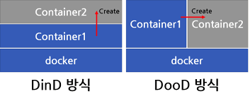

# 개발상식, 기타

## 1. 가상화가 무엇이고, 이것이 가상머신과 어떠한 차이가 있는지 설명해 주세요.

    
 가상화가 무엇이고, 이것이 가상머신과 어떠한 차이가 있는지 설명해 주세요.

- **가상화(Virtualization)**:
  - 물리적인 컴퓨터 자원(CPU, 메모리, 저장 장치 등)을 추상화하여 여러 개의 논리적, 독립적인 환경을 생성하는 기술
  - 하나의 물리적 장치에서 여러 개의 가상 환경을 동시에 실행할 수 있게 해주는 기반 기술
- **가상 머신(VM)**
  - 하이퍼바이저 위에서 OS를 포함한 독립 실행 환경을 제공하는 가상화 기반 기술
  - 가상화 기술을 통해 만들어진, 소프트웨어로 구현된 컴퓨터 시스템
  - 예) VMware, VirtualBox, KVM, Hyper-V
- **컨테이너**
  - OS 커널을 공유하며 필요한 라이브러리·런타임만 포함한 경량 실행 단위
  - 이미지 기반으로 빠른 생성·삭제, OS 전체가 아닌 프로세스 단위로 격리
  - 예) Docker, Kubernetes(오케스트레이션)

    
 그렇다면 Docker는 둘 중 어디에 속하나요? 왜 사람들이 Docker를 많이 채택할까요?

- Docker: 전통적인 VM이 아니라 '컨테이너 기반 가상화'에 속함
- Docker의 장점
  - VM과 달리 Host OS 커널을 공유하기 때문에 가볍고 속도가 빠름 
  - 이미지 기반, 일관성과 이식성, 배포 자동화에 최적화된 구조 

    
  하나의 Host OS에서 돌아간다면 충분히 한 컨테이너가 다른 컨테이너에 간섭할 수 있는 위험이 있지 않을까요? 이를 어떻게 방어할 수 있을까요?

- Docker의 주요 격리 기술
  - Namespaces(네임스페이스):
    - 하나의 시스템에서 프로세스들을 격리하기 위한 기술
    - 독립적인 프로세스(PID), 네트워크(NET), 파일 시스템 마운트 등을 가지도록 분리 
  - cgroups(Control groups):
    - 컨테이너의 CPU/메모리/IO 리소스 사용량 관리 
    - 툭정 컨테이너가 호스트 시스템의 자원을 과도하게 사용하지 않도록 제어하여 안정성을 유지
  - 이외에도 seccomp, SELinux 등을 이용해 세밀한 격리 가능 

    
  Docker 위에 Docker를 올릴 순 없을까요?

- 가능함, Docker 위에 Docker를 올려야 하는 상황:
  - CI/CD 파이프라인에서 Docker 이미지를 빌드해야 하는 경우
  - 빌드 환경을 완전 고립시키기 위해서
  - 컨테이너 기반 테스트(Integration Test) 환경 등 

- (1) Docker in Docker(DinD):
  - 도커 컨테이너 내부에서 실제 도커를 사용하는 방법
  - 도케 컨테이너 내부에서 도커 데몬을 추가적으로 동작함
  - 성능과 보안 측면에서 권장되지 않는 방법 
- (2) Docker out of Docker(DooD):
  - 호스트의 도커 데몬을 사용(마운트)하여 도커 컨테이너 내부에서 호스트의 도커 데몬을 사용하는 방법
  - 컨테이너 내에서 호스트의 Docker 소켓을 공유하는 방식
  - 속도가 빠르고, 더 안정적인 환경 

## 2. CI/CD 를 사용해 본 경험이 있나요? 있다면 간단하게 설명해 주세요.

    
 CI/CD 를 사용해 본 경험이 있나요? 있다면 간단하게 설명해 주세요.

- GitHub Actions + Docker + Docker Compose를 활용한 CI/CD 구축 
- GitHub Actions
  - 특정 서비스 디렉터리에 변경 발생 시 자동 빌드 트리거
  - Docker 이미지 빌드 후 Docker Hub에 push
- Docker Compose
  - 새 이미지 감지 후 해당 서비스 컨테이너만 교체
  - 전체 재시작 없이 변경된 서비스만 부분 롤링 업데이트
- 결과
  - 수동 작업 없이 자동화된 배포
  - 마이크로서비스 특성에 맞는 독립적인 배포 흐름 구현

## 3. static 키워드는 어떤 의미를 갖나요? (본인이 사용하는 언어에서 없다면 패스...)

    
 static 키워드는 어떤 의미를 갖나요? (Java)

- Java에서 static: 클래스 레벨의 멤버(변수, 메소드)에 속하는 개념
- 특징
  - 객체 생성 없이 클래스명으로 직접 접근 가능
  - 해당 클래스의 모든 인스턴스가 값을 공유
- static 사용 시 장점
  - 메모리 효율성: 여러 인스턴스가 하나의 자원을 공유
  - 호출 편의성(객체 없이 유틸성 메서드를 바로 호출 가능), 공통 상태 관리에 유리
- static 사용 시 주의할 점
  - static 메서드/영역에서는 인스턴스 변수/메서드에 직접 접근 불가
  - 남용 시 객체지향 구조가 약해질 수 있음

    
 컴파일 할 때, static 키워드가 붙은 변수, 함수는 어떻게 처리되나요?

- static 멤버는 객체가 아닌 ‘클래스 자체’에 속하는 멤버로 컴파일 
  - 컴파일 시 .class 파일에 기록되며, 변수와 메서드는 서로 다른 영역에 저장됨
    - static 변수 → .class의 Field 영역 
    - static 메서드 → .class의 Method 영역
- JVM 클래스 로딩 과정에서 메모리에 배치
  - 컴파일 후, 클래스가 처음 사용될 때 JVM의 Metaspace(메소드 영역)에 로드 
  - 이 시점에 static 변수는 단 하나만 생성되고, static 메서드는 실행 가능한 코드로 등록
  - 인스턴스 생성과는 완전히 무관하며, 클래스 레벨에서 단 한 번만 로드

    
 Java에서 static과 static final은 어떤 차이를 갖나요? final과 static final은요? 

- **static**
  - 객체가 아닌 클래스 수준(Class-level) 멤버
  - 모든 인스턴스가 공유하며, 객체 생성 없이 클래스명으로 접근 가능, 값 변경 가능 
- **final**
  - 한 번만 초기화되고 변경할 수 없는 값
  - 인스턴스 변수에 적용하면 객체마다 별도로 존재하지만 각각 불변 
  - 클래스, 메서드, 변수에 모두 적용 가능
- **static final**
  - 클래스 수준의 불변 상수
  - 클래스가 단 하나만 보유하며 모든 인스턴스가 동일한 값을 공유, 초기화 이후 값 변경 불가 

## 4. 객체지향 프로그래밍이 무엇인가요?

    
 객체지향 프로그래밍이 무엇인가요?

- 객체지향 프로그래밍:
  - 프로그램 구현에 필요한 객체를 파악하고 객체들 간의 상호작용을 통해 프로그램을 만드는 것
- 객체지향 프로그래밍 주요 특징:
  - 캡슐화: 정보 은닉(필요 없는 정보는 외부에서 접근하지 못하도록 제한), 높은 응집도, 낮은 결합도로 유연함과 유지보수성 증가
  - 추상화: 사물들의 공통적인 특징을 파악해서 하나의 개념(집합)으로 다루는 것
  - 상속: 기존 상위클래스에 근거하여 새롭게 클래스와 행위를 정의할 수 있게 도와주는 개념
  - 다형성: 같은 형태로 다른 기능을 하는 것을 의미 

    
 SOLID 원칙에 대해 설명해 주세요.

- S : 단일 책임 원칙(Single Responsible Principle)
    - 객체는 단 하나의 책임만을 가져야한다.
    - 어떤 변화에 의해 클래스를 변경해야 하는 이유는 오직 하나뿐이어야 한다.
- O : 개방 폐쇄 원칙(Open Closed Principle)
    - 기존 코드를 변경하지 않으면서 기능을 추가할 수 있도록 설계되어야 한다.
- L : 리스코프 치환 원칙
    - 자식 클래스는 최소한 자신의 부모 클래스에서 가능한 행위는 수행할 수 있어야한다.
- I : 인터페이스 분리 원칙
    - 특정 클라이언트를 위한 인터페이스 여러 개가 범용 인터페이스 하나보다 낫다.
    - 인터페이스가 명확해지고, 대체 가능성이 높아진다.
- D : 의존관계 역전 원칙 (Dependency Inversion Principle)
    - 의존 관계를 맺을 때 변화하기 쉬운 것 또는 자주 변화하는 것보다는 변화하기 어려운 것, 거의 변화가 없는 것에 의존해야 한다. 
    - 간단하게는, 구현 클래스에 의존하지 말고, 인터페이스에 의존해야 함 

    
 다형성이 무엇인지 설명하고, 동적 다형성과 정적 다형성이 무엇인지 설명해 주세요.

- 다형성이란:
  - 하나의 인터페이스(또는 타입)에 여러 구현이 존재할 수 있는 성질
- **동적 다형성**:
  - 실행(런타임) 시점에서 어떤 메서드가 호출될지 결정됨
  - 메서드 오버라이딩 (Overriding) 기반
  - JVM의 동적 바인딩(dynamic binding)에 의해 실제 객체의 메서드가 선택됨
  - Java 다형성의 핵심, 성능은 더 느리지만 유연성이 높음 
- **정적 다형성**:
  - 컴파일 시점에 호출될 메서드가 결정됨
  - 메서드 오버로딩 (Overloading) 기반 
  - 컴파일러가 함수 호출을 결정, 성능이 더 빠르지만 유연성이 떨어짐

    
 오버로딩과 오버라이딩의 차이에 대해 설명해 주세요.

- 오버로딩 (Overloading)
  - 두 메서드가 같은 이름을 갖고 있으나 매개변수 개수, 타입, 순서가 다른 여러 개의 메서드를 정의하는 경우
  - 오버로딩의 특징:
    - 상속 관계가 필요하지 않음 
    - 컴파일 시점에 메서드 호출이 결정됨 (정적 바인딩)
    - 같은 이름으로 다양한 형태의 입력값을 처리할 수 있게 함 
- 오버라이딩 (Overriding)
  - 상속 관계의 하위 클래스에서 상위 클래스의 메서드를 재정의하여 기능을 변경하는 것
  - 오버라이딩의 특징:
    - 상속 관계가 필수적
    - 메서드 시그니처(이름, 매개변수, 리턴 타입)이 모두 같아야 함
    - 실행 시점에 객체의 타입에 따라 메서드 호출이 결정됨 (동적 바인딩)
    - 부모 클래스의 기능을 자식 클래스의 특징에 맞게 수정하거나 확장하는 방법 

    
 클래스가 있는 언어는 반드시 객체지향 언어라고 할 수 있을까요? 그 반대는 성립하나요?

- 객체지향의 핵심 특징(캡슐화, 상속, 다형성)을 언어 전체가 지원해야만 객체지향 언어(OOP)라고 할 수 있음. 
  - C++, PHP, TypeScript 등도 클래스가 있는 언어지만 OOP 언어라고 할 수 없음
- 반대로, 객체지향 언어라고 해서 반드시 클래스를 가져야 하는 것은 아님
  - JavaScript, Ruby 등의 언어는 클래스가 아닌 다양한 방법(프로토타입 체계 등)을 이용해 객체지향 구현. 

## 5. 프레임워크와 라이브러리의 차이에 대해 설명해 주세요.

    
 프레임워크와 라이브러리의 차이에 대해 설명해 주세요.

- **프레임워크(Framework)**:
  - 소프트웨어 개발을 위한 기반 구조를 제공
  - 제어의 역전(IoC, Inversion of Control)을 통해 프레임워크가 전체 애플리케이션의 흐름을 주도, 애플리케이션을 빠르게 구축할 수 있도록 공통된 기능과 아키텍처를 제공
  - 예) Spring(Java), Django(Python) 등
- **라이브러리(Library)**:
  - 특정 기능을 수행하는 재사용 가능한 코드(함수 또는 클래스)의 집합
  - 개발자가 애플리케이션의 전체 흐름을 직접 제어하며, 필요할 때 원하는 특정 기능을 위해 라이브러리의 코드를 호출하여 사용
  - 예) jQuery(DOM 조작), React 등 

## 6. Call By Value와 Call By Reference의 차이를 본인의 언어를 기반으로 설명해 주세요.

    
 Call By Value와 Call By Reference의 차이를 본인의 언어를 기반으로 설명해 주세요.

- Call By Value:
  - 메서드 호출 시 인자의 값을 그대로 복사해서 전달
  - 원본 값에 영향을 주지 않음, 함수 내부의 매개변수는 원본 변수와 메모리상에서 별개의 공간에 저장 
  - `Java에서는 Call By Value만 사용`
- Call By Reference:
  - 메서드가 원본 변수 그 자체(메모리 주소)를 직접 참조
  - 함수 내에서 매개변수의 값을 변경하면, 동일한 메모리 주소에 있는 원본 변수의 값이 직접 변경됨 
  - C++, Python 일부 구조에서 가능, `Java는 제공하지 않음`
- Call by Sharing:
  - 함수 호출 시 객체에 대한 참조(주소)를 복사해 전달, 참조 자체는 새로운 변수에 복사되는 방식
  - 참조 자체를 값으로 복사해서 전달하는 방식
  - 재할당은 원본에 영향을 주지 않지만, 전달된 객체의 내부 내용을 수정하면 원본에 영향

    
 사실 이 질문에는 약간의 낚시가 있습니다. 과연 모든 언어에 저 개념이 존재할까요?

| 언어             | 호출 방식                                      | 설명(핵심)                             |
| -------------- |--------------------------------------------| ---------------------------------- |
| **Java**       | Call by Value                              | 참조값도 값으로 복사해서 전달                   |
| **C**          | Call by Value                              | 포인터로 참조 효과만 흉내냄                    |
| **C++**        | Call by Value + Call by Reference          | 참조(&) 파라미터 지원                      |
| **C#**         | Call by Value + Call by Reference          | 명시적으로 Reference Passing 가능         |
| **Python**     | Call by Sharing                            | 참조를 복사하여 공유 (객체 내부 변경 가능)          |
| **JavaScript** | Call by Value + Call by Sharing (객체) | 객체 참조를 값으로 복사                      |
| **Ruby**       | Call by Sharing                            | 객체 참조 전달 모델                        |
| **Go**         | Call by Value                              | 포인터 전달 시 효과적으로 참조처럼 사용             |
| **Kotlin**     | Call by Value                              | 객체 참조값을 값으로 전달                     |

## 7. 순수함수가 무엇인지를 함수형 프로그래밍 매커니즘과 연관지어 설명해 주세요.

    
 순수함수가 무엇인지를 함수형 프로그래밍 매커니즘과 연관지어 설명해 주세요.

- 순수 함수란:
     > - 입력값이 같으면 항상 같은 결과를 반환
    > - 함수 외부 상태를 변경하는 Side Effect가 없는 함수
- 함수형 프로그래밍(Functional Programming, FP):
  - 순수 함수를 이용하는 이유:
    - 상태 변경 최소화
    - 함수 실행 결과의 예측 가능성과 추론 용이성을 높임: 순수 함수는 외부 상태의 의존하지 않기 때문 
    - 테스트, 병렬 실행, 캐싱 용이: 여러 스레드에서 동시에 실행되어도 서로 간섭하지 않음 (Thread Safe)

    
 Side Effect가 무엇인가요? 이를 모두 없애는 프로그래밍이 이상적이라고 할 수 있을까요?

- Side Effect(부수 효과)란:
  - 함수가 자신의 반환 값 외에 외부의 상태를 변경하는 모든 행위
  - 함수형 프로그래밍에서 피해야 할 대상으로 간주됨
  - 예) 전역 변수 변경, DB/파일 I/O, 로그 출력, 객체 내부 상태 변경 등
- 모든 Side Effect를 없애는 것은 불가능
  - 이상적인 프로그래밍 방식은 Side Effect를 제어하고 최소한의 영역으로 격리하는 것 

    
 왜 함수형 프로그래밍 매커니즘을 사용한다고 생각하시나요?

- 함수형 프로그래밍(Functional Programming, FP):
  - 목표는 프로그램의 복잡성을 줄이고 예측 가능성을 높이는 것
  - 프로그램을 상태 변화(State Change) 없이 함수들의 조합으로 보는 패러다임으로, 순수 함수를 매커니즘으로 사용
  - 함수형 프로그래밍의 장점 
    - 버그 감소 및 코드 신뢰성 향상 (Side Effect 감소)
    - 쉬운 테스트, 유지보수, 추상화 
    - 병렬 처리의 용이성 등 

    
 순수함수는 Thread Safe 한가요? 왜 그럴까요?

- Thread Safe의 의미:
  - 여러 개의 스레드/프로세스가 동시에 실행돼도 프로그램의 실행 결과가 항상 올바르게 보장되는 성질 
- 순수함수가 Thread Safe한 이유:
  - 외부 상태를 변경하지 않음 (Side Effect 없음)
  - 불변 데이터만 사용 (Mutable state 없음)
  - 여러 스레드가 동시에 같은 순수함수를 호출해도 자신의 입력값만으로 독립적인 계산 수행
  - 공유되는 자원이 없으므로 경쟁 조건(Race Condition), 데드락(Deadlock) 같은 동시성 문제 발생하지 않음

    
 고차함수에 대해 설명해 주세요.

- 고차함수(Higher-order Function)란:
  > - 함수를 인자(Argument)로 받음 
  > - 또는, 함수를 반환 값(Return Value)으로 반환
  - 함수형 프로그래밍의 중요한 특징 중 하나
  - 함수를 숫자나 문자열 같은 일반적인 값처럼 다루는 일급 객체(First-class Citizen) 개념 위에서 작동 
  - 고차 함수를 이용해 반복되는 로직을 추상화하고, 코드를 더 간결하고 재사용성 높게 작성할 수 있음 
  - 예) `map()`, `filter()` 등 배열/리스트 처리 함수

  
<h3>8. MVC 패턴이 무엇인가요?</h3>

<ul>
<li> 다른 아키텍쳐 패턴은 없나요? MVC랑 비교해서 어떤 차이가 있나요?</li>
</ul>

  
<h3>9. 디자인 패턴이 무엇인지 설명해주고, 대표적인 디자인 패턴에 대해 설명해 주세요.</h3>

<ul>
<li> Singleton의 장단점에 대해 설명해 주세요.</li>
<li> Singleton이 하나의 객체를 생성한다는 것을 어떻게 보장할 수 있을까요?</li>
</ul>

  
<h3>10. GC에 대해 설명해 주세요.</h3>

<ul>
<li> 본인이 사용하는 언어에서는 GC를 어떻게 구현했나요?</li>
<li> GC의 장단점에 대해 설명해 주세요.</li>
<li> GC는 어떤 영역에 있는 데이터를 관리하나요?</li>
<li> Reference Counting 방식에 대해 설명하고, 이 알고리즘에서 발생할 수 있는 순환 참조 및 Retain Cycle에 대해 설명해 주세요.</li>
</ul>

  
<h3>11. 32비트와 64비트의 차이는 무엇인가요?</h3>

<ul>
<li> 32비트에서 가용한 메모리의 크기는 최대 4GB라고 하는데, 왜 그런걸까요?</li>
</ul>

  
<h3>12. 인증과 인가의 차이에 대해 설명해 주세요.</h3>

<ul>
<li> OAuth가 무엇인지 설명하고, 이것은 인증인지 인가인지에 대해 설명해 주세요.</li>
</ul>

  
<h3>13. JWT 인증 방식이 무엇인가요?</h3>

<ul>
<li> Signature는 어떻게 만들어지나요?</li>
<li> 만약 Access Token이 탈취되면, 어떻게 대응할 수 있을까요?</li>
<li> 반대로 Refresh Token이 탈취되면, 어떻게 대응해야 할까요?</li>
</ul>

  
<h3>14. 암호화 알고리즘에 대해 설명해 주세요.</h3>

<ul>

  
<h3>15. 문자열 인코딩에 대해 설명해 주세요.</h3>

<ul>
<li> Base64 인코딩은 일반적인 문자열 인코딩과는 달리, 사용자가 읽기 어려운 알파벳과 숫자 조합으로 변경합니다. 이를 사용하는 이유는 무엇일까요?</li>

  
<h3>16. Git에 대해 설명해 주세요.</h3>

<ul>
<li> 여러 브랜치를 합쳐야 할 때, 어떤 방법을 사용할 수 있는지 "모두" 설명해 주세요.</li>
<li> 여러 브랜치를 합쳐야 할 때, 어떤 방법을 사용할 수 있는지 "모두" 설명해 주세요.</li>

