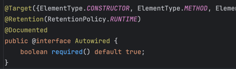
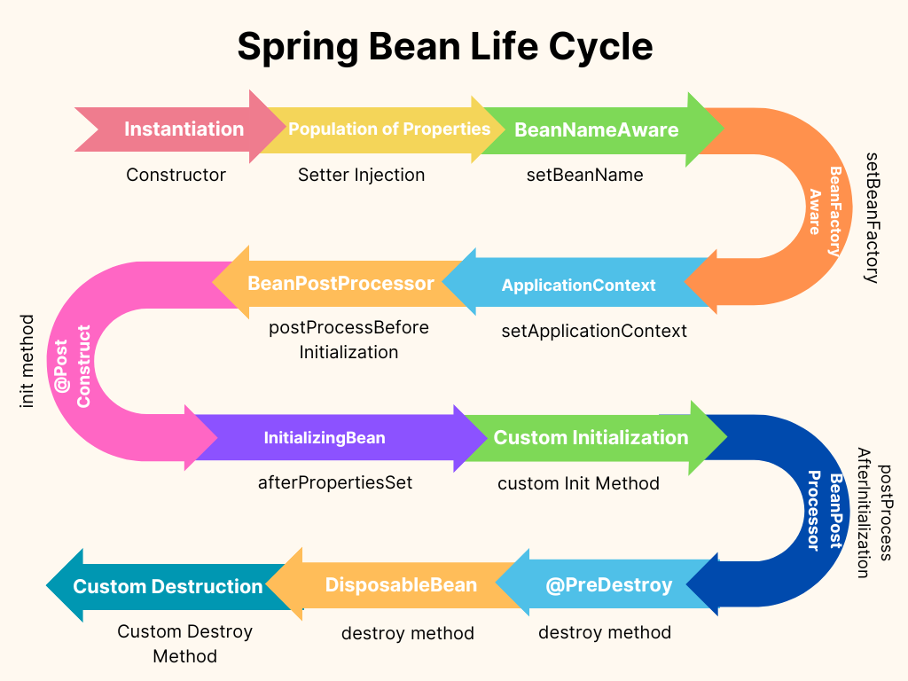
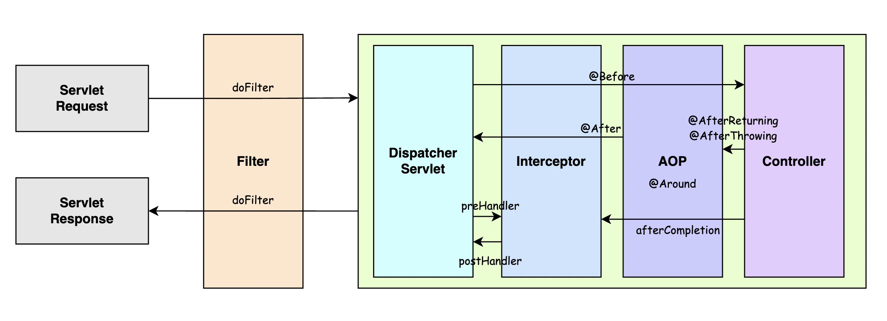
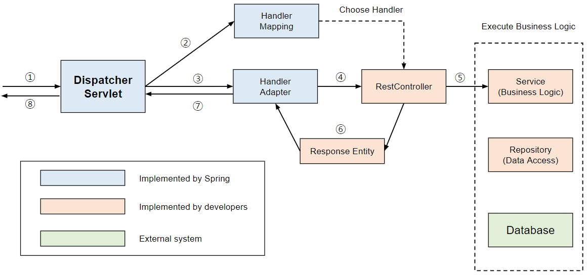

# Java, Spring

## 1. JVM이 정확히 무엇이고, 어떤 기능을 하는지 설명해 주세요.
`JVM (Java Virtual Machine)` : OS에 종속받지 않고 CPU가 Java 애플리케이션을 인식하고 실행할 수 있게 하는 가상 머신     
=> 컴파일된 Java.class 파일이 다양한 OS에서 실행될 수 있게 해준다. 
#### 컴파일 과정
```
*.java --[Copiler]--> *.class --[JVM]--> 기계어 --> [OS]
```
1. 자바 소스코드는 Java Compiler를 통해 JVM이 인식할 수 있는 Java bytecode로 변환됨
   > Java compiler는 JDK를 설치하면 `/bin`에 존재하는 javac.exe를 의미
2. JVM은 OS가 바이트코드를 이해할 수 있도록 해석해주는 역할을 하고, 이때문에 바이트코드가 JVM 위에서 OS 상관없이 실행 가능한 것
#### 구조
JVM은 크게 세 가지 구성 요소로 나뉨
1. 클래스 로더 (Class Loader)
- 클래스 파일을 읽어 JVM 메모리에 적재(로드)하고 링크를 통해 배치하는 작업 수행
2. 실행 엔진 (Execution Engine)
- JVM이 로드한 클래스 파일을 실행하는 역할 담당     
- 주요 구성 요소로는 인터프리터와 JIT(Just In Time) 컴파일러, 가비지 콜렉터가 있다.
  - 인터프리터 : 바이트코드를 한 줄씩 해석하고 실행
  - JIT 컴파일러 : 자주 실행되는 코드를 네이티브 코드로 변환해 캐싱
  - GC : 힙 영역의 메모리를 관리, 더 이상 참조되지 않는 객체를 찾아 자동으로 메모리 해제
3. Runtime Data Area
- Method Area (메서드/클래스 영역) : 실행에 필요한 클래스를 로드해서 저장
- Heap Area : 객체 인스턴스들이 올라가는 영역, 동적 메모리 할당 영역. GC 대상
- JVM Stack : 프로그램 실행 중 발생하는 메서드 호출과 복귀에 대한 정보 저장
- Native Method Stack : C, C++ 같은 네이티브 메서드 실행을 위한 스택

### ⁃ 그럼, 자바 말고 다른 언어는 JVM 위에 올릴 수 없나요?
자바 바이트코드로 컴파일될 수 있는 언어는 모두 JVM 위에 올릴 수 있다.     
Kotlin, Groovy, Scala, Clojure 등이 그 예시
### ⁃ 반대로 JVM 계열 언어를 일반적으로 컴파일해서 사용할 순 없나요?
사용 가능하다. kotlin-native의 경우 jvm이 아니라 llvm 방식으로 컴파일되어서 운영체제의 실행파일을 만듦.
### ⁃ VM을 사용함으로써 얻을 수 있는 장점과 단점에 대해 설명해 주세요.
#### 장점
- 플랫폼 독립성 (이식성) : Write Once, Run Anywhere
- 보안성 : 프로그램이 VM 안에서 실행되므로 OS나 하드웨어에 직접 접근하기 어려워 보안성이 강화됨
- 안정성 : VM이 메모리 관리나 예외처리 등을 해주므로 위험이 줄어듦
#### 단점
- 프로그램이 하드웨어 위에서 직접 실행되지 않고 가상머신을 거치므로 순수 네이티브 코드에 비해 속도가 떨어질 수 있음
- 가상머신 자체적인 메모리 사용량이 상대로 크다.

### ⁃ JVM과 내부에서 실행되고 있는 프로그램은 부모 프로세스 - 자식 프로세스 관계를 갖고 있다고 봐도 무방한가요?
운영체제 관점에서는 Java라는 실행파일(=JVM 실행 엔진)을 하나의 프로세스로 띄우고     
해당 프로세스 내에서 .class 바이트코드를 해석/실행하는 것이라 새로운 OS 프로세스가 생성되지 않음     
JVM 내부 관점에서도 본인 프로세스 내에서 스레드를 생성해서 `main()` 같은 사용자 프로그램을 실행하는 거기 때문에     
JVM 내부에서 실행되는 프로그램은 자식 프로세스가 아니라 JVM 프로세스의 내부 스레드라고 보는 것이 정확

## 2. final 키워드를 사용하면, 어떤 이점이 있나요?
- 안정성 보장 : 의도치 않은 변경, 오버라이딩, 상속을 막아 버그 예방
- 명확성 보장 : 해당 값/메서드/클래스는 절대 변하지 않는다는 코드의 의도를 분명히 전달 가능
- 성능 최적화 : final 키워드로 인해 변경 불가능성 보장되므로 JIT 컴파일러가 최적화 기법을 사용하기 더 수월함
    > ##### 인라이닝
    > 메서드를 호출할 때 호출하지 않고 메서드 본문을 그대로 복사해 넣는 최적화 기법
    > ##### Constant Pool Optimization
    > 자바는 Class Cosntant Pool 이라는 영역에 문자열, 리터럴 값, 메서드/필드 참조 같은 불변 값을 저장하는데
    > final static 변수는 컴파일 타임 상수로 Constant Pool에 저장하여 사용 가능 → 변수 접근이 아니라 상수 값을 직접 사용함으로써 메모리 접근 절약 + 실행 효율 증가
### ⁃ 그렇다면 컴파일 과정에서, final 키워드는 다르게 취급되나요?
`.class` 파일의 메타데이터에 '변경 불가' 라는 플래그가 기록된다.     
JVM과 JIT는 이를 근거로 인라이닝, 상수 대체, 가상 호출 제거 등의 최적화를 더 공격적으로 수행 가능

## 3. 인터페이스와 추상 클래스의 차이에 대해 설명해 주세요.
|구분|                    인터페이스                    |추상 클래스|
|:---:|:-------------------------------------------:|:---:|
|목적|                    규약 정의                    |공통 로직 + 추상 메서드 제공|
|다중 상속|                     가능                      |단일 상속만 가능|
|멤버 변수|         public static final (Only)          |인스턴스 변수, 상수 모두 가능|
|메서드| abstract, default, static, private(Java9 ↑) |추상 메서드 + 일반 메서드|
|생성자|                     불가능                     |가능|

### ⁃ 왜 클래스는 단일 상속만 가능한데, 인터페이스는 2개 이상 구현이 가능할까요?
- 추상 클래스 : C++처럼 다중상속을 허용할 경우 다이아몬드 상속 문제(모호성)가 생길 수 있음 → 상속 계층 구조가 복잡해져서 버그 가능성이 높아짐
- 인터페이스 : 멤버 변수(상태)를 가질 수 없고 단순히 규약만 정의하기 때문에 충돌 가능성이 낮음 

## 4. 리플렉션에 대해 설명해 주세요.
런타임 시점에 클래스의 메타데이터(클래스, 메서드, 필드, 생성자 정보 등)에 접근하고 조작할 수 있게 해주는 기능.       
컴파일 시점에는 알 수 없는 클래스나 객체의 내부 구조를 실행 중에 동적으로 다룰 수 있게 해준다.      
#### 제공하는 기능
- 클래스 / 필드 / 메서드 / 생성자 / 인터페이스 / 어노테이션 접근
- 생성자를 통해 인스턴스 객체 생성
- 메서드 호출
- ...
### ⁃ 의미만 들어보면 리플렉션은 보안적인 문제가 있을 가능성이 있어보이는데, 실제로 그렇게 생각하시나요? 만약 그렇다면, 어떻게 방지할 수 있을까요?
#### 보안 문제
리플렉션은 private 필드나 메서드에도 접근 가능하기 때문에 캡슐화를 위반하고 객체의 불변성이나 내부 상태 보호가 깨질 수 있다는 단점이 존재한다.      
또한 공격자가 리플렉션을 악용하면 원래 설계자가 의도하지 않은 메서드를 호출하거나 민감 데이터에 접근할 수 있기 때문에 보안의 위험이 존재한다.
#### 대응 방안
프레임워크나 라이브러리 개발이 아니라면 불필요한 리플렉션 사용은 지양해야 한다.      
또한 입력 검증을 강화하고 직렬화 시 필터링을 적용함으로써 외부 입력을 바탕으로 클래스를 로딩/메서드를 실행하지 않도록 방어하는 것이 좋다.
### ⁃ 리플렉션을 언제 활용할 수 있을까요?
리플렉션은 성능 및 보안 이슈가 존재하므로 주로 테스트나 프레임워크 같은 특수한 상황에서 사용    
#### 스프링 어노테이션     
스프링과 같은 DI 프레임워크는 클래스 타입을 직접 알지 못해도 객체를 생성하고 의존성을 주입해주어야 한다.        
`@Autowired`, `@Bean` 같은 어노테이션을 보고 런타임에 해당 필드/메서드를 찾아 주입할 때 리플렉션 사용
  > #### @Autowired
  > 
  > #### @Retention
  > - `RetentionPolicy.RUNTIME` : 어노테이션이 런타임 시점까지 유지. 리플렉션을 사용하여 어노테이션 정보를 런타임에 분석하거나 처리하는 경우 사용됨 (ex. @Transactional)
  > - `RetentionPolicy.SOURCE` : 어노테이션이 소스 코드에서만 유지. 주로 코드 분석 도구나 IDE에서의 경고 및 오류를 나타내는 데 사용 (ex. @Override)        
#### ORM      
ORM 프레임워크는 리플렉션을 사용해 객체와 데이터베이스 테이블 간 매핑을 자동화함
#### 직렬화 / 역직렬화       
자바의 jackson 라이브러리는 JSON과 객체를 변환할 때 클래스 타입을 모른 채 필드에 접근해야 함. 리플렉션으로 private 필드도 읽고 쓸 수 있음. 
#### IDE의 자동완성 기능     
IntelliJ나 Eclipse 같은 IDE는 리플렉션을 사용해 개발자가 코드를 작성할 때 클래스의 메서드, 필드를 동적으로 조회하고 해당 정보를 바탕으로 자동완성 기능 제공. 

## 5. static class와 static method를 비교해 주세요.
#### static method
속한 클래스의 인스턴스화 없이 사용 가능한 메서드를 의미

#### static class
중첩 클래스에서 사용되는 개념으로, 외부 클래스의 인스턴스화 없이 사용되는 내부 클래스를 의미        
**내부 클래스가 static 선언을 해야 하는 이유**      
내부 클래스가 외부 참조를 갖지 않게 하기 위함.       
내부 클래스를 static으로 선언하지 않는 경우 내부 클래스를 인스턴스화 하기 위해서는 외부 클래스를 인스턴스화 해야 하고, 내부 클래스는 외부 클래스에 대해 외부 참조를 가지게 된다.     
외부 참조가 문제가 되는 이유는 **메모리 누수** 위험 때문인데, 만약 외부 클래스는 필요 없어지고 내부 클래스만 필요한 경우, 필요없어진 외부 클래스를 GC 대상으로 삼아 메모리에서 제거해야 되지만 외부 참조로 내부 클래스와 연결되어 있기 때문에 메모리에서 제거가 안되고 잔존하게 된다. → 메모리 누수로 이어진다.      
따라서 내부 클래스가 외부 클래스의 멤버를 사용하지 않는 경우 static으로 선언.

### ⁃ static 을 사용하면 어떤 이점을 얻을 수 있나요? 어떤 제약이 걸릴까요?
#### 이점
일반적으로 new 연산을 통해 생성한 객체는 힙 영역에 생성되지만 전역 변수와 static이 붙은 멤버들은 static 메모리 공간에 적재된다.    
따라서 고정된 메모리 영역을 사용하기 때문에 매번 인스턴스를 생성하며 메모리를 낭비하지 않아도 됨. (공용 데이터나 함수를 정의할 때 효율적)

#### 제약
1. 인스턴스 멤버 접근 불가       
static 메서드나 클래스에서는 외부 클래스의 인스턴스 변수나 메서드에 직접 접근할 수 X
2. 다형성 제한        
static 메서드는 오버라이드 불가능 (컴파일 시점에 바인딩됨)

### ⁃ 컴파일 과정에서 static 이 어떻게 처리되는지 설명해 주세요.
static 멤버는 객체와 무관하게 클래스 로딩 시 메서드 영역 (Java8 부터 Metaspace) 에 올라간다.   
특히 static 메서드는 Early Binding 된다.     
> ##### Early Binding
> 메서드 호출 시점이 컴파일 단계에서 미리 결정되는 바인딩을 의미 = 호출 대상이 실행 중에 변하지 않음        
> 오버라이딩이 불가능하므로 호출할 메서드가 컴파일 타임에 확정됨.

## 6. Java의 Exception에 대해 설명해 주세요.

자바에서는 예외를 클래스를 통해 관리하는데, 모든 예외 클래스는 `java.lang` 패키지의 `Exception` 클래스를 상속받는다.       
예외는 크게 `CheckedException`과 `UncheckedException`으로 구분 가능하다. 

### ⁃ 예외처리를 하는 세 방법에 대해 설명해 주세요.
#### 예외 복구 
예외가 발생했을 때 try-catch 블록을 사용해 예외를 잡아내고 그에 대한 적절한 조치를 취함으로써 프로그램을 정상 상태로 되돌리는 방법
#### 예외 회피 
메서드 내에서 예외를 직접 처리하지 않고, 메서드 시그니처에 throws를 선언하여 해당 메서드를 호출한 상위 호출자 쪽에 예외 처리를 위임
#### 예외 전환 
예외 처리 회피와 비슷하게 메서드 밖으로 예외를 던지지만 무작정 던지지 않고       
조금 더 명확한 의미를 가진 좁은 범위의 예외로 변경해서 throws하거나        
상위 클래스로 단순하게 포장해서 throws하는 방법

### ⁃ CheckedException, UncheckedException 의 차이에 대해 설명해 주세요.
#### CheckedException
컴파일 과정에서 예외를 검사하고 예외 처리를 하지 않으면 컴파일 오류 발생 (`IOException`, `SQLException`, `FileNotFoundException`)
#### UncheckedException 
컴파일 시 예외 검사를 하지 않음 (`NullPointerException`, `ArrayIndexOutofBoundsException`, `ArithmeticException`) 

### ⁃ 예외처리가 성능에 큰 영향을 미치나요? 만약 그렇다면, 어떻게 하면 부하를 줄일 수 있을까요?
자바에서는 예외가 발생(throws)될 때 예외 객체 생성 + StackTrace 캡처 + 스택 unwinding + 핸들러 탐색이 일어나는데, 이 비용이 비싸다.     
특히 예외가 발생한 메서드를 검색하기 위해 call stack을 탐색하는 것도 비용이 많이 들지만, 예외에 stackTrace를 추가하기 위한 `fillInStackTrace()` 메서드도 비용을 크게 증가시킨다.      
#### 성능 최적화 방안
1. 예외를 '흐름 제어' 목적으로 사용하지 않기
2. 입력 상태를 미리 검증해서 예외 발생을 최소화시키기
3. Logging은 '처리' 책임이 있는 레이어에서 한번만 
4. StackTrace 비활성화 

## 7. Synchronized 키워드에 대해 설명해 주세요.
멀티스레드 환경에서 스레드 간 동기화 문제를 해결하기 위한 수단.     
여러 개의 스레드가 하나의 자원을 사용하려고 할 때 현재 데이터를 사용하고 있는 스레드를 제외한 나머지 스레드가 해당 데이터에 접근하지 못하도록 lock을 거는 개념
### ⁃ Synchronized 키워드가 어디에 붙는지에 따라 의미가 약간씩 변화하는데, 각각 어떤 의미를 갖게 되는지 설명해 주세요.
#### Synchronized Method
```java
public synchronized void instanceMethod() {
    // 임계영역
}
```
- 해당 메서드를 호출할 때 해당 객체의 모니터 락을 획득해야 진입 가능
- 동일한 객체에 대해 여러 스레드가 동시에 접근하려고 해도 한번에 한 스레드만 실행
- 서로 다른 객체 인스턴스라면 락이 다르므로 동시 실행 가능 → 객체 단위 동기화
#### Static Synchronized Method
```java
public static synchronized void staticMethod() {
  // 임계영역
}
```
- 해당 클래스 객체의 모니터 락을 사용
- 모든 인스턴스가 공유하는 자원을 보호 → 클래스 단위 동기화
#### Synchronized Block
```java
public void blockMethod() {
    synchronized (this) {
        // 임계영역
    }
}
```
- 동기화 블록을 지정하고 괄호 안에 동기화 대상을 직접 명시
- this, 특정 필드 객체, 별도로 만든 lock 객체 등 원하는 기준으로 락을 걸 수 있음
- 전체 메서드가 아닌 필요한 부분만 동기화해서 성능을 최적화할 수 있음 → 특정 객체 단위 동기화

> ##### Monitor
> 동기화를 지원하는 도구.      
> 자바에서 모든 객체는 자동으로 하나의 모니터(락 + 대기열)을 가진다.      
> 스레드가 Synchronized 블록에 들어가기 위해서는 그 객체의 모니터 락을 반드시 획득해야 한다. 

### ⁃ 효율적인 코드 작성 측면에서, Synchronized는 좋은 키워드일까요?
1. 락 경합 시 성능 저하 가능성
- 여러 스레드가 동시에 락을 요구할 시 Thread Blcoking과 Context Switching 발생
- 락을 오래 잡고 있는 코드라면 전체 Throughput이 떨어진다. 
2. 임계 영역이 넓을 시 병렬성 저해
- Synchronized 범위를 너무 넓게 잡을 시 불필요하게 많은 코드가 직렬화되고, CPU의 여러 코어를 제대로 활용할 수 없게 된다. 
### ⁃ Synchronized 를 대체할 수 있는 자바의 다른 동기화 기법에 대해 설명해 주세요.
#### Lock
- ReentrantLock
- ReadWriteLock
- StampedLock
#### 조건 대기/신호, 스레드 협업
- Condition
- LockSupport, partk/unpark
#### 원자 연산/메모리 가시성
- volatile
- Atomic 클래스
- LongAdder / LongAccumulator
- VarHandle
#### 동시성 컬렉션
- ConcurrentHashMap
- CopyOnWriteArrayList/Set
- BlockingQueue

### ⁃ Thread Local에 대해 설명해 주세요.
- 멀티스레드 환경에서 각각의 스레드별로 독립적인 변수 저장 공간을 제공해주는 도구
- 보통의 멀티 스레드 환경에서는 여러 스레드가 같은 객체 필드나 static 변수를 공유하므로 동시 접근 시 동기화 필요
- ThreadLocal 사용 시 변수 값이 스레드마다 별도로 유지되므로 동기화 없이 안전히 사용 가능
- 내부적으로는 각 스레드가 `ThreadLocalMap`이라는 해시맵을 가지고 있고, `ThreadLocal`이라는 객체를 key로 해서 값을 보관

## 8. Java Stream에 대해 설명해 주세요.
#### 정의
Java8부터 도입된 API로, 데이터를 선언적이고 함수형 스타일로 처리할 수 있도록 돕는 도구.     
컬렉션, 배열 등의 데이터를 소스로 하여 필터링, 매핑, 정렬, 집계 같은 연산을 간결히 표현 가능함
#### 특징
- Stream 연산은 원본 데이터를 변경하지 않고 새로운 결과를 생성함
- `for-each` 같은 외부 반복 대신 Stream은 내부적으로 반복을 처리
- 중간 연산이 즉시 실행되지 않고 최종 연산 시 한번에 수행됨
- `parallelStream()`을 통해 병렬 처리 지원
#### 연산 종류
- 중간 연산 : 연산 결과로 새로운 Stream 반환 (`filter()`, `map()`, `sorted()`, ...)
- 최종 연산 : Stream을 소모하고 결과를 반환 (`forEach()`, `collect()`, `reduce()`, ...)

### ⁃ Stream과 for ~ loop의 성능 차이를 비교해 주세요,
- `for loop` : 단순 반복문 처리 시 오버헤드가 거의 없어 작은 데이터셋에서는 더 빠름
- `Stream` : 내부 반복과 람다, 객체 생성 비용이 있어 소규모 연산에서 상대적으로 느릴 수 있으나 파이프라인 처리, 병렬 스트림 활용 시 대용량 데이터 처리에 유리함

### ⁃ Stream은 병렬처리 할 수 있나요?
- `parallelStream()` 또는 `stream().parallel()` 을 사용하면 손쉽게 병렬 처리 가능
- 내부적으로 `ForkJoinPool` 을 활용하여 데이터를 여러 청크로 분할 후 병렬 연산 수행
  > ##### ForkJoinPool
  > Java7에서 도입된 병렬 처리 프레임워크로, 작업을 더 작은 단위로 분할하고, 이를 여러 스레드에 할당하여 처리한다.

### ⁃ Stream에서 사용할 수 있는 함수형 인터페이스에 대해 설명해 주세요.
#### 함수형 인터페이스
- 단 하나의 추상 메서드만 갖는 인터페이스를 의미함 (default/static 메서드는 여러 개 있어도 상관 X)        
- 람다식(`() -> {}`)이나 메서드 참조(`Type::method`)의 타깃 타입이 되며 자바 컴파일러가 컨텍스트로부터 타입을 추론함
  > ##### 타깃 타입
  > 자바에서 람다식 자체는 타입이 없고, 람다식이 대입되거나 전달되는 컨텍스트를 보고 컴파일러가 해당 람다를 어떤 함수형 인터페이스로 변환할지 추론하는데, 그 람다의 타입을 결정하는 인터페이스가 바로 타겟 타입
  > `Function<String,Integer> f = s -> s.length();` 같은 경우 `s -> s.length()` 라는 람다식 자체는 타입이 없으나 대입되는 변수 타입이 `Function<String, Integer>` 이므로 `s`는 String, 반환은 Integer로 추론 가능 → 이 람다의 타깃 타입은 `Function<String, Integer>` 

#### Stream에서 사용 가능한 함수형 인터페이스
- Function<T, R>
  - 입력값 T를 받아 출력값 R을 반환하는 변환 함수
  - ex) `map(String::length)`
- Predicate<T>
  - 입력값 T를 받아 `boolean`을 반환하는 조건 검사 함수
  - ex) `filter(num -> num > 10)`
- Consumer<T>
  - 입력값 T를 받아 소비만 하고 반환값이 없는 함수
  - ex) `forEach(System.out::println)`
- Supplier<T>
  - 입력값 없이 T 타입의 값을 공급하는 함수
  - ex) `Stream.generate(() -> new Random().nextInt())`
- UnaryOperator<T> / BinaryOperator<T>
  - 같은 타입의 입력과 출력을 다루는 연산자 (Function의 특수화)
  - ex) `map(x -> x * 2)` (UnaryOperator), `reduce((a, b) -> a + b)` (BinaryOperator)
- 기본형 특화 인터페이스
  - 박싱/언박싱 오버헤드를 줄이기 위해 제공
  - `IntFunction`, `IntPredicate`, `IntConsumer`, `ToIntFunction<T>` 등

### ⁃ 가끔 외부 변수를 사용할 때, final 키워드를 붙여서 사용하는데 왜 그럴까요? 꼭 그래야 할까요?
- 람다/익명 클래스에서 참조하는 외부 지역변수는 `final`로 선언되거나 `effectively final`이어야 함
  > ##### effectively final
  > 변수에 명시적으로 final을 선언하지는 않았으나 값이 변경되지 않아 final과 유사하게 동작하는 것
- 외부 지역 변수는 스택에 있고 메서드 종료 시 사라지기 때문에 람다식 내부에서 외부의 변수를 사용할 때에는 복사본을 생성해 사용 (Lambda Capturing)
- 명시적으로 `final` 키워드를 붙이는 건 선택 사항이지만, 한 번만 대입되고 변경되지만 않으면 컴파일러가 자동으로 effectively final로 간주함

## 9. Java의 GC에 대해 설명해 주세요.
- 자바의 메모리 관리 방법 중 하나로 JVM의 Heap 영역에서 동적으로 할당했던 메모리 중 필요 없어진 메모리 객체를 모아 주기적으로 제거하는 프로세스
- (+) 프로그래머가 메모리 관리나 메모리 누수에 대해 신경 쓸 필요 없이 개발에 집중 가능
- (-) 메모리가 언제 해제되는지 정확히 알 수 없어 제어하기 힘들다.
- (-) GC가 동작하는 동안 다른 동작을 멈추기 때문에 오버헤드가 발생된다. (Stop The World)
### ⁃ finalize() 를 수동으로 호출하는 것은 왜 문제가 될 수 있을까요?
finalize() 메서드는 Java9부터 Deprecated 되었다.        
`try-finally` 혹은 `try-with-resources` 를 이용해 처리하는 것 추천
        
finalize()는 객체가 GC에 의해 수거될 때 한번 호출되는 메서드로, 자원 정리 목적으로 설계됨.    
개발자가 직접 호출할 시 GC가 호출하는 경우와 혼동되어 객체가 여전히 사용 중인데도 마치 정리된 것처럼 동작할 가능성 존재.      
자원 중복 해제, 참조 무효화, 보안 취약점 등 예측 불가능한 상태를 초래 가능

### ⁃ 어떤 변수의 값이 null이 되었다면, 이 값은 GC가 될 가능성이 있을까요?
변수를 `null`로 만들면 해당 객체에 대한 참조가 끊어지므로 더이상 그 객체에 도달 가능한 경로가 없으면 GC 대상이 될 수 있다.     
기본적으로 객체로의 모든 참조가 사라졌을 때만 GC 대상이 되므로 다른 변수가 같은 객체를 여전히 참조하고 있다면 GC가 되지 않는다.

## 10. equals()와 hashcode()에 대해 설명해 주세요.
#### equals()
  - 두 객체가 "논리적으로 같은지"를 비교하는 메서드
  - 기본적으로 `Object`의 `equals()`는 참조(주소) 비교를 하지만, 필요 시 오버라이딩하여 값 비교로 재정의 가능
  - 예: `String`, `Integer` 클래스는 내용을 비교하도록 오버라이딩되어 있음
#### hashCode()
  - 객체를 식별할 수 있는 정수 해시값을 반환하는 메서드
  - 주로 `HashMap`, `HashSet` 같은 해시 기반 컬렉션에서 객체를 빠르게 검색할 때 사용됨
#### equals()와 hashCode()의 규약
  - 두 객체가 `equals()`로 같다면, 반드시 같은 `hashCode()`를 반환해야 함
  - 그러나 `hashCode()`가 같다고 해서 반드시 `equals()`가 같은 것은 아님 (충돌 가능)
  - 이 규약을 지키지 않으면 `HashMap`, `HashSet` 등에서 정상 동작하지 않을 수 있음

### ⁃ 본인이 hashcode() 를 정의해야 한다면, 어떤 점을 염두에 두고 구현할 것 같으세요?
1. 같은 객체에서 여러 번 호출해도 항상 동일한 값을 반환해야 한다.
2. `equals()`가 같으면 반드시 같은 `hashCode()`를 반환해야 하므로 `equals()`에 쓰이지 않는 필드는 반드시 제거해야 한다.     
    객체의 동등성을 판별하는 데 a,b 속성만 사용되는데 hash값을 생성할 때 c 속성까지 넣으면 a와 b가 같아서 동등한 객체여도 c 값이 달라 다른 해시 값을 반환할 수 있기 때문
3. hash가 반환하는 값은 equals에 정의한 필드들을 기준으로 균등한 값을 가질수록 좋다. (해시 충돌 최소화)
4. 실행 중 값이 변하지 않는 불변 필드를 기준으로 계산하는 것이 안전하다. 

### ⁃ 그렇다면 equals() 를 재정의 해야 할 때, 어떤 점을 염두에 두어야 하는지 설명해 주세요.
Object 명세에는 equals() 에 대한 규약이 작성되어있으며, 이를 지켜서 재정의해야 한다.       
         
equals() 메서드는 반드시 동치관계를 구현하며, 다음을 만족한다.
1. 반사성 (Reflexivity) : null이 아닌 모든 참조 값 x에 대해 x.equals(x)는 true
2. 대칭성 (Symmetry) : null이 아닌 모든 참조 값 x,y에 대해 x.equals(y)가 true이면 y.equals(x)도 true
3. 추이성 (Transitivity) : null이 아닌 모든 참조 값 x,y,z에 대해 x.equals(y)가 true이고 y.equals(z)가 true이면 x.equals(z)도 true
4. 일관성 (Consistency) : null이 아닌 모든 참조 값 x,y에 대해 x.equals(y)를 반복해서 호출하면 항상 true를 반환하거나 항상 false를 반환
5. null 아님 : null이 아닌 모든 참조 값 x에 대해 x.equals(null)은 false
6. equals()를 재정의할 때는 반드시 hashCode()도 함께 재정의해야 해시 기반 컬렉션에서 정상 동작 보장

## 11. IoC와 DI에 대해 설명해 주세요.
#### 의존성
클래스 A가 클래스 B를 사용하는 경우 A는 B에 의존한다고 이야기한다.

- 객체 간의 의존 관계에서 직접 생성하면 생성부터 메모리 관리를 위한 소멸까지 해당 객체의 라이프사이클을 개발자가 다 관리해야하므로 강한 결합이 된다.
- 이미 누군가가 생성한 객체를 주입받으면 사용만 하면 되므로 약한(느슨한) 결합이 된다.

#### 의존성 주입 (DI; Dependency Injection)
A 클래스가 B 클래스를 사용하고 있을 때(=의존하고 있을 때)       
A클래스에서 B클래스를 직접 생성해서 사용하는 것이 아니라     
외부에서 B클래스의 인스턴스를 생성해서 주입해주는 방식

#### 제어의 역전 (IOC; Inversion of Control)
기존에는 의존성을 직접 제어했지만, IOC가 발생하면 제어권이 역전되어있기 때문에 직접 제어하지 않음을 의미       
개발자가 직접 의존성을 제어하던 것을 어떠한 매개체에게 제어권을 일임(또는 빼앗기게 되어) 더이상 제어의 주체가 개발자가 아니게 되었기 때문에 제어의 역전이 발생했다고 본다.

#### IOC Container
개발자에게 일임받은 제어권을 사용하여 의존성을 관리, instance를 생성하여 주입, 메모리를 해제하는 역할. 주로 프레임워크가 이 역할을 담당한다.

### ⁃ 후보 없이 특정 기능을 하는 클래스가 딱 한 개하면, 구체 클래스를 그냥 사용해도 되지 않나요? 그럼에도 불구하고 왜 Spring에선 Bean을 사용 할까요?
- 지금은 구현체가 하나뿐이더라도 앞으로 변경·확장될 가능성이 있음
- Spring Bean으로 등록하면 싱글톤 관리, 라이프사이클 제어, AOP, 트랜잭션 처리, 보안 등 스프링이 제공하는 부가 기능 활용 가능
- 테스트 시에도 구체 객체 대신 Mock/Stub 교체가 쉬워짐 → 유지보수성과 확장성이 크게 향상됨

### ⁃ Spring의 Bean 생성 주기에 대해 설명해 주세요.

1. BeanDefinition 등록 → 설정 파일, 어노테이션을 읽어 Bean 메타데이터 생성
2. Bean 생성 → `new` 혹은 팩토리 메서드로 객체 인스턴스화
3. 의존성 주입 (DI) → 필요한 의존 관계 주입 (`@Autowired`, 생성자 주입 등)
4. 초기화 단계 → `@PostConstruct`, `InitializingBean.afterPropertiesSet()`, 커스텀 init 메서드 실행
5. 사용 단계 → 컨테이너에서 관리되며 서비스 로직 수행
6. 소멸 단계 → 컨테이너 종료 시 `@PreDestroy`, `DisposableBean.destroy()`, 커스텀 destroy 메서드 

### ⁃ 프로토타입 빈은 무엇인가요?
- 기본 스코프인 싱글톤과 달리 요청할 때마다 새로운 인스턴스를 반환하는 빈
- 상태를 가지는 객체나 사용자별로 독립된 인스턴스가 필요한 경우 적합
- IoC 컨테이너는 프로토타입 빈의 생성과 의존성 주입까지만 관리하고 소멸은 관리하지 않음 → 프로토타입 빈은 해당 빈을 주입받은 오브젝트에 종속적일 수 밖에 없다. 

## 12. 관점지향 프로그래밍(AOP; Aspect Oriented Programming)에 대해 설명해 주세요.


- 핵심 기능과 부가 기능을 분리하여 모듈화하는 프로그래밍 패러다임
- 메소드나 객체의 기능을 핵심 관심사(Core Concern)와 횡단 관심사(Cross-cutting Concern)으로 나누어 프로그래밍하는 것
  >   ##### Core Concern 
  >   핵심적인 비즈니스 로직을 의미      
  >   Ex. 게시판 서비스 / 로그인 서비스 / 주문 서비스 / ...
  >   ##### Cross-cutting Concern
  >   소스코드 상에서 다른 부분에 계속 반복해서 사용되는 코드들을 의미       
  >   이를 Aspect라는 모듈로 정의하고 핵심적인 비즈니스 로직에서 분리해 재사용률을 높이는 것이 AOP의 취지
  >   Ex. 로깅 / 보안 / 트랜잭션 / ...

#### AOP 주요 개념
- `Aspect` : 공통 관심사를 모듈화한 것
- `Target` : 주요 기능이나 비즈니스 로직을 담당하는 객체, AOP에서는 Aspect가 적용되는 대상을 의미
- `Proxy` : Target을 감싸는 대리 객체, AOP에서는 보조 업무를 적용하기 위한 용도로 사용됨. 클라이언트가 실제 target이 아닌 proxy에 접근하게 되면 proxy는 필요한 보조 업무를 처리한 후 실제 target에게 제어 전달
- `Join point` : Aspect가 적용될 수 있는 시점. 예를 들어 메소드 실행 전, 예외 발생 시 등이 될 수 있다.
- `Advice` :  Aspect가 언제, 어떤 방식으로 실행될지 기능을 정의한 코드 (Ex. Before/After/Around)
- `Point cut` : Join Point 중 실제로 Aspect를 적용할 곳/조건을 지정한 표현식
- `Weaving` : Pointcut에 의해서 결정된 타겟의 Join Point에 Advice를 삽입하는 과정

#### 스프링 AOP의 특징
1. **프록시 기반** | 프록시가 스프링 빈을 감싸면서 AOP 적용
2. **Runtime Weaving** | 코드 컴파일 단계나 클래스 로딩 단계에서 Aspect를 끼워 넣는 것이 아니라 실행할 때 프록시로 감싸서 부가기능 삽입. 따라서 Spring AOP는 스프링 빈에서만 적용됨
3. **선언적 AOP 지원** | 어노테이션 방식 사용

#### Spring AOP 어노테이션
- `@Aspect` : 해당 클래스를 Aspect로 사용하겠다는 것을 명시
- `@Before` : 대상 메서드가 실행되기 전 Advice를 실행
- `@AfterReturning` : 대상 메서드가 정상적으로 실행되고 반환된 후 Advice 실행. 기존 @After에 반환값을 얻어오는 기능을 제공
- `@AfterThrowing` : 대상 메서드에서 예외가 발생했을 때 Advcie 실행
- `@After` : 대상 메서드가 실행된 후 Advcie 실행
- `@Around` : 대상 메서드 실행 전, 후, 또는 예외 발생 시 Advice 실행
> ##### 적용 예시 
> ```java
> // 서비스 메서드 실행 시간을 측정하고 싶을 때
>  @Aspect
>  @Component
>  public class LoggingAspect {
>  
>      @Around("execution(* com.example.service..*(..))")
>      public Object logExecutionTime(ProceedingJoinPoint joinPoint) throws Throwable {
>          long start = System.currentTimeMillis();
>          
>          Object result = joinPoint.proceed(); // 실제 메서드 실행
>          
>          long end = System.currentTimeMillis();
>          System.out.println(joinPoint.getSignature() + " 실행 시간: " + (end - start) + "ms");
>          
>          return result;
>      }
>  }
>  ```

### ⁃ @Aspect는 어떻게 동작하나요?
스프링에서 `@Aspect`를 처리하는 과정은 다음과 같다.    
1. 생성 | @SpringBootAplication이 실행되며 @Bean과 @Component가 적용된 모든 객체를 생성
2. 전달 | 생성된 객체를 스프링 컨테이너의 빈 저장소에 등록하기 전 빈 후처리기(`AnnotationAwareAspectJAutoProxyCreator`)에 전달
3. @Aspect 빈 스캔 | @Aspect 클래스 내부의 Pointcut + Advice 메서드 정보를 통해 `Advisor` 객체로 변환 후 등록
4. 프록시 적용 대상 확인 | 단계 1에서 생성된 객체를 검사하여 대상 빈이 Advisor의 Pointcut에 매칭되면 프록시 객체를 대신 생성해서 최종적으로 컨테이너에 등록
   ex. MemberService를 컨테이너에 넣으려고 검사하다가 해당 객체가 @Aspect 적용 대상인 걸 알게되면 MemberServiceProxy 객체를 대신 등록하는 식
5. 프록시 실행 | 클라이언트가 실제로 타겟 메서드를 호출하면 실제 주입된 것은 프록시 객체이기 때문에 프록시가 Advice 체인 실행 및 타겟 메서드 호출을 담당한다.

## 13. Spring 에서 Interceptor와 Servlet Filter에 대해 설명해 주세요.
Spring은 공통적으로 여러 작업을 처리함으로써 중복된 코드를 제거할 수 있도록 기능을 제공하는데, 그 중 Filter와 Interceptor가 존재        

#### Servlet Filter
- Servlet 스펙에 정의된 표준 기능으로 Spring에 종속적이지 않고 서블릿 컨테이너(톰캣) 레벨에서 동작
- 본래 서블릿 컨테이너 관리 대상이지만 스프링 빈으로도 등록이 가능
- **디스패처 서블릿에 요청이 전달되기 전/후**의 url 패턴에 맞는 모든 요청에 대해 부가 작업을 처리할 수 있는 기능 제공
- 메서드 종류
  - `init()` : 필터 객체 초기화를 위한 메서드 -> 웹 컨테이너가 init()을 호출하고 필터 객체를 초기화하면 이후 요청들은 doFilter에 의해 처리됨
  - `doFilter()` : url 패턴에 맞는 모든 http 요청이 디스패처 서블리승로 전달되기 전 웹 컨테이너에 의해 실행되는 메서드
  - `destroy()` : 필터 객체를 제거하고 사용하는 자원을 반환하기 위한 메서드 -> 웹 컨테이너가 destroy()를 호출하고 필터 객체를 종료하면 이후 요청들은 doFilter에 의해 처리되지 X

#### Interceptor
- 스프링이 제공하는 기술로서 웹 컨테이너에서 동작하는 필터와 달리 인터셉터는 스프링 컨텍스트에서 동작
- 디스패처 서블릿이 **컨트롤러를 호출하기 전/후**에 요청과 응답을 참조하거나 가공할 수 있는 기능 제공
- 디스패처 서블릿은 핸들러 매핑을 통해 적절한 컨트롤러를 찾도록 요청하는데, 그 결과로 실행 체인을 반환한다 → 해당 실행체인에 1개 이상의 인터셉터가 등록되어 있다면 순차적으로 인터셉터들을 거쳐 컨트롤러가 실행됨
  > ##### 동작 과정 
  > 1. 클라이언트 요청 → 필터 통과 → 디스패처 서블릿 도착
  > 2. 디스패처 서블릿은 핸들러(컨트롤러) 호출하기 직전에 인터셉터의 preHandle() 호출
  > 3. 컨트롤러 실행 후 postHandle() 실행
  > 4. 뷰 렌더링 끝난 후 afterCompletioin() 실행
- 메서드 종류
  - `preHandle()` : 컨트롤러가 호출되기 전에 실행되며 컨트롤러 이전에 처리해야 하는 전처리 작업이나 요청 정보를 가공하거나 추가하는 경우 사용. 리턴 타입이 boolean인데, false를 리턴할 경우 작업을 중단하고 다음 작업이 진행되지 않는다.
  - `postHandle()` : 컨트롤러가 호출된 후 실행되며 후처리 작업에 사용 가능. 컨트롤러 하위 계층에서 작업을 진행하다가 중간에 예외가 발생하면 postHandle은 호출되지 않는다. 
  - `afterCompletion()` : 모든 뷰에서 최종 결과를 생성하는 일을 포함해 모든 작업이 완료된 후 실행됨. 컨트롤러 하위 계층에서 작업을 진행하다가 중간에 예외가 발생해도 반드시 호출되는 메서드

### ⁃ 설명만 들어보면 인터셉터만 쓰는게 나아보이는데, 아닌가요? 필터는 어떤 상황에 사용 해야 하나요?
#### 필터의 용도 | 스프링과 무관하게 전역적으로 처리해야 하는 작업
- 공통된 보안 및 인증/인가 관련 작업
  - CORS 처리 (Preflight 포함)
  - 캐릭터 인코딩 (e.g. CharacterEncodingFilter)
  - 보안 필터 체인 (Spring Security 가 전형적인 예시)
  - IP 차단, WAF성 로직 (애플리케이션 단위의 보안 검사 로직을 의미)
  - Rate Limiting | 일정 시간 동안 들어오는 요청 수를 제한하는 기법
- 정적 리소스까지 포함한 전역 로깅/추적
- 요청/응답의 바디/헤더 래핑이 필요할 때
  - GZIP 압축, 응답 헤더 통일 적용
- ERROR/FORWARD/INCLUDE/ASYNC 디스패치까지 제어해야 할 때

#### 인터셉터의 용도 | 클라이언트의 요청과 관련되어 전역적으로 처리해야 하는 작업
- 세부적인 인증/인가 공통 작업 | 토큰 검증 결과를 사용해야 하거나 컨트롤러별 권한 분기가 필요할 때
- API 호출에 대한 로깅 또는 감사
- 예외를 스프링 방식으로 처리하고 싶을 때 (`@ExceptionHandler` / `@ControllerAdvice`)
- 컨트롤러로 넘겨주는 데이터의 전처리

#### 결론
- 인터셉터는 스프링 MVC 요청에만 관여하기 때문에 CORS/인코딩/보안 체인/정적 리소스/에러 디스패치와 같은 전역/저수준 처리는 필터에서 해야함
- 특히 보안의 경우 100% 필터체인 위에서 동작 (Spring Security)

## 14. DispatcherServlet 의 역할에 대해 설명해 주세요.
HTTP 프로토콜로 들어오는 모든 요청을 가장 먼저 받아 적합한 컨트롤러에 위임해주는 프론트 컨트롤러
> ##### Front Controller
> 주로 서블릿 컨테이너의 제일 앞에서 서버로 들어오는 클라이언트의 모든 요청을 받아 처리해주는 컨트롤러로서, MVC 구조에서 함께 사용되는 디자인 패턴

### 여러 요청이 들어온다고 가정할 때, DispatcherServlet은 한번에 여러 요청을 모두 받을 수 있나요?
```
[클라이언트 요청 1] ─┐
                     │  ┌───────────────┐
[클라이언트 요청 2] ─┼──▶│   스레드풀(Thread1) ──▶ DispatcherServlet ──▶ Controller
                     │  └───────────────┘
[클라이언트 요청 3] ─┘      ┌───────────────┐
                        │스레드풀(Thread2) ──▶ DispatcherServlet ──▶ Controller
                        └───────────────┘
```
- 서블릿 컨테이너가 여러 요청을 동시에 처리할 수 있도록 멀티스레드 환경을 제공
- 디스패처 서블릿은 요청마다 별도의 스레드에서 동시에 실행된다. → 각 디스패처 서블릿은 한번에 하나의 요청을 처리

### 수많은 @Controller 를 DispatcherServlet은 어떻게 구분 할까요?
디스패처 서블릿은 어느 컨트롤러가 요청을 처리할 수 있는지를 식별해야 하는데, `HandlerMapping` 이라는 컴포넌트에게 위임해서 결정한다.   
특히 @Controller 방식은 `RequestMappingHandlerMapping` 이 처리함
#### 동작 과정

1. 클라이언트 요청 도착 (GET `/members/1`)
2. 디스패처 서블릿은 등록된 HandlerMapping 목록을 순서대로 조회
3. URL, HTTP 메서드, 파라미터 등을 기준으로 해당 요청을 처리할 컨트롤러의 메서드를 찾음
4. HandlerMapping이 반환한 Handler 정보를 디스패처 서블릿이 받아서 해당 Handler를 실행 가능한 HandlerAdapter에게 실행을 위임
5. 최종적으로 해당 @Controller의 메서드가 실행됨

## 15. JPA와 같은 ORM을 사용하는 이유가 무엇인가요?
#### ORM (Object Relational Mapping)
개발자가 순수 SQL 쿼리를 작성하는 대신 객체지향프로그래밍 개념을 사용해 데이터베이스와 상호작용할 수 있도록 하는 프로그래밍 기술

#### ORM의 장점
1. 추상화 | 데이터베이스와의 상호작용 단순화
2. 보일러 플레이트 코드 감소 | 일반적인 데이터베이스 작업을 ORM 도구가 처리해줌으로써 중복 코드 감소
3. 이식성 | ORM 도구는 일반적으로 여러 데이터베이스 시스템을 지원하므로 데이터베이스 전환 시 코드 변경을 최소화할 수 있음
4. 생산성 | 복잡한 SQL 쿼리를 작성하는 대신 비즈니스 로직에 더 집중 가능
5. 유지관리성 | 객체지향설계 패턴 사용을 촉진함으로써 더 구조화되고 유지관리하기 쉬운 코드베이스 생성 가능

#### ORM의 단점
1. 성능 | ORM에서 자동으로 생성해준 쿼리의 성능이 떨어질 수 있음
2. 제어력 상실 | 데이터베이스 작업의 많은 세부사항이 추상화됨으로써 데이터베이스에 대한 세밀한 제어력을 상실하게 됨
3. 데이터베이스 기능 지원 제한 | ORM이 특정 데이터베이스 시스템의 모든 기능을 지원하지 않을 수 있음

### ⁃ 영속성은 어떤 기능을 하나요? 이게 진짜 성능 향상에 큰 도움이 되나요?
영속성 컨텍스트는 엔티티를 1차 캐시에 보관함으로써 동일성 보장, 중복 조회 방지, 쓰기 지연, 변경 감지 등의 기능을 제공한다.      
따라서 트랜잭션 내에서 DB 접근 횟수를 줄임으로써 성능에 도움이 될 수 있지만, 해당 효과는 트랜잭션 단위에 국한되므로 대규모 성능 최적화는 별도의 캐시나 DB 튜닝이 필요하다.
#### 영속성 컨텍스트의 특징
1. 1차 캐시 
```java
Member m = new Member();
m.setId("1");
em.persist(m); //1차 캐시에 저장
Member om = em.find(Member.class, "1"); //1차 캐시에서 조회
```
2. 쓰기 지연
```java
EntityManager em = emf.createEntityManager();
EntityTransaction tx = em.getTransaction();
tx.begin();  //트랜잭션 시작
em.persist(a); //영속상태 변경, INSERT SQL 전송은 X
em.persist(b);
tx.commit(); //커밋하는 순간 데이터베이스에 sql문 전송
```
3. 변경 감지 
```java
Member m = em.find(Member.class("1"));
m.setName("new name");
tx.commit(); //추가적인 persist() 호출 없이도 더티체킹
```
4. 엔티티의 동일성 보장
```java
Member a = em.find(Member.class, "1");
Member b = em.find(Member.class, "1");
System.out.println("result = ", (a == b)); //result = true
```

### ⁃ N + 1 문제에 대해 설명해 주세요.
- 연관관계가 설정된 엔티티를 조회 시 조회된 데이터 개수(n)만틈 연관관계의 조회 쿼리가 추가로 발생하는 문제
- 발생 원인 → 연관관계 기본 전략이 지연 로딩이라서 연관관계를 실제로 사용하기 전까지는 쿼리를 안 날리는데, 루프를 돌며 접근할 때마다 추가 쿼리가 나가면서 성능이 저하되는 것
- 해결 방안
  - Fetch Join | JPQL에서 연관 엔티티까지 한 번에 다 가져오기
  - EntityGraph | 특정 쿼리에만 즉시 로딩처럼 동작하도록 명시
  - Batch Fetching | 한번에 여러 개의 연관 엔티티를 IN 쿼리로 묶어 가져오기

## 16. @Transactional 은 어떤 기능을 하나요?
메서드나 클래스에 붙이면 해당 범위 내의 메서드가 트랜잭션임을 보장해준다.

### ⁃ @Transactional(readonly=true) 는 어떤 기능인가요? 이게 도움이 되나요?
읽기 전용 트랜잭션을 선언하는 어노테이션. 다음과 같은 이점이 있다.
1. 데이터 일관성 | 코드 내에서 save()를 호출하거나 엔티티의 상태를 변경하더라도 쓰기 쿼리가 막혔기 때문에 적용되지 않음
2. 영속성 컨텍스트 최적화 | ORM은 일반적으로 트랜잭션 안에서 더티체킹을 수행하기 위해 스냅샷을 저장해두지만, 읽기 전용으로 선언할 시 스냅샷을 만들지 않아 메모리 사용량이 감소하고 성능이 향상됨
3. 가독성 향상 | 해당 메서드는 DB에서 데이터를 읽기만 한다는 걸 명확히 확인 가능

### ⁃ 그런데, 읽기에 트랜잭션을 걸 필요가 있나요? @Transactional을 안 붙이면 되는거 아닐까요?
1. 트랜잭션 범위와 일관성 보장 : 여러 SELECT문이 하나의 트랜잭션 안에서 실행될 경우 같은 시점의 스냅샷을 보장하기 때문에 일관성이 지켜진다. 트랜잭션이 없을 시 각 쿼리가 Auto-Commit 되므로 중간에 데이터가 바뀌면 결과가 일관되지 않을 수 있음
2. DB 레벨 최적화 : DB 드라이버에 따라 set transaction read only 같은 힌트를 전달하면 DB 내부 최적화(쓰기 차단, MVCC(Multi-Version Concurrency Control) 부담 감소)가 수행된다. 

## 17. Java 에서 Annotation 은 어떤 기능을 하나요?
자바 소스코드에 추가하여 사용할 수 있는 메타데이터의 일종
#### 역할
- 컴파일러에게 문법 에러를 체크하도록 정보 제공
- 프로그램을 빌드할 때 코드를 자동 생성할 수 있도록 정보 제공
- 런타임에 특정 기능을 실행하도록 정보 제공
#### 종류
- 표준 어노테이션 | 자바에서 기본적으로 제공
  - `@Override`
  - `@Deprecated`
  - `SuppressWarning`
- 메타 어노테이션 | 어노테이션을 정의하는 데 사용, 어노테이션에 붙이는 어노테이션
  - `@Target`
  - `@Documented`
  - `@Retention`
  - `@Repeatable`
- 사용자 어노테이션 | 사용자 정의

### ⁃ 별 기능이 없는 것 같은데, 어떻게 Spring 에서는 Annotation 이 그렇게 많은 기능을 하는 걸까요?
- 스프링이 어노테이션을 강력하게 만드는 건 스프링 컨테이너, BeanPostProcessor, AOP와 같은 인프라 덕분
- 스프링은 실행 시점에 리플렉션으로 클래스/메서드/필드에 붙은 어노테이션을 읽음
- 내부적으로 준비된 빈 후처리기나 프록시 생성기가 어노테이션을 해석해서 실제 동작을 바꿔줌
  - `@Autowired` : 의존성 주입 실행 (빈 후처리기가 리플렉션으로 주입)
  - `@Component` : 클래스 스캔해서 빈으로 등록 (스프링이 직접 컨테이너에 등록)
- 스프링의 어노테이션은 Trigger 역할을 하고 뒤에서 실제 로직을 구현하는 엔진을 만들어둔 개념

### ⁃ Lombok의 @Data를 잘 사용하지 않는 이유는 무엇일까요?
`@Data` : `@ToString`, `@Getter`, `@Setter`, `@EqualsAndHashCode`, `@RequiredArgsConstructor` 어노테이션을 모두 포함하는 어노테이션
- 모든 클래스에 무분별하게 @Data를 사용할 경우 불필요한 메서드들이 생성되어 객체의 책임이 불분명해질 수 있음
- 과도한 Setter 생성으로 인해 불변성이 깨질 수 있음
- equals/hashCode 자동 생성으로 인해 연관관계일 경우 순환 참조나 성능 문제 발생
- toString 자동 생성으로 인해 연관관계 엔티티 포함 시 순환 참조, 무한 루프가 발생할 수 있으며 민감 데이터도 그대로 노출될 위험이 있음

## 18. Tomcat이 정확히 어떤 역할을 하는 도구인가요?
- `Tomcat` : 자바 기반의 서블릿 컨테이너이자 WAS
- 서블릿 컨테이너로서의 역할
  - HttpServletRequest, HttpServletResponse 같은 서블릿 API 구현
  - 서블릿 객체의 생명주기 관리 : `init()` → `service()` → `destroy()`
  - 클라이언트의 요청을 파싱하여 적절한 서블릿을 실행하고 응답 반환
- WAS로서의 기능
  - 단순 정적 리소스 제공 뿐만 아니라 동적 요청 처리
  - 세션 관리, 스레드 관리, DB 커넥션 풀, 보안 같은 실행 환경 제공
  - HTTP/1.1, HTTPS 프로토콜 구현 및 소켓 통신 처리
- 멀티스레드 기반 요청 처리
  - 요청마다 프로세스를 새로 만들지 않고 스레드 풀을 활용

### ⁃ 혹시 Netty에 대해 들어보셨나요? 왜 이런 것을 사용할까요?
- 비동기 이벤트 기반 네트워크 애플리케이션 프로토콜
- TCP/UDP, HTTP, WebSocket 등 다양한 프로토콜 서버/클라이언트를 손쉽게 만들 수 있음

#### Netty의 이점
1. 비동기·논블로킹 I/O
  > Tomcat같은 전통적 WAS는 요청당 스레드를 하나씩 할당하는 Thread-Per-Request 모델이라 동시 접속자가 많을 시 스레드 폭발 위험 존재     
  > Netty는 이벤트 루프 기반으로 소수의 스레드로 수만개 연결을 동시에 처리 가능
2. 고성능 네트워크 애플리케이션
  > 게임 서버, 실시간 채팅, 스트리밍, IoT 같이 초당 수천-수만 커넥션을 다루는 시스템에서 자주 사용
  > 카카오톡, 디스코드, 엘라스틱 서치 같은 대규모 시스템도 Netty 기반
3. 유연한 프로토콜 처리
  > 기본적으로 HTTP/HTTPS도 지원하지만 WebSocket, MQTT 같은 맞춤형 네트워크 프로토콜을 구현하기 쉬움
4. 성숙도와 안정성
  > 자바 NIO는 직접 쓰기 복잡하지만 Netty는 이를 잘 추상화함